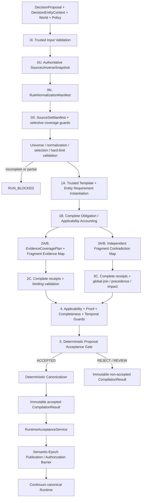
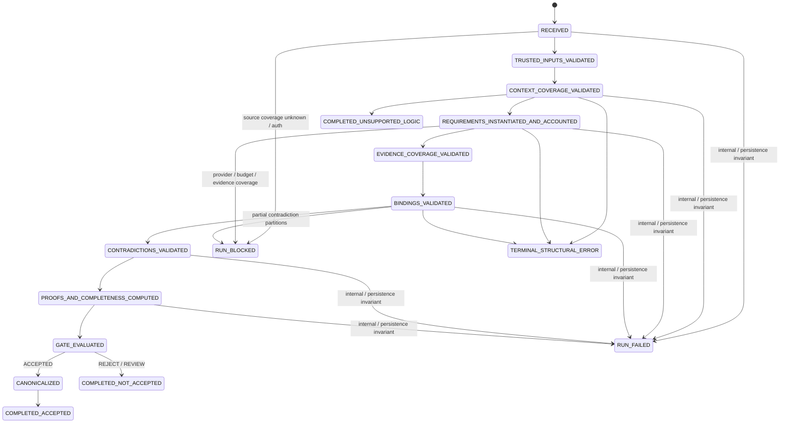

# 02 — Architecture

## Status

The product owner selected **Option B's direction** and rejected concrete specifications through Revision 3. The former `DecisionDraft → validator → vague critic → canonicalizer` architecture remains rejected after K3. This document is the compiler topology overview；[15_REPLACEMENT_ARCHITECTURE.md](15_REPLACEMENT_ARCHITECTURE.md) Revision 4 is normative for typed contracts、proposal/Requirement authority、artifact lifecycles、coverage proof、temporal/epoch safety、terminal semantics、migration and ablation.

Revision 4 is presented for product-owner review and is not approved or implemented. Module 01 remains `REDESIGN REQUIRED`.

## Component topology



Structural errors may take an early terminal path. Unknown/incomplete universe、normalization、selection、Evidence or contradiction coverage is execution-blocking, not semantic success. Unsupported governing logic/predicate/absence produces a typed fail-closed result. Missing evidence、applicability ambiguity、contradictions、entity mismatch、indeterminate entailment and proposal-outcome mismatch reach their relevant semantic stages before deterministic disposition.

## Trust boundaries

### Trusted deterministic boundary

- artifact/revision/representation/fragment identity;
- separate `EnterpriseWorldArtifact | CompilerPolicyArtifact | CompilerDerivedArtifact` identities and exact derivation bindings;
- signed proposal/entity request envelopes reference but never join their input world snapshot；
- `CompilerPolicyBundle`、authoritative `SourceUniverseSnapshot`、fragment-complete `RuleNormalizationManifest` and complete `SourceSetManifest` identity;
- request-scoped universe boundary、source inventory、normalization/selection receipts、retrieval provenance、partitions and access scope;
- schema and local-ID integrity;
- stable pre-registered `PredicateIdentity` and normalized DIRECT_ATOM/ALL_OF topology；unknown material predicates fail closed;
- immutable domain-agent `DecisionProposal` ownership and trusted `DecisionEntityContext` role binding；
- single Requirement authority: independently approved reusable templates deterministically instantiated from entity context；
- source-ref existence and canonical resolution;
- temporal validity and historical-read restrictions;
- source-type and authority relation rules;
- authority metadata and configured precedence;
- obligation/template accounting and binding/contradiction cross-link integrity;
- fragment-complete Evidence/applicability and contradiction plans/partitions/receipts with executable hard limits；
- evidence proof eligibility, proof selection, and canonical materiality;
- contradiction inventory completion and validity impact;
- support-path reachability over the typed DAG;
- outcome-class rules and final compilation disposition;
- canonical IDs, ordering, deduplication, hashes, and compiler state transitions;
- validity-bearing provenance for applicability、material policies and selective coverage/rule/eligibility guards；the whole manifest is audit-only;
- finite temporal validity horizons for time-sensitive proofs and explicit P0 `NOT_EXISTS` non-support；
- semantic-epoch validity envelope / irrelevance-certificate authorization contract；
- immutable Runtime acceptance under exact proposal/entity/mission/world/universe/policy/derived-artifact binding.

### Probabilistic boundary

- fragment-to-evidence/applicability bounded semantic matches、role、entailment、value and asserted horizon；
- independent fragment-to-predicate contradiction matches。

Model output is immutable analysis IR only. It cannot author business outcome、Requirement、predicate/entity identity、canonical applicability、`CRITICAL | SUPPORTING`、canonical contradiction impact、deterministic precedence、coverage completeness、final disposition、Runtime mutations、Decision staleness、epochs/certificates or side-effect authority.

## Compiler stages

### Stage 0I/0U/0N/0S — Trusted input、universe、normalization and selection

Validate proposal producer/version/outcome mapping、entity roles and exact snapshots；validate an authoritative universe root；account every fragment through trusted normalization；then derive rule/Evidence/contradiction inventories and selective Runtime guards. Incomplete/unknown/review-required coverage fails closed，and derived manifests never become members of their input world snapshot.

### Stage 1A/1B — Deterministic Requirement Decomposition and Accounting

Instantiate approved governing/decision-class `RequirementTemplate`s through `DecisionEntityContext`, normalize atomic stable predicates/ALL_OF, and account every template/obligation/applicability target exactly once. There is no acceptance-path Requirement model and no second semantic authority.

### Stage 2 — Complete Evidence and applicability interpretation

Build a no-top-K `EvidenceCoveragePlan` over every certified eligible fragment and instantiated Requirement/applicability target. Model returns one fragment wrapper with actual matches；receipts prove process coverage, while annotations test semantic correctness. Code validates target/entity/ref/scope/time/role and derives binding candidates；it does not accept model materiality.

### Stage 3 — Independent Contradiction Pass

Independently process all contradiction-eligible fragments. Each emits only actual matches, so output is O(fragments+matches), not a negative cross-product. Complete receipts and global reduce find cross-partition conflicts、apply precedence and derive impact from reachability/proof eligibility；the schema has no severity authority.

### Stage 4 — Deterministic Applicability、Proof、Completeness and Temporal Validity

Finalize applicability after contradiction、select stable proofs、derive materiality、compute assessments and emit finite `TemporalValidityGuard`s/`DecisionValidityEnvelope`. This stage has no model call.

### Stage 5 — Deterministic Proposal Acceptance Gate

Compute an evidence-supported validation class and compare it to immutable `DecisionProposal`; mismatch rejects/reviews that proposal and never substitutes another outcome. Only matching APPROVE/DENY with every precondition invokes canonicalizer.

## Execution state



Execution status and semantic disposition are separate. A blocked provider call does not become a semantic rejection, and a semantic rejection cannot expose canonical graph state.

## Canonical graph shape

```text
SourceFragment
  --SUPPORTED_BY / GOVERNED_BY[CRITICAL]-->
Claim(requirement assessment)
  --DERIVED_FROM / REQUIRES[CRITICAL]-->
Claim(derived requirement)
  --REQUIRES[CRITICAL]-->
Decision

CompilerPolicyArtifact / selective CoverageGuard
  --GOVERNED_BY[CRITICAL]-->
Claim(decision interpretation)
  --REQUIRES[CRITICAL]-->
Decision

DecisionProposal / DecisionEntityContext / TemporalValidityGuard /
DecisionValidityEnvelope
  --VALIDATED_AS / BINDS_ENTITY / AUTHORIZES_WHILE_CURRENT[CRITICAL]-->
Decision
```

Support and later invalidation use graph reachability. Existing Source → Claim → Claim → Decision semantics remain valid. Canonical state contains Stage-4 selected proof、applicability guards and materially participating policy/coverage semantic keys；full manifests/receipts remain immutable audit derivation. APPROVE uses all root closures；DENY uses one stable failed path selected without proposition text. No redundant direct edge is required.

## Integration boundary

The compiler produces an immutable `CompilationResult`. `RuntimeAcceptanceService` alone may translate an accepted canonical result into Runtime graph mutations, after checking exact proposal/entity/mission/world/universe/policy hashes、clock horizon、derived envelope and semantic epoch. A newer executable epoch requires an unbroken deterministic irrelevance-certificate chain or authorization is denied. Runtime still owns Decision lifecycle、stale propagation、action blocking and side-effect authorization.

The old critic and reasoner-only routes remain only as explicit benchmark baselines during migration. Neither is a production fallback for the replacement pipeline.
