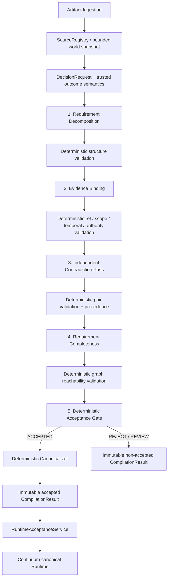
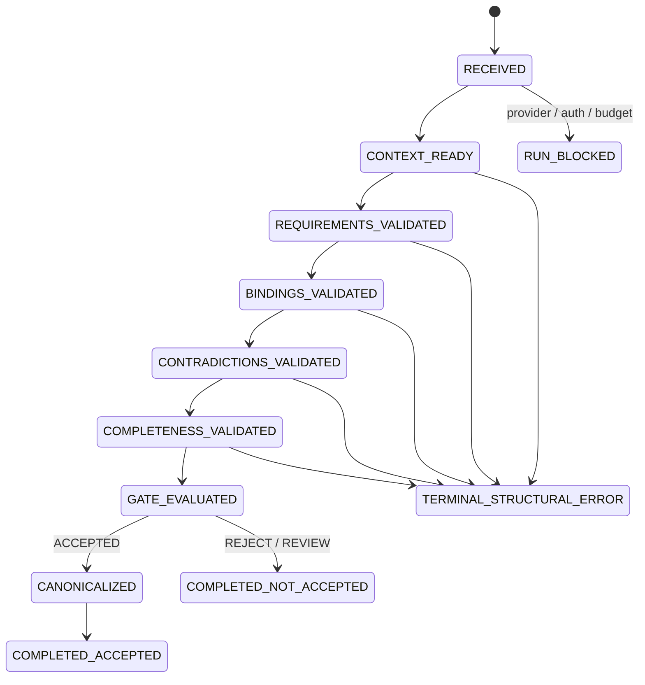

# 02 — Architecture

## Status

The product owner selected **Option B** on 2026-08-19. The former `DecisionDraft → validator → vague critic → canonicalizer` architecture is rejected after K3 was triggered. This document is the compiler topology overview; [15_REPLACEMENT_ARCHITECTURE.md](15_REPLACEMENT_ARCHITECTURE.md) is the normative design for typed contracts, stage ownership, terminal semantics, migration, and ablation.

This is the product-owner-selected direction and is now presented for design review; it is not an implemented claim. Module 01 remains `REDESIGN REQUIRED`.

## Component topology



Only structural errors may take an early terminal path. Missing evidence, unsupported requirements, contradictory authorities, semantic uncertainty, and outcome mismatch are accumulated through the relevant semantic stages and resolved only by the deterministic gate.

## Trust boundaries

### Trusted deterministic boundary

- artifact/revision/representation/fragment identity;
- request-scoped source inventory and access scope;
- schema and local-ID integrity;
- source-ref existence and canonical resolution;
- temporal validity and historical-read restrictions;
- source-type and authority relation rules;
- authority metadata and configured precedence;
- requirement/binding/contradiction cross-link integrity;
- support-path reachability over the typed DAG;
- outcome-class rules and final compilation disposition;
- canonical IDs, ordering, deduplication, hashes, and compiler state transitions;
- immutable Runtime acceptance under exact mission revision/world snapshot.

### Probabilistic boundary

- semantic requirement decomposition;
- proposition-to-evidence binding;
- CRITICAL versus SUPPORTING materiality proposal;
- semantic contradiction candidate discovery;
- semantic evidence sufficiency assessment.

Model output is immutable analysis IR only. It cannot create source identities, set deterministic precedence, emit canonical Runtime mutations, mark Decisions stale, or authorize side effects.

## Compiler stages

### Stage 0 — Context assembly

Build a bounded, read-only source package and trusted outcome-semantic mapping. No model receives database write access or benchmark ground truth.

### Stage 1 — Requirement Decomposition

Produce atomic semantic propositions and a requirement DAG. A `Requirement` contains no source ref.

### Stage 2 — Evidence Binding

Bind each explicit requirement to a minimal sufficient set of canonical source fragments. Each binding distinguishes `CRITICAL` from `SUPPORTING` through explicit counterfactual validity impact.

### Stage 3 — Independent Contradiction Pass

Detect typed semantic conflicts across bound evidence and other bounded relevant authoritative fragments. Deterministic code validates the pair and applies configured precedence.

### Stage 4 — Requirement Completeness

Assess every explicit requirement against direct or transitive evidence paths. This stage cannot invent a new requirement, source ref, or `UNKNOWN_SOURCE_REQUIRED` sentinel.

### Stage 5 — Deterministic Acceptance Gate

Apply structural results, requirement coverage, contradiction resolution, and trusted `APPROVE | DENY | REVIEW` semantics. Only `ACCEPTED` invokes the deterministic canonicalizer.

## Execution state



Execution status and semantic disposition are separate. A blocked provider call does not become a semantic rejection, and a semantic rejection cannot expose canonical graph state.

## Canonical graph shape

```text
SourceFragment
  --SUPPORTED_BY / GOVERNED_BY[CRITICAL]-->
Claim(requirement)
  --DERIVED_FROM / REQUIRES[CRITICAL]-->
Claim(derived requirement)
  --REQUIRES[CRITICAL]-->
Decision
```

Support and later invalidation use graph reachability. Existing Source → Claim → Claim → Decision semantics remain valid; the compiler must not demand redundant direct source edges on every derived Claim or Decision.

## Integration boundary

The compiler produces an immutable `CompilationResult`. `RuntimeAcceptanceService` alone may translate an accepted canonical result into Runtime graph mutations, after checking the exact mission revision and world snapshot. Runtime still owns Decision lifecycle, stale propagation, action blocking, and side-effect authorization.

The old critic and reasoner-only routes remain only as explicit benchmark baselines during migration. Neither is a production fallback for the replacement pipeline.
