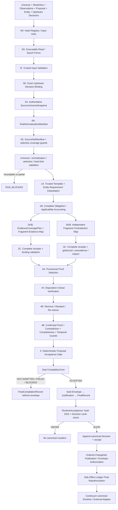
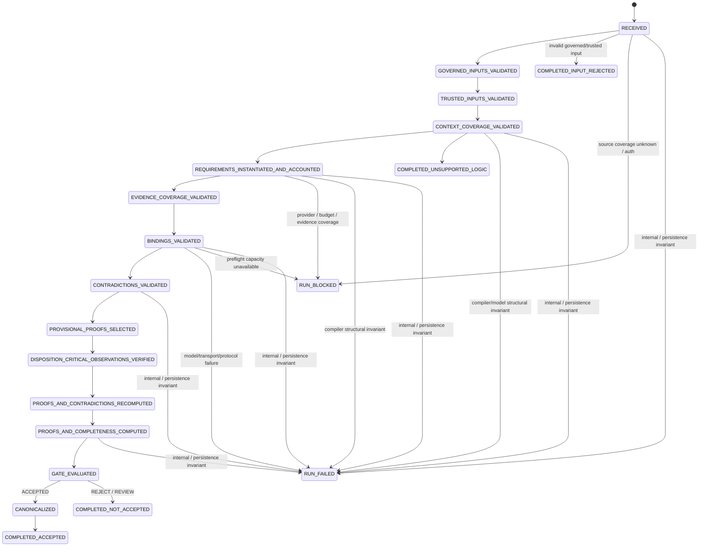

# 02 — Architecture

## Status

The product owner selected **Option B's direction** and architecturally accepted/froze P0-1～P0-37 after Revision 6. The former `DecisionDraft → validator → vague critic → canonicalizer` architecture remains rejected after K3. This document is the compiler topology overview；[15_REPLACEMENT_ARCHITECTURE.md](15_REPLACEMENT_ARCHITECTURE.md) Revision 7 is normative only for P0-38/P0-39 and preserves all frozen contracts.

Revision 7 is presented for product-owner review and is not approved、planned or implemented. Module 01 remains `REDESIGN REQUIRED`.

## Component topology



Trusted-input rejection、execution failure and semantic proposal non-admission are disjoint. A model/schema/ref/transport failure is `RUN_FAILED` with no proposal-admission disposition；unknown/incomplete pre-call coverage/capacity is execution-blocking. Unsupported governing logic/predicate/absence/unregistered cross-predicate relation produces a typed semantic result. Missing evidence、applicability ambiguity、direct contradictions、stale upstream Decision and proposal-outcome mismatch reach their relevant semantic stages before deterministic admission disposition. Business outcome remains exclusively on the immutable proposal/accepted Decision。

## Trust boundaries

### Trusted deterministic boundary

- artifact/revision/representation/fragment identity;
- separate `EnterpriseWorldArtifact | CompilerPolicyArtifact | CompilerDerivedArtifact` identities and exact derivation bindings;
- signed proposal/entity request envelopes reference but never join their input world snapshot；
- `CompilerPolicyBundle`、authoritative `SourceUniverseSnapshot`、fragment-complete `RuleNormalizationManifest` and complete `SourceSetManifest` identity;
- request-scoped universe boundary、source inventory、normalization/selection receipts、retrieval provenance、partitions and access scope;
- schema and local-ID integrity;
- stable pre-registered `PredicateIdentity` and normalized DIRECT_ATOM/ALL_OF topology；unknown material predicates fail closed;
- immutable domain-agent `DecisionProposal` ownership and trusted `DecisionEntityContext` role binding；
- single Requirement authority: independently approved reusable templates deterministically instantiated from entity context；
- source-ref existence and canonical resolution;
- temporal validity and historical-read restrictions;
- source-type and authority relation rules;
- authority metadata and configured precedence;
- obligation/template accounting and binding/contradiction cross-link integrity;
- fragment-complete Evidence/applicability and contradiction plans/partitions/receipts with executable hard limits；
- evidence proof eligibility, proof selection, and canonical materiality;
- contradiction inventory completion and validity impact;
- support-path reachability over the typed DAG;
- outcome-class rules and final compilation disposition;
- canonical IDs, ordering, deduplication, hashes, and compiler state transitions;
- validity-bearing provenance for applicability、material policies and selective coverage/rule/eligibility guards；the whole manifest is audit-only;
- finite temporal validity horizons for time-sensitive proofs and explicit P0 `NOT_EXISTS` non-support；
- semantic-sequence validity envelope / contiguous ChangeSet-range authorization contract；irrelevance certificates are optional caches；
- complete governed-observation closure and executable read/epoch fencing；
- exact `UpstreamDecisionBinding`、acyclic `downstream --REQUIRES--> upstream` proof and reverse invalidation reachability；
- independent disposition-critical verification for selected proof/applicability and both sides of critical direct conflicts；
- executable ChangeSet log + per-envelope authorization intersection without fleet-wide writes；
- immutable Runtime acceptance under exact proposal/entity/mission/world/universe/policy/derived-artifact binding.
- closed `continuum-hash-v1` preimage registry and acyclic construction order；no observation/proposal、universe/read-view or compilation/envelope fixed point；
- exact-ID plus supersession-lineage Decision DAG checks before acceptance；D→D=`REQUIRES`, D→Action/SideEffect=`AUTHORIZES`；
- immutable `SideEffectIntentCore` plus append-only transition hash chain and non-content-addressed CAS head；

### Probabilistic boundary

- fragment-to-evidence/applicability bounded semantic matches、role、entailment、value and asserted horizon；
- independent fragment-to-predicate contradiction matches。
- exact preselected disposition-critical semantic verification verdicts only。

Model output is immutable analysis IR only. It cannot author business outcome、Requirement、upstream Decision、predicate/entity identity、canonical applicability、`CRITICAL | SUPPORTING`、canonical contradiction impact、deterministic precedence、coverage completeness、final disposition、Runtime mutations、Decision staleness、epochs/certificates or side-effect authority.

## Compiler stages

### Stage 0H/0G/0I/0D/0U/0N/0S — Hash DAG、governed input、upstream Decisions、universe、normalization and selection

First recompute every registered v7 digest/ID and validate the constructible input DAG。Then validate one executable governed read/epoch closure、proposal/entity inputs and exact upstream Decision final records/envelopes/status；then validate universe completeness、normalization、selection and selective guards. Mixed/future/bypass observations、unregistered preimages and descendant back-references are input rejection；a stale/superseded upstream cannot satisfy proof and is never auto-rebound。

### Stage 1A/1B — Deterministic Requirement Decomposition and Accounting

Instantiate approved governing/decision-class `RequirementTemplate`s through `DecisionEntityContext`, normalize atomic stable predicates/ALL_OF, and account every template/obligation/applicability target exactly once. There is no acceptance-path Requirement model and no second semantic authority.

### Stage 2 — Complete Evidence and applicability interpretation

Build a no-top-K `EvidenceCoveragePlan` over every certified eligible fragment and instantiated Requirement/applicability target. Model returns one fragment wrapper with actual matches；receipts prove process coverage, while annotations test semantic correctness. Code validates target/entity/ref/scope/time/role and derives binding candidates；it does not accept model materiality.

### Stage 3 — Independent Contradiction Pass

Independently process all contradiction-eligible fragments. Each emits only actual matches, so output is O(fragments+matches), not a negative cross-product. Complete receipts and global reduce find cross-partition conflicts、apply precedence and derive impact from reachability/proof eligibility；the schema has no severity authority.

### Stage 4A/4V/4R/4B — Selection、Disposition-Critical Verification、Recompute、Completeness and Temporal Validity

Provisional selection chooses stable enterprise candidates and provisional critical direct conflicts. The narrow independent verifier sees only one exact preselected fragment/target/entity/claimed semantic observation and returns `CONFIRMED | REFUTED | INDETERMINATE`. Only confirmed proof/applicability canonicalizes, and both model sides must confirm before a contradiction becomes blocking. Code removes REFUTED observations、reselects/re-reduces deterministically, and represents INDETERMINATE critical-conflict observations as semantic uncertainty. Final code derives materiality、assessments、temporal guards and the sequence-bound envelope.

### Stage 5 — Deterministic Proposal Acceptance Gate

Compute an evidence-supported validation class and compare it to immutable `DecisionProposal`; mismatch rejects/reviews that proposal and never substitutes another outcome. Only matching APPROVE/DENY with every precondition invokes canonicalizer.

## Execution state



Execution status and semantic disposition are separate. A blocked provider call does not become a semantic rejection, and a semantic rejection cannot expose canonical graph state.

## Canonical graph shape

```text
SourceFragment
  --SUPPORTED_BY / GOVERNED_BY[CRITICAL]-->
Claim(requirement assessment)
  --DERIVED_FROM / REQUIRES[CRITICAL]-->
Claim(derived requirement)
  --REQUIRES[CRITICAL]-->
Decision

DownstreamDecision
  --REQUIRES[CRITICAL]-->
UpstreamDecision(exact final record + envelope)

Decision
  --AUTHORIZES[CRITICAL]-->
Action / SideEffectIntentCore

CompilerPolicyArtifact / selective CoverageGuard
  --GOVERNED_BY[CRITICAL]-->
Claim(decision interpretation)
  --REQUIRES[CRITICAL]-->
Decision

DecisionProposal / DecisionEntityContext / GovernedObservationSet /
DispositionCriticalVerificationReceipt / TemporalValidityGuard /
DecisionValidityEnvelope(validated semantic sequence + component epoch)
  --VALIDATED_AS / BINDS_ENTITY / AUTHORIZES_WHILE_CURRENT[CRITICAL]-->
Decision
```

Support and later invalidation use graph reachability. Existing Source → Claim → Claim → Decision semantics remain valid, and contract-required upstream proof is the distinct edge `downstream --REQUIRES--> upstream`; invalidation traverses its reverse index. Exact-ID and lineage projections are both acyclic before acceptance. Canonical state contains independently verified selected proof、applicability/upstream guards and materially participating policy/coverage semantic keys；full manifests/receipts remain immutable audit derivation. APPROVE uses all root closures；DENY uses one stable failed path selected without proposition text. No redundant direct source edge is required.

## Integration boundary

The compiler produces immutable layers `CompilationCore → DecisionValidityEnvelope → DecisionJustification → FinalCompilationRecord`. `RuntimeAcceptanceService` alone may translate `proposal_admission_disposition=ACCEPTED` into Runtime graph mutations, after checking the closed hash DAG、exact proposal/entity/observation/upstream/mission/world/universe/policy hashes、clock horizon、derived envelope and both Decision DAG projections；the canonical outcome remains the proposal's exact value. `PublishEpochTxn` assigns the next owner-scope `semantic_sequence` and advances the complete ChangeSet/read fence without Decision fan-out. The Side Effect Ledger's `ReauthorizeForExecutionTxn` checks every intervening ordered ChangeSet/upstream/horizon and atomically appends the `EXECUTING` transition before—but not atomically with—the external call. Runtime owns lifecycle、stale projection、action blocking、idempotency and reconciliation.

The old critic and reasoner-only routes remain only as explicit benchmark baselines during migration. Neither is a production fallback for the replacement pipeline.
