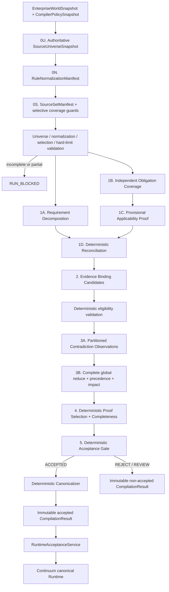
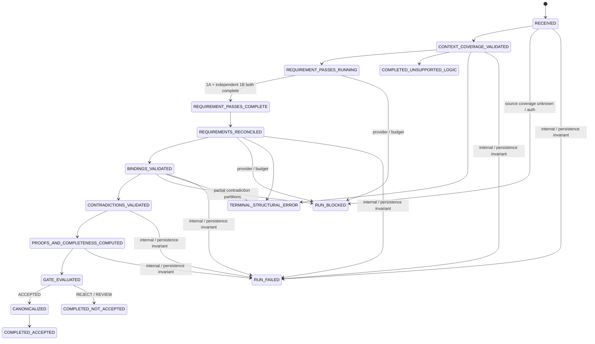

# 02 — Architecture

## Status

The product owner selected **Option B's direction** on 2026-08-19 and rejected both the first concrete specification and Revision 2. The former `DecisionDraft → validator → vague critic → canonicalizer` architecture remains rejected after K3. This document is the compiler topology overview；[15_REPLACEMENT_ARCHITECTURE.md](15_REPLACEMENT_ARCHITECTURE.md) Revision 3 is normative for typed contracts、artifact lifecycles、applicability/coverage proof、selective invalidation、terminal semantics、migration and ablation.

Revision 3 is presented for product-owner review and is not approved or implemented. Module 01 remains `REDESIGN REQUIRED`.

## Component topology



Structural errors may take an early terminal path. Unknown/incomplete universe、normalization、selection or contradiction coverage is execution-blocking, not semantic success. Unsupported governing logic/predicate produces a typed fail-closed result. Missing evidence、applicability ambiguity、contradictions、indeterminate entailment and outcome mismatch reach their relevant semantic stages before deterministic disposition.

## Trust boundaries

### Trusted deterministic boundary

- artifact/revision/representation/fragment identity;
- separate `EnterpriseWorldArtifact | CompilerPolicyArtifact | CompilerDerivedArtifact` identities and exact derivation bindings;
- `CompilerPolicyBundle`、authoritative `SourceUniverseSnapshot`、fragment-complete `RuleNormalizationManifest` and complete `SourceSetManifest` identity;
- request-scoped universe boundary、source inventory、normalization/selection receipts、retrieval provenance、partitions and access scope;
- schema and local-ID integrity;
- stable pre-registered `PredicateIdentity` and normalized DIRECT_ATOM/ALL_OF topology；unknown material predicates fail closed;
- source-ref existence and canonical resolution;
- temporal validity and historical-read restrictions;
- source-type and authority relation rules;
- authority metadata and configured precedence;
- requirement reconciliation and binding/contradiction cross-link integrity;
- evidence proof eligibility, proof selection, and canonical materiality;
- contradiction inventory completion and validity impact;
- support-path reachability over the typed DAG;
- outcome-class rules and final compilation disposition;
- canonical IDs, ordering, deduplication, hashes, and compiler state transitions;
- validity-bearing provenance for applicability、material policies and selective coverage/rule/eligibility guards；the whole manifest is audit-only;
- immutable Runtime acceptance under exact mission/world/universe/policy/derived-artifact binding.

### Probabilistic boundary

- semantic requirement decomposition;
- independent governing-obligation and applicability-binding candidates;
- proposition-to-evidence role and entailment proposals;
- partitioned semantic contradiction observations;
- advisory counterfactual and contradiction severity text.

Model output is immutable analysis IR only. It cannot set canonical applicability、`CRITICAL | SUPPORTING`、canonical contradiction impact、deterministic precedence、universe/normalization/selection completeness、final disposition、Runtime mutations、Decision staleness or side-effect authority.

## Compiler stages

### Stage 0U/0N/0S — Universe、normalization and selection coverage

Validate an authoritative universe root；account every in-boundary fragment through trusted normalization；then derive the selected rule/contradiction inventory and selective Runtime guards. Incomplete/unknown/review-required coverage fails closed，and derived manifests never become members of their input world snapshot.

### Stage 1A — Requirement Decomposition

Produce one untrusted outcome proposal plus atomic stable predicates and an `ALL_OF` DAG. Display propositions are non-authoritative; structured predicate identity drives IDs and normalization.

### Stage 1B/1C/1D — Independent Coverage、Applicability Proof and Reconciliation

An outcome-blind pass inventories material obligations、Requirement candidates and applicability bindings without seeing Stage-1A output. It must retain a semantic Requirement candidate for every representable obligation even when proposed N/A. Stage 1C validates provisional proofs；Stage 3 independently checks applicability conflicts；Stage 4 alone finalizes APPLICABLE/NOT_APPLICABLE and validity provenance. Reconciliation never invents placeholder refs/codes or permits early N/A suppression.

### Stage 2 — Evidence Binding

Propose canonical refs, semantic roles, and `ENTAILED_TRUE | ENTAILED_FALSE | INDETERMINATE`. The model does not assign canonical materiality. Deterministic proof selection later makes selected proof bindings CRITICAL.

### Stage 3 — Independent Contradiction Pass

Observe all current/in-scope contradiction-eligible fragments in deterministic partitions. Receipts prove full inventory coverage; a global reduce finds cross-partition conflicts, applies precedence, and derives validity impact from reachability/proof eligibility rather than model severity.

### Stage 4 — Deterministic Proof Selection and Requirement Completeness

Select one stable proof per required role, derive canonical materiality, and compute every effective RequirementAssessment from determinate entailment, precedence, and DIRECT_ATOM/ALL_OF reachability. This stage has no model call.

### Stage 5 — Deterministic Acceptance Gate

Compute expected outcome class, validate the model proposal through versioned trusted semantics, and select a minimal justification by stable predicate/source/topology identity—never lexical proposition text. Only `ACCEPTED` invokes the canonicalizer.

## Execution state



Execution status and semantic disposition are separate. A blocked provider call does not become a semantic rejection, and a semantic rejection cannot expose canonical graph state.

## Canonical graph shape

```text
SourceFragment
  --SUPPORTED_BY / GOVERNED_BY[CRITICAL]-->
Claim(requirement assessment)
  --DERIVED_FROM / REQUIRES[CRITICAL]-->
Claim(derived requirement)
  --REQUIRES[CRITICAL]-->
Decision

CompilerPolicyArtifact / selective CoverageGuard
  --GOVERNED_BY[CRITICAL]-->
Claim(decision interpretation)
  --REQUIRES[CRITICAL]-->
Decision
```

Support and later invalidation use graph reachability. Existing Source → Claim → Claim → Decision semantics remain valid. Canonical state contains Stage-4 selected proof、applicability guards and materially participating policy/coverage semantic keys；full manifests/receipts remain immutable audit derivation. APPROVE uses all root closures；DENY uses one stable failed path selected without proposition text. No redundant direct edge is required.

## Integration boundary

The compiler produces an immutable `CompilationResult`. `RuntimeAcceptanceService` alone may translate an accepted canonical result into Runtime graph mutations, after checking the exact mission revision、input world/universe/policy snapshots、derived-artifact envelope and selective guards. Runtime still owns Decision lifecycle、stale propagation、action blocking and side-effect authorization.

The old critic and reasoner-only routes remain only as explicit benchmark baselines during migration. Neither is a production fallback for the replacement pipeline.
