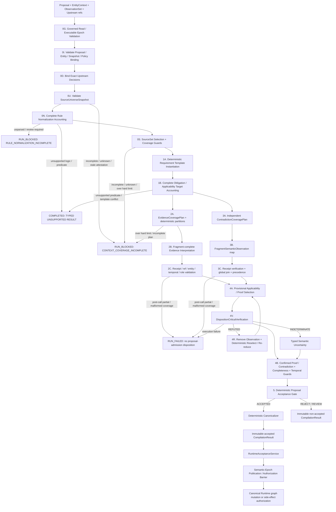

# 15 — Replacement Architecture: Requirement-Centred Compiler

## 文档状态

- Product owner 决策：**Option B 的方向已批准**。
- Product owner 评审：第一版及 Revision 2～5 的具体规范均 **REJECTED**；Option B 方向仍获批准。Revision 5 的 P0-1～P0-33 已获架构层认可，必须保持。
- 本文状态：**REVISION 6 — FOR PRODUCT-OWNER REVIEW，尚未批准实施或实施规划**。
- Module 01：**REDESIGN REQUIRED**。
- 当前 vague critic：已被 K3 与产品决策否决，不得成为生产 fallback。
- Option A（reasoner-only）只保留为 ablation baseline；Option C 不执行。
- 本文获批前，不得编写 replacement implementation plan、修改 production compiler、生成或读取 blind holdout、调用 live model、运行 full 120 paid benchmark，或开始 Module 02。

## P0 产品边界

P0 只支持 **具有预注册、版本化 predicate catalog 与受信任 normalized governing-rule schema 的 gate-shaped enterprise approval decision classes**：一个 APPROVE 必须满足一组可识别的原子 gate，组合逻辑仅为 `DIRECT_ATOM | ALL_OF`。本模块不声称支持 arbitrary enterprise reasoning，也不允许 model 即席扩充 predicate vocabulary。

以下 governing logic / proof shape 不在 P0 支持面内：

- `OR` / `ANY_OF`；
- threshold / quorum，例如“3 项中至少 2 项”；
- exception / override chains；
- quantified rules；
- 未归一化的 temporal、numeric range 或 cross-entity aggregation；
- `NOT_EXISTS` 与任何依赖“没有检索到记录”来证明 absence 的 Requirement；
- 其他无法无损表示为 atomic predicate 与 conjunction 的形式。

任何与当前 Decision 相关的 governing source 包含上述逻辑，或无法被受信任的 normalized-rule representation 判定逻辑形态时，必须产生 typed `UnsupportedLogicResult` 并 fail closed；禁止把它压成 conjunction。任何 material applicable obligation 无法由当前 catalog 表达时，必须产生 typed `UnsupportedPredicateResult` / `REJECTED_UNSUPPORTED_PREDICATE`；model 不得创造 predicate code，compiler 不得忽略该 obligation。

## 决策依据

Experiment 1 已触发 K3：旧 critic 在 30 个 audited cases 中只执行 8 次，恢复 0 个 omission、发现 0 个 contradiction，虚构 4 个 `UNKNOWN_SOURCE_REQUIRED`，并新增 5 次 false block。第一版 Option B 又留下 11 个架构阻塞：Stage-1 omission、model-controlled materiality/severity、binary entailment、source-universe completeness、deterministic-policy provenance、lexical proof selection、窄化的 injection gate、非盲 holdout、contradiction truncation 和 unsupported logic。

Revision 2 保留 Option B 的职责拆分并实质性推进 P0-1～P0-11，但仍错误地把 applicability 当作 audit-only model label、把 normalized rule inventory 当作既定事实、让 selector 自证 universe completeness、把整个 SourceSetManifest 做成 super-dependency，并把 compiler-derived manifest 循环放回 input world snapshot。Revision 3 保留前一轮 safety mechanisms，并补入 P0-12～P0-19 的 applicability、normalization、universe、selective provenance、artifact lifecycle、method-blind DEV、Gemini ordering 与 predicate-boundary guarantees；但它仍让 compiler/model 提出业务 outcome、让 Stage 1B 与 trusted normalized templates 形成双重 semantic authority、没有完整 Evidence/applicability search receipts、使用不可执行的 contradiction cross-product、允许 model 提出 entity IDs、没有 time-expiry guard、暴露未定义的 absence semantics，也没有消除 semantic-change/invalidation queue race。

Revision 4 保留 P0-1～P0-19，并作出以下单一权威选择：domain agent 拥有 immutable `DecisionProposal`；受信任 governing-rule/decision-class templates 经受信任 `DecisionEntityContext` **deterministically instantiate** Requirements；model 只解释完整搜索域内的 evidence 和独立观察 contradiction。P0 支持 explicit temporal validity guard，但明确不支持 absence proof / `NOT_EXISTS`。Module 01 还必须输出 Runtime 可强制执行的 semantic-epoch validity envelope。

Revision 5 保留 P0-1～P0-27，并补齐六个边界：upstream Continuum Decision 是一等 proof/dependency；所有 material reads 都绑定 executable snapshot/epoch；epoch publication 以 `SemanticChangeSet` 为真相且不 fan-out 写所有 Decision；execution failure 与 business non-acceptance 分离；selected enterprise proof 经过窄化独立复核；P0 contradiction 只保证同一 normalized predicate/entity/target 的直接冲突，cross-predicate invariants 必须预注册。Operational gate 同时衡量安全、成功执行率、context block、调用、Token、延迟与成本。

Revision 6 不重写上述设计，只修正四个剩余边界：semantic result 表达 **proposal admission** 而不是 Continuum 自创的业务处置；Side Effect Ledger 在 `INTENDED → EXECUTING` 的原子转换中执行最终重授权，外部调用不被伪称为数据库事务的一部分；所有可直接改变 admission disposition 的预选 model semantic claim（selected proof、applicability guard、critical direct-contradiction 两侧）进入统一窄化复核；每个 owner scope 增加严格单调 `semantic_sequence`，作为 ChangeSet range、重放和授权的全序。

## 架构不变量

1. `Requirement` 是结构化 semantic proposition，不是 source ref；显示文本不是 identity。
2. Domain proposal/rationale 不是 Requirement coverage authority。受信任 normalization/templates 必须从完整 governing-source universe 确定性实例化并核算每个 material obligation。
3. model 只能输出 complete-plan fragments 上的 bounded evidence/applicability/contradiction semantic matches；不能创建 outcome、Requirement、predicate/entity identity、canonical materiality/impact、disposition 或 Runtime mutation。
4. canonical `CRITICAL` 是 deterministic proof-selection 的结果：被选入必要 Requirement proof 的 binding 才是 validity-bearing。
5. Replacement contradiction schema 没有 severity authority；任何额外/legacy model severity field 均不参与语义。是否 validity-critical 只由 requirement reachability、proof eligibility、authority/preference 与 resolution state 计算。
6. evidence entailment 至少是 `ENTAILED_TRUE | ENTAILED_FALSE | INDETERMINATE`；`INDETERMINATE` 不能证明 DIRECT Requirement。
7. 编译只在 source universe 被声明并验证为对该 decision class 完整时运行。`INCOMPLETE | UNKNOWN` coverage 必须 fail closed。
8. authority、outcome mapping、entity binding、source selection、predicate、proof、logic、Evidence/contradiction partition、temporal 和 semantic-epoch rules 都是 versioned validity dependencies，不是 audit-only strings。
9. contradiction pass 必须覆盖完整 in-scope inventory；不得因 context limit 静默截断。
10. semantic omission、incompleteness、contradiction 与 ambiguity 不得在相应 semantic pass 之前终止。Structural corruption 可以提前终止。
11. canonical support 与 invalidation 使用 transitive graph reachability；不得要求 redundant direct source edges。
12. LLM output 永远不能直接修改 canonical Runtime state。
13. `APPLICABLE` 与参与 acceptance 的 `NOT_APPLICABLE` 都必须有 determinate、validity-bearing `ApplicabilityJustification`；model label 本身没有效力。
14. 每个 governing source fragment 必须在 `RuleNormalizationManifest` 中被完全核算；silent parser omission 绝不等价于 `NO_GOVERNING_RULE`。
15. `SourceSetManifest` 的 completeness 必须根植于 validated `SourceUniverseSnapshot`，不能由 selector 对自己可见的 catalog 循环自证。
16. coverage audit manifest 不是 whole-inventory super-dependency；Runtime 只保留会改变当前 Decision validity 的 boundary、rule-set、Evidence/contradiction eligibility、applicability、temporal/epoch 与 selected proof dependencies。
17. `EnterpriseWorldArtifact`、`CompilerPolicyArtifact` 与 `CompilerDerivedArtifact` 使用独立 namespace/lifecycle；derived artifact 记录输入 snapshot，但不成为该 snapshot 的成员。
18. P0 未注册 predicate、未解析 rule、缺失 applicability proof 或不完整 universe 都 fail closed；不得将“无法表示/无法证明”解释为“不适用”。
19. 业务 outcome 由 producing domain agent 的 immutable `DecisionProposal` 拥有；compiler 只验证 supplied proposal，绝不改写或替换成另一个业务 Decision。
20. Governing `RequirementTemplate` 的 semantic authority 只来自 independently approved normalized rule 或 decision-class contract；model 不得创建、删除或改写 acceptance-critical Requirement。
21. Requirement subject/object identity 只能由 trusted `DecisionEntityContext` 与 catalog role constraints 实例化；model 不得提供 arbitrary entity IDs。
22. Evidence/applicability discovery 与 contradiction observation 都必须有 fragment-complete bounded plan/partition/receipt；receipt 证明 processing coverage，不虚称 model semantic correctness。
23. Temporal proof 必须输出 finite validity horizon 或被明确判定 timeless；Runtime authorization 必须同步检查 expiry，不得只依赖异步 stale event。
24. P0 不支持 `NOT_EXISTS` 或 retrieval-derived absence。无结果不是 proof；遇到 material absence obligation 必须 typed fail closed。
25. Every accepted Decision carries a semantic-sequence/component-epoch validity envelope；after a newer sequence becomes executable, side effects require a complete ChangeSet/range check proving no relevant intersection. Irrelevance certificates are optional caches, never publication prerequisites。
26. Contract-required upstream Continuum Decisions are first-class proof objects and canonical `Decision → Decision` CRITICAL edges；它们不得被降级成 enterprise fragment，supersession 也不得静默改写旧 binding。
27. Every material observation used by a proposal or compiler proof is traceable to one executable governed world/semantic epoch；unversioned、future-epoch、mixed-epoch or bypass reads cannot canonicalize。
28. Epoch publication never requires fleet-wide Decision-row fan-out。Durable truth is an executable hash-chained `SemanticChangeSet` log；authorization checks the specific envelope against every intervening change before the side effect commits。
29. Trusted-input rejection、compiler/model execution failure and semantic non-acceptance are disjoint result classes。Model/transport/protocol failure never becomes a durable business DENY。
30. Every model-interpreted enterprise binding selected for canonical proof or applicability is independently verified as `CONFIRMED` before use；the verifier cannot discover refs/Requirements or decide materiality、outcome or disposition。
31. P0 contradiction detection guarantees only direct conflicts over the same normalized predicate、entity、target and overlapping scope/time。Unregistered cross-predicate relations fail closed；不得宣称 generic contradiction reasoning。
32. `SEMANTIC_RESULT` 的 disposition 只描述 proposal 是否被 Continuum admission/canonicalization；业务 outcome 只存在于 immutable `DecisionProposal.proposed_outcome`，accepted Decision 必须原样复制该值。
33. Semantic authorization 与 Side Effect Ledger 的 `INTENDED → EXECUTING` 转换在同一 conditional transaction 内线性化；外部网络调用不属于该事务。进入 `EXECUTING` 前的相关变化取消 intent，进入后使用 idempotency/reconciliation 处理不确定结果。
34. Any preselected model semantic observation that can directly change final proposal admission is independently verified through the same minimal three-valued contract；unconfirmed contradiction observations cannot become confirmed contradictions。
35. Every executable semantic publication in one owner scope has exactly one contiguous monotonic `semantic_sequence`。Epoch component counters explain **what** changed；the sequence defines **when** and is the only ChangeSet range-order key。

## Artifact namespaces and trust boundary

三个 namespace 互不嵌套，也不通过修改历史 snapshot 来制造当前性：

```text
EnterpriseWorldArtifact
  enterprise source/content/state; immutable revision
  membership: EnterpriseWorldSnapshot

CompilerPolicyArtifact
  selector、normalizer、catalog、authority、outcome、proof、partition policy
  membership: CompilerPolicySnapshot

CompilerDerivedArtifact
  ProposalOutcomeBinding、SourceSetManifest、RuleNormalizationManifest、
  RequirementInstantiationReceipt、Evidence/contradiction plans/receipts、
  UpstreamDecisionBinding、DispositionCriticalVerification records、
  ConstraintEvaluationReceipt、
  ApplicabilityJustification set、TemporalValidityGuard set、
  DecisionValidityEnvelope、DecisionInterpretation
  derivation: input_world_snapshot_id + source_universe_snapshot_id +
              compiler_policy_bundle_id + exact input/output hashes
  membership: CompilerProvenanceStore only; never the input world snapshot
```

`EnterpriseWorldSnapshot` 与 `CompilerPolicySnapshot` 都是 immutable views。一次 compilation 读取它们，随后把 content-addressed derived records 写入独立 provenance store；不能把刚生成的 manifest 伪装成其输入 snapshot 内“当前 SourceRef”。External/trusted guarantees 与 Continuum-proven guarantees 分开：

`SourceUniverseSnapshot` 是 authoritative registry 对一个 enterprise world view 的 signed snapshot envelope：它不是第四类 artifact，也不是其所枚举 world 的成员，更不是 compiler semantic output。它作为 trusted input root 存于 registry snapshot store；`RuleNormalizationManifest`、`SourceSetManifest` 等才是由它派生的 `CompilerDerivedArtifact`。

`DecisionProposal`、`DecisionEntityContext` 与 proposal 引用的 `GovernedObservationSet` 同样是 signed immutable request-input envelopes，分别存于 `RequestInputStore` / `GovernedObservationStore`。它们引用 `input_world_snapshot_id` 与 executable semantic epoch，但**不是该 snapshot 的成员**，也不构成第四个 compiler artifact namespace；否则 producing agent 在读取 W17 后生成 proposal 再要求 proposal 已在 W17 内，会重建 Revision-2 的 snapshot circularity。Runtime acceptance independently verifies signatures/hashes、W17/epoch binding and material-read closure。

- 外部/受信任：registry/catalog 是 owner scope 的 authoritative source；connector 已同步到声明 watermark；签名者有 completeness/normalization authority；source bytes 与业务事实真实。
- Continuum 可证明：枚举、revision/hash、namespace/boundary 与 registry snapshot 一致；selection 只使用所声明 universe/policy；每个 fragment/rule/partition 被恰好核算；derived artifact 与 exact inputs/policies/hash 绑定；accepted proof 只引用 validated immutable identities。
- 外部 attestation 缺失、过期或不覆盖所需 namespace 时，Continuum 只能返回 `RUN_BLOCKED`，不能把局部一致性升级为 universe completeness。

## Versioned trusted inputs

### `DecisionProposal` ownership

The compiler validates a business Decision proposed by a domain agent；it is not a second Decision Maker：

```text
DecisionProposal                              # signed immutable request input; not in input world
  proposal_id: content-addressed ID
  schema_version: string
  producing_agent_id: stable registered identity
  producing_agent_version: immutable version
  decision_type: registered decision-class key
  proposed_outcome: domain outcome value
  rationale_summary: string                   # audit-only; not Requirement authority
  entity_context_id: string
  material_observation_set_id: string
  upstream_decision_refs[]:
    dependency_role / upstream_decision_id
  input_world_snapshot_id: string
  observed_semantic_sequence: uint64
  observed_semantic_epoch: SemanticEpochVector
  produced_at: trusted timestamp
  proposal_hash: SHA-256

ProposalOutcomeBinding                       # deterministic CompilerDerivedArtifact
  proposal_id / proposal_hash
  proposed_outcome_hash
  outcome_semantics_policy_ref: CompilerPolicyRef
  normalized_outcome_class: APPROVE | DENY | REVIEW
  binding_hash: SHA-256
```

The domain agent owns only its exact `proposed_outcome`. `ProposalOutcomeBinding.normalized_outcome_class` is deterministically mapped by the versioned decision-class/outcome contract；neither domain agent nor model can invent the mapping, and compiler cannot alter the source outcome. The compiler may derive validity Requirements、interpret evidence、detect contradictions and calculate whether the **supplied** proposal is acceptable. If proof implies a different class, Gate returns rejection/review tied to `proposal_id`；it never emits a replacement proposal or canonical Decision with a different business outcome. `REVIEW` cannot authorize Runtime side effects。

Proposal signature/producer authorization、agent version、world/epoch/observation binding、entity-context/upstream-role binding and hash are Stage-0 trusted inputs. A malformed or unauthorized proposal produces a typed completed input-rejection result；a valid proposal whose outcome conflicts with proof continues through all relevant semantic passes and is rejected only at Gate。

### `DecisionEntityContext`

Entity identity is a trusted input, not model-authored text：

```text
DecisionEntityContext                         # signed immutable request input; not in input world
  entity_context_id: content-addressed ID
  schema_version: string
  decision_type: registered decision-class key
  owner_scope: string
  role_bindings:
    semantic_role -> stable_entity_ref
    # e.g. REQUESTER -> employee:alice; RESOURCE -> database:prod
  typed_context_values: canonical map          # only contract-declared fields
  input_world_snapshot_id: string
  issuer_id / signer_id / issued_at
  context_hash: SHA-256
```

Each predicate/template catalog entry declares legal `subject_role`、optional `object_role`、entity types and allowed context-value paths. Deterministic instantiation resolves those roles from `DecisionEntityContext` and computes `PredicateIdentity`；model stages receive only already-instantiated target semantic keys. A model-emitted unknown target/entity ID is `MODEL_PROTOCOL_INTEGRITY_FAILURE` with no proposal-admission disposition. A faithfully observed source proposition about another entity is `ENTITY_BINDING_MISMATCH`、proof-ineligible and cannot canonicalize；the semantic pipeline still performs the independent contradiction pass before Gate rejects admission for incomplete evidence. Changing an entity binding creates a new context/proposal, never mutates an accepted Decision in place。

### `GovernedObservation` and executable snapshot isolation

Every material fact observed by the producing agent or supplied to a compiler/model pass must be traceable to a governed read. “Material” means it appears in proposal inputs that affect the outcome、an instantiated predicate value、an Evidence/applicability/contradiction fragment、or an upstream-Decision proof. Audit-only telemetry that cannot affect semantics need not become proof。

```text
GovernedObservation                         # signed immutable observation envelope
  observation_id: content-addressed ID
  source_or_tool_identity: stable registered identity
  source_or_tool_version: immutable version
  world_snapshot_id: string
  semantic_sequence: uint64
  semantic_epoch: SemanticEpochVector
  observed_at: trusted timestamp
  content_hash: SHA-256
  observation_subject: ENTERPRISE_FRAGMENT | CONTINUUM_DECISION | TOOL_RESULT
  enterprise_fragment_refs[]
  continuum_decision_ids[] / validity_envelope_hashes[]
  authorization_context_hash: SHA-256
  gateway_attestation_ref / signer_id
  observation_hash: SHA-256

GovernedObservationSet                      # signed request input; not world membership
  observation_set_id: content-addressed ID
  proposal_id
  observation_ids[]
  world_snapshot_id
  semantic_sequence
  semantic_epoch
  material_input_path_to_observation_id[]
  closure_status: COMPLETE | INCOMPLETE
  set_hash: SHA-256

GovernedReadView                            # Runtime/tool-gateway read fence
  owner_scope
  executable_semantic_sequence: uint64
  executable_epoch
  executable_world_snapshot_id
  executable_universe_snapshot_id
  executable_policy_snapshot_id
  read_fence_token / issued_at / expires_at
  view_hash: SHA-256
```

Stage 0G verifies that every material proposal input has exactly one observation mapping；all observations resolve through the same `GovernedReadView` as the proposal's declared executable world/epoch；every referenced fragment is a member of that view；gateway identity/version、authorization context、signature、content hash and read-fence token validate。`UNVERSIONED_OBSERVATION`、`FUTURE_EPOCH_OBSERVATION`、`MIXED_EPOCH_OBSERVATIONS`、`BYPASS_READ` or incomplete closure is `INPUT_REJECTED_OBSERVATION_PROVENANCE`, not a business DENY。

Compiler-owned source reads are also obtained from the same governed view: `SourceUniverseSnapshot`、normalization/selection and every model partition carry the observation/world/epoch binding. Module 01 defines and verifies this proof contract；later Agent Gateway、tool gateway and Runtime adapters must issue/enforce the read fence. Until those adapters exist, a request lacking the attestation is ineligible for canonical acceptance—test fixtures may use a signed deterministic fake gateway, never an unversioned shortcut。

### First-class upstream Decision proof

`DecisionClassContract` declares reusable upstream dependency roles. The proposal names an exact upstream Decision for each required role；the compiler never searches for “latest,” and a model never chooses or rewrites it。

```text
UpstreamDecisionRequirement
  dependency_role: stable decision-class role
  upstream_decision_type: registered decision type
  relation: REQUIRES | AUTHORIZES
  required_outcome_class: APPROVE | DENY
  required_semantic_condition_ref?: CompilerPolicyRef
  proof_role: UPSTREAM_DECISION

UpstreamDecisionBinding                    # deterministic CompilerDerivedArtifact
  binding_id: content-addressed ID
  downstream_proposal_id / downstream_requirement_id
  dependency_role / relation
  upstream_decision_id / upstream_decision_type
  upstream_compilation_hash
  upstream_validity_envelope_hash
  required_outcome_class / required_semantic_condition_ref
  observed_outcome_class
  observed_status: VALID | STALE | SUPERSEDED | INVALID
  validated_semantic_sequence: uint64
  validated_epoch: SemanticEpochVector
  governed_observation_id
  binding_hash: SHA-256
```

Only an accepted、current、`VALID` upstream Decision whose exact compilation/envelope、outcome condition、epoch and governed observation all validate can satisfy `UPSTREAM_DECISION`. `STALE | SUPERSEDED | INVALID` never satisfies it. Supersession creates a different Decision/envelope；it never rewrites the old binding. A downstream revalidation must receive a new signed proposal/ref and explicitly bind the successor. Runtime rechecks upstream currentness at canonical acceptance and every side-effect authorization, and persists a canonical `upstream Decision --REQUIRES/AUTHORIZES[CRITICAL]--> downstream Decision` edge so stale propagation remains transitive。

### Governing Requirement authority

There are exactly two trusted, reusable Requirement-template authorities：

1. `RuleNormalizationManifest.normalized_rules[].requirement_templates[]` for governing obligations；
2. `DecisionClassContract.proposal_validity_requirement_templates[]` for class-wide proposal integrity/preconditions that do not originate in a governing source。

The latter may express reusable invariants such as “the requested resource equals the resource bound in the proposal”；it may not encode a benchmark case、source ref、expected case outcome or per-case exact dependency graph. Domain-agent rationale and model output are never Requirement authorities。

```text
DecisionClassContract
  decision_type / contract_version
  allowed_producer_classes[]
  outcome_semantics_policy_ref
  proposal_validity_requirement_templates[]
  upstream_decision_requirements[]
  registered_cross_predicate_constraint_refs[]
  allowed_entity_roles / context_value_schema
  contract_hash: SHA-256

RequirementTemplate
  requirement_template_id: stable class/rule-level ID
  authority_kind: NORMALIZED_GOVERNING_RULE | DECISION_CLASS_CONTRACT
  authority_ref: normalized_rule_id | CompilerPolicyRef
  predicate_template:
    predicate_catalog_key / subject_role / comparator /
    typed_object_binding / scope_binding / temporal_binding
  expected_state: TRUE | FALSE
  logical_form: DIRECT_ATOM | ALL_OF
  child_template_ids[]
  applicability_template_ids[]
  required_proof_roles[]                     # enterprise roles and/or UPSTREAM_DECISION
  upstream_decision_requirements[]
  registered_cross_predicate_constraint_ref?: CompilerPolicyRef
  template_schema_version
```

Stage 1 deterministically instantiates these templates with `DecisionEntityContext` and accounts for every applicable/candidate normalized obligation exactly once. A registered cross-predicate invariant is permitted only when the decision-class contract names a versioned deterministic evaluator and a normalized output predicate/template；for example `requested_access <= max_allowed_access` becomes a contract-owned `requested_access_within_limit=true` gate with both typed inputs in its receipt. Arbitrary model logic is not permitted. An unregistered relation is `UNSUPPORTED_CROSS_PREDICATE_RELATION_P0` and fails closed rather than being mislabeled a contradiction。

Stage 1 does not run a requirement-invention model. This removes the Stage-1A/Stage-1B double authority while preserving K6: templates describe reusable domain/decision-class semantics and are forbidden from containing `case_id`、fixture identity、concrete source/revision refs or benchmark expected outcomes。

```text
RegisteredCrossPredicateConstraint          # trusted decision-class policy artifact
  constraint_id / schema_version
  decision_type
  input_predicate_template_ids[]             # fixed typed inputs
  evaluator_policy_ref / evaluator_version
  evaluator_kind: closed deterministic evaluator key
  output_predicate_template_id               # normalized boolean gate
  applicability_template_ids[]
  constraint_hash: SHA-256

ConstraintEvaluationReceipt                 # deterministic CompilerDerivedArtifact
  constraint_id / evaluator_policy_ref
  instantiated_input_predicate_keys[]
  selected_verified_input_binding_ids[]
  normalized_input_values[]
  result: TRUE | FALSE | INDETERMINATE
  output_predicate_semantic_key
  evaluated_at_epoch
  receipt_hash: SHA-256
```

The evaluator is a closed typed function registered for a reusable decision class, not arbitrary model code. It runs only after each enterprise input binding is independently confirmed. Missing/conflicted/unverified input yields INDETERMINATE. Its output is assessed as an ordinary deterministic Requirement and its input proof/constraint policy keys become critical provenance. It does not create a `Contradiction` record。

### `CompilerPolicyBundle`

每次 compilation 都绑定一个 immutable policy bundle：

```text
CompilerPolicyBundle
  bundle_id: content-addressed ID
  schema_version: string
  compiler_policy_snapshot_id: string
  authority_precedence_policy_ref: CompilerPolicyRef
  authority_classification_policy_ref: CompilerPolicyRef
  outcome_semantics_policy_ref: CompilerPolicyRef
  source_universe_policy_ref: CompilerPolicyRef
  source_selection_policy_ref: CompilerPolicyRef
  rule_normalization_policy_ref: CompilerPolicyRef
  normalization_review_policy_ref: CompilerPolicyRef
  decision_class_contract_ref: CompilerPolicyRef
  predicate_catalog_ref: CompilerPolicyRef
  entity_binding_policy_ref: CompilerPolicyRef
  proof_selection_policy_ref: CompilerPolicyRef
  evidence_coverage_policy_ref: CompilerPolicyRef
  context_partition_policy_ref: CompilerPolicyRef
  temporal_validity_policy_ref: CompilerPolicyRef
  semantic_epoch_policy_ref: CompilerPolicyRef
  governed_read_policy_ref: CompilerPolicyRef
  upstream_decision_binding_policy_ref: CompilerPolicyRef
  disposition_critical_verification_policy_ref: CompilerPolicyRef
  registered_cross_predicate_constraint_policy_ref: CompilerPolicyRef
  operational_limit_profile_ref: CompilerPolicyRef
  supported_logic_policy_ref: CompilerPolicyRef
  additional_interpretation_policy_refs[]: CompilerPolicyRef
  bundle_hash: SHA-256
```

这些 refs 必须解析到独立 `CompilerPolicySnapshot` 中 immutable、trusted、versioned `CompilerPolicyArtifact` revisions，而不是企业 input world。任何实际参与 `DecisionJustification` 的 policy ref 都进入 canonical validity provenance；更新它必须能经 policy-change invalidation 使受影响的旧 Decision `STALE`。仅把 version ID 写进 metadata 不满足该要求。

```text
PolicyUsageTrace
  policy_ref: CompilerPolicyRef
  rule_keys_used[]
  input_hash: SHA-256
  output_hash: SHA-256
```

Every deterministic component that can alter universe boundary、rule normalization、applicability、Requirement identity、proof eligibility/selection、authority resolution、outcome/disposition、canonical mapping or coverage records a usage entry. Gate rejects `UNVERSIONED_POLICY_INPUT` if such a code path reads configuration not resolved from the bundle. `selected_policy_refs` comes from this trace, not a manually curated audit list。

### `SourceUniverseSnapshot`

Source selection 的 authoritative root 是 independently validated universe snapshot：

```text
SourceUniverseSnapshot
  universe_snapshot_id: content-addressed ID
  schema_version: string
  owner_scope: string
  executable_semantic_epoch: SemanticEpochVector
  governed_read_view_hash: SHA-256
  authoritative_catalog_ref: EnterpriseWorldRef | external registry identity
  namespaces[]
  enumerated_artifacts[]:
    artifact_id / revision_id / representation_id / content_hash / namespace
  registry_version: string
  connector_versions[]
  sync_watermarks[]
  index_versions[]
  completeness_authority:
    authority_id / attestation_ref / signed_at / valid_through
  coverage_status: COMPLETE | INCOMPLETE | UNKNOWN
  snapshot_hash: SHA-256
```

Required chain is `GovernedReadView → SourceUniverseSnapshot → SourceSelectionPolicy → SourceSetManifest`。Validator 必须验证 owner scope、executable epoch/world fence、namespace coverage、watermark freshness、complete enumeration、hash 与 signer authority；没有 `COMPLETE` universe root，`SourceSetManifest` 不得声明 `DECLARED_COMPLETE`。

### `RuleNormalizationManifest`

Trusted normalization occurs before requirement discovery and has its own complete accounting proof：

```text
RuleNormalizationManifest                         # CompilerDerivedArtifact
  normalization_manifest_id: content-addressed ID
  schema_version: string
  input_world_snapshot_id: string
  source_universe_snapshot_id: string
  compiler_policy_bundle_id: string
  parser_id / parser_version
  reviewer_policy_ref: CompilerPolicyRef
  entries[]:                                      # every in-boundary source fragment exactly once
    source_revision_ref: EnterpriseWorldRef
    fragment_ref: EnterpriseWorldFragmentRef
    accounting_status: NORMALIZED_RULES | NO_GOVERNING_RULE |
                       UNSUPPORTED_LOGIC | UNSUPPORTED_PREDICATE |
                       UNPARSED_REVIEW_REQUIRED
    normalized_rule_ids[]
    parser_receipt_hash: SHA-256
    reviewer_or_signer_id?: string
    review_receipt_hash?: SHA-256
  normalized_rules[]:
    normalized_rule_id / obligation_keys[] / logic_form
    applicability_predicate_templates[] / requirement_templates[]
    template_schema_version / independent_approval_receipt_hash
    source_fragment_refs[]
  coverage_receipts[]
  coverage_status: COMPLETE | INCOMPLETE | REVIEW_REQUIRED
  manifest_hash: SHA-256
```

每个 in-boundary fragment 必须恰好落入一条 accounting entry。`NORMALIZED_RULES` 至少映射一个 stable rule；`NO_GOVERNING_RULE` 需要 parser proof，并在 review policy 要求时需要 reviewer/signature；unsupported/unparsed 状态有显式来源但禁止 normal acceptance。空 parser output、漏 fragment 或缺 receipt 永远不是“没有规则”。Normalization manifest、parser、schema 与 reviewer policy 若参与 accepted semantics，均成为 selective validity provenance。

### `SourceSetManifest`

Context Assembly 必须生成并验证：

```text
SourceSetManifest
  manifest_id: content-addressed ID
  schema_version: string
  decision_class_id: string
  owner_scope: string
  input_world_snapshot_id: string
  source_universe_snapshot_id: string
  rule_normalization_manifest_id: string
  compiler_policy_bundle_id: string
  source_selection_policy_ref: CompilerPolicyRef
  selection_run_id: string
  retrieval/index/query_versions[]
  coverage_boundary:
    artifact_types[]
    logical_namespaces[]
    authority_classes[]
    temporal_boundary
  included_artifacts[]:
    artifact_id / revision_id / representation_id / content_hash
    included_fragment_refs[]
  excluded_artifacts[]:
    artifact_id / revision_id / reason_code
  governing_fragment_refs[]
  normalized_governing_rule_ids[]
  evidence_eligible_fragment_refs[]
  contradiction_eligible_fragment_refs[]
  coverage_status: DECLARED_COMPLETE | INCOMPLETE | UNKNOWN
  declared_complete_for_decision_class: boolean
  completeness_declaration_authority_ref: string
  coverage_boundary_semantic_key: SHA-256
  rule_set_membership_hash: SHA-256
  contradiction_eligibility_hash: SHA-256
  partition_plan_hash: SHA-256
  manifest_hash: SHA-256
```

`DECLARED_COMPLETE` 只能由 trusted selector 从 validated `COMPLETE` universe root、versioned selection policy 与 complete normalization manifest 推导，不能来自 model。Validator 必须对 universe/world snapshots、boundary、included/excluded inventory、revision/representation hashes、rule/contradiction sets 和 deterministic manifest hash 复算。

如果底层只提供 retrieved subset，selection policy 必须说明它如何对该 decision class 保证完整性，并记录 query/index/retriever versions。无法证明完整的 retrieval 返回 `UNKNOWN`，结果为 `RUN_BLOCKED: CONTEXT_COVERAGE_INCOMPLETE`，不得伪装成正常 `REJECTED_*` 或 `ACCEPTED`。

`SourceSetManifest` 是 immutable audit/derivation certificate，但**整个 manifest hash 不作为单一 CRITICAL super-dependency**。Canonical provenance 拆成：

```text
CoverageBoundaryDependency
  decision_class_id / owner_scope / universe namespace boundary
  universe authority + source-selection policy semantic keys

GoverningRuleSetDependency
  considered normalized governing rule IDs whose applicability/requirement status participated
  rule-set membership semantic key

ContradictionEligibilityDependency
  predicate/authority scope that was required for complete contradiction inventory
  eligibility semantic key

EvidenceEligibilityDependency
  predicate/entity-role/authority/namespace scope required for complete evidence search
  eligibility semantic key

IndividualProofDependency
  only selected enterprise fragments/current-state bindings
```

Full included/excluded inventory 与 receipts 留在 audit derivation。Coverage impact evaluator 对 membership/policy/catalog change 以 deterministic semantic keys 计算受影响 Decision classes/rule guards；individual source content 仍只沿 selected proof、governing/applicability 或 contradiction-critical edges 传播。若无法证明某次 boundary change 与某 Decision 无关，安全策略可以对该 boundary 下的 Decision 广泛 revalidate，但必须报告为 coverage-induced invalidation，不能伪称精准。

## Stable semantic identity

显示命题不能决定 canonical identity。P0 使用：

```text
PredicateIdentity
  predicate_catalog_id: bundle-resolved stable catalog ID
  predicate_code: stable catalog key
  subject:
    entity_type: string
    entity_id: stable identity instantiated from DecisionEntityContext role
  comparator: IS | EQUALS | EXISTS
  typed_object: bool | string | integer | stable entity identity instantiated
                from a permitted role/context binding
  scope_qualifiers: canonical map
  temporal_qualifiers: canonical map
```

`predicate_catalog_id` must equal the identity resolved from `CompilerPolicyBundle.predicate_catalog_ref`; the Requirement itself contains no enterprise SourceRef. `predicate_semantic_key` 是上述 canonical JSON 的 hash，不包含 `proposition_display`、model local ID、case ID、domain name 或 source wording。

- DIRECT requirement ID 由 `predicate_semantic_key + expected_state + proof_contract` 派生。
- ALL_OF requirement 先递归 flatten nested conjunction、去重并按 child semantic key 排序，再由 child IDs 派生。
- trusted input 中 malformed identity、unbound/illegal entity role 是 `INPUT_REJECTION`；model-authored target key 是 `MODEL_PROTOCOL_INTEGRITY_FAILURE`；material normalized obligation 使用未知/不可表示 predicate 则是 typed semantic `REJECTED_UNSUPPORTED_PREDICATE`。禁止 model 发明 code/entity，也禁止 compiler 静默跳过 obligation。
- `proposition_display` 只用于审计和 UI；改变措辞不能改变 requirement ID、排序、proof slice 或 Runtime edges。
- predicate catalog revision 与 rule schema revision 若改变 accepted semantic key、proof contract 或 representability，必须通过 validity-bearing policy/rule-set provenance 使相应旧 Decision revalidate。
- P0 明确不支持 `NOT_EXISTS`，也不允许 `comparator=EXISTS + expected_state=FALSE` 进入 `Requirement`。`EXISTS` 只能由 positively identified record/state proof 证明 TRUE。若 obligation validity 依赖 complete-set absence，normalization emits `UNSUPPORTED_PREDICATE: ABSENCE_PROOF_NOT_SUPPORTED_P0`。Explicit authoritative boolean state（例如 `security_scan_failed IS false`）不是 absence proof。

## Replacement pipeline



### Stage 0G / 0I / 0D / 0U / 0N / 0S — Governed input、upstream Decisions、universe、normalization and selection

Deterministic Context Assembly first validates `GovernedObservationSet` closure and one executable read fence, then proposal producer/version/hash、`DecisionEntityContext` role bindings and exact snapshot/policy binding. Stage 0D resolves every contract-required upstream Decision to its exact immutable compilation/envelope and governed observation；a valid but stale/superseded upstream is an unsatisfied upstream proof, while a malformed/unauthorized upstream ref is an input rejection. It never auto-rebinds a successor。

The compiler then validates the authoritative `SourceUniverseSnapshot`. A trusted normalizer/reviewer accounts for every in-boundary fragment in `RuleNormalizationManifest`; only then may the selector derive a `SourceSetManifest` and selective coverage guards from the universe root + selection policy. It identifies normalized governing rules、evidence/applicability search inventory and contradiction-eligible fragments. None of these stages performs model-authored Requirement or outcome discovery。

Normalization is not allowed to silently return an empty rule list. `UNPARSED_REVIEW_REQUIRED` blocks execution；`UNSUPPORTED_LOGIC` and `UNSUPPORTED_PREDICATE` create explicit typed completed results with exact source/rule provenance and no canonical graph。

### Stage 1A — Deterministic Requirement Decomposition / Instantiation

Code resolves every approved normalized governing-rule template plus every class-wide proposal-validity template. It binds declared subject/object roles and typed context paths through `DecisionEntityContext`、instantiates stable `PredicateIdentity`, recursively normalizes `DIRECT_ATOM | ALL_OF`, and produces the candidate Requirement DAG. It never reads `rationale_summary` as semantic authority and makes no model call。

### Stage 1B — Complete Obligation and Applicability Target Accounting

Code verifies a bijection between every representable normalized obligation/template and instantiated Requirement/applicability target records. An obligation remains a candidate until Stage 4 proves APPLICABLE or NOT_APPLICABLE；no provisional label can suppress it. The accounting receipt contains every obligation/template key exactly once and records typed unsupported/template-conflict findings。

There is no acceptance-path Stage-1 model and therefore no competing authority to reconcile. A domain agent may omit a governing assumption from its rationale, but the trusted template inventory still instantiates it. A model cannot create a generic “unknown requirement” or `UNKNOWN_SOURCE_REQUIRED`；unknown/unrepresentable rule semantics are typed normalization failures, not guessed Requirements。

### Stage 2 — Complete Evidence and applicability interpretation

Stage 2A builds `EvidenceCoveragePlan` from the complete eligible source inventory and every instantiated DIRECT Requirement/applicability predicate. Deterministic catalog role/namespace rules narrow only by certified eligibility, never top-K relevance. Stage 2B is a model map over disjoint fragment partitions；for each assigned fragment it returns exactly one `FragmentEvidenceObservation`, whose empty match array explicitly means “processed, no relevant proposition observed.” Stage 2C verifies receipts、source membership、target keys、entity/scope/time compatibility、roles and three-state entailment, then derives validated `EvidenceBinding` candidates。

`GOVERNING_AUTHORITY` is not rediscovered by the model：it is deterministically bound from the approved normalized rule/template and its exact governing fragment. Model interpretation is limited to factual、authorization、satisfaction and applicability propositions in the declared target set. Receipt completeness proves every eligible fragment was processed；it does **not** prove that the model interpreted every proposition correctly. Semantic recall/precision remains a falsification metric。

### Stage 3 — Independent contradiction observation

Stage 3 uses a separate prompt/schema/model call path and does not receive Stage-2 matches、selected refs or bindings. Each disjoint partition sees its assigned complete fragment subset and the deterministic target-predicate descriptor set allowed for those fragments. It emits one `FragmentSemanticObservation` per fragment with only actual semantic matches；an empty array is the coverage marker. Deterministic reduce validates fragment-complete receipts, joins determinate opposing matches globally by stable predicate/entity/target key, and applies versioned authority precedence。

The output shape is `O(fragments + actual semantic matches)`, not a ref×predicate negative cross-product. A preflight hard-cap overflow is `RUN_BLOCKED`; missing/truncated/malformed receipts after invocation are `RUN_FAILED` with no proposal-admission disposition. Neither can be reported as zero contradictions. As in Stage 2, processing receipts do not certify model semantic correctness。

### Stage 4A / 4V / 4R / 4B — Deterministic selection、disposition-critical verification、reduction、completeness and temporal validity

Stage 4A resolves provisional applicability/direct-conflict observations and produces a deterministic ordered candidate list for every enterprise-evidence proof role/guard. It also identifies each provisional `VALIDITY_CRITICAL` direct contradiction whose two model-interpreted observations could change final proposal admission. Stage 4V independently receives one isolated, exact preselected observation at a time—selected enterprise proof、selected applicability guard、or one side of such a contradiction—and returns only `CONFIRMED | REFUTED | INDETERMINATE`。

Stage 4R permanently removes a `REFUTED` observation for this immutable run, then deterministically reselects proof/applicability candidates and recomputes the direct-conflict join/impact over the frozen primary-output inventory. Newly disposition-critical observations enter the same verifier. Each observation is verified at most once, so this bounded fixed point terminates. An `INDETERMINATE` selected proof/guard triggers deterministic reselection；an `INDETERMINATE` material side of an otherwise critical direct conflict becomes typed semantic uncertainty, not a confirmed contradiction, and fails closed to admission review。

Only independently `CONFIRMED` enterprise bindings may finalize `ApplicabilityJustification` or Requirement proof, and a direct contradiction becomes confirmed/blocking only when both model-interpreted material sides are `CONFIRMED`. Stage 4B also executes any registered cross-predicate constraint over exact verified typed inputs and stores `ConstraintEvaluationReceipt`; unregistered relations never execute. APPLICABLE obligations enter the effective Requirement set；NOT_APPLICABLE obligations retain a verified validity-bearing determinate false guard；exhausted/INDETERMINATE/conflicted candidates prevent acceptance. Stage 4B derives canonical materiality/confirmed direct-contradiction impact、assesses every effective Requirement and constructs `TemporalValidityGuard`s for every time-bounded selected proof/guard/policy attestation。

Any selected time-sensitive semantic fact must yield a trusted `[valid_from, valid_until)` horizon. `valid_until` is exclusive；at `now >= valid_until` the Decision cannot authorize continuation. Missing horizon for a predicate whose catalog contract is time-sensitive produces insufficient evidence, never an unbounded proof. Stage 4V is the only Stage-4 model interface and cannot discover refs/Requirements/contradictions、mutate selection policy、choose materiality/outcome/admission disposition or touch Runtime。

### Stage 5 — Deterministic proposal acceptance

Code computes the evidence-supported validation class (`APPROVE | DENY | REVIEW`) and compares it with deterministic `ProposalOutcomeBinding.normalized_outcome_class`, which remains hash-bound to the immutable source outcome. Matching APPROVE/DENY may be admitted if all preconditions hold. Any mismatch returns a **proposal-admission** rejection/review against the supplied proposal；no replacement outcome/proposal is emitted. Canonicalization consumes only an admitted proof slice plus `DecisionValidityEnvelope`，whose canonical Decision outcome exactly equals `DecisionProposal.proposed_outcome`。

Runtime acceptance revalidates exact proposal/entity/snapshot/policy/derived hashes、current clock and semantic sequence/component epoch. It publishes the graph through the sequence barrier；the compiler/model cannot directly mutate Runtime。

## Typed contracts

All contracts are immutable analysis IR. Only deterministic validators may convert model candidates into validated objects。

### `Requirement`

```text
Requirement
  requirement_id: deterministic semantic ID
  requirement_template_id: stable reusable template ID
  predicate_identity: PredicateIdentity | null       # DIRECT only
  proposition_display: string                        # non-authoritative
  kind: FACT | RULE | AUTHORIZATION | EVIDENCE_PRESENCE | NEGATIVE_CONSTRAINT
  expected_state: TRUE | FALSE
  logical_form: DIRECT_ATOM | ALL_OF
  child_requirement_ids[]                            # ALL_OF only
  required_proof_roles[]                             # enterprise roles and/or UPSTREAM_DECISION
  upstream_decision_requirement_ids[]
  authority_kind: NORMALIZED_GOVERNING_RULE | DECISION_CLASS_CONTRACT
  authority_ref: normalized_rule_id | CompilerPolicyRef
  governing_obligation_keys[]
  entity_context_id: string
  instantiation_receipt_hash: SHA-256
```

Rules：

- `DIRECT_ATOM` has a stable predicate and no children。
- `ALL_OF` has no independent predicate; children are flattened, deduped and sorted deterministically。
- Every Requirement is necessary for APPROVE validity. There is no SUPPORTING Requirement。
- `required_proof_roles` is derived from the approved template/catalog, not freely authored by the model. A policy-derived gate may require deterministically bound `GOVERNING_AUTHORITY`、interpreted `STATE_EVIDENCE` and an exact `UPSTREAM_DECISION` role。
- `governing_obligation_keys` identify normalized rule records, not source refs. Their provenance is carried by bindings。
- `entity_context_id` and instantiation receipt prove subject/object bindings came from the trusted role map；model output contains no entity-authoring field。
- Unsupported OR/threshold/exception/quantified forms cannot enter this type。
- A registered cross-predicate invariant enters only as the output of its versioned deterministic decision-class evaluator；an arbitrary relationship inferred by a model cannot enter this type or the contradiction pass。

### Requirement/accounting and applicability proof contracts

```text
RequirementInstantiationReceipt               # deterministic Stage 1
  governing_obligation_key: string
  normalized_rule_id: string
  requirement_template_ids[]
  instantiated_requirement_ids[]
  applicability_predicate_semantic_keys[]
  entity_context_id / context_hash
  accounting_status: INSTANTIATED | NOT_APPLICABLE_CANDIDATE |
                     UNSUPPORTED_LOGIC | UNSUPPORTED_PREDICATE |
                     TEMPLATE_CONFLICT
  receipt_hash: SHA-256

RequirementInstantiationResult
  proposal_id / entity_context_id
  requirements[]
  receipts[]
  processed_obligation_keys[]
  processed_decision_class_template_ids[]
  coverage_status: COMPLETE | CONFLICTED | UNSUPPORTED
  result_hash: SHA-256
```

Across all receipts, every normalized governing obligation and every decision-class proposal-validity template appears exactly once. Every representable obligation maps to typed Requirement/applicability targets even when it may later be NOT_APPLICABLE. No model label exists at this stage；applicability is finalized only from Stage-2 evidence plus Stage-3 contradiction/precedence results。

```text
ApplicabilityJustification                    # Stage-4 finalized CompilerDerivedArtifact
  applicability_justification_id: content-addressed ID
  normalized_obligation_key: string
  normalized_rule_id: string
  applicability: APPLICABLE | NOT_APPLICABLE
  applicability_predicate_semantic_keys[]
  expected_predicate_states[]
  selected_current_binding_ids[]
  selected_false_guard_predicate_key?: string # stable NOT_APPLICABLE proof path
  governing_source_fragment_refs[]
  relevant_policy_refs[]: CompilerPolicyRef
  input_world_snapshot_id: string
  stable_semantic_key: SHA-256
  proof_receipt_hash: SHA-256
```

Stage 4 may finalize `APPLICABLE` only when selected bindings determinately satisfy **all** applicability predicates after global contradiction/precedence reduction. It may finalize `NOT_APPLICABLE` only when at least one selected binding determinately falsifies a condition；the canonical guard is chosen by predicate semantic key、authority tier、stable source identity and binding key. Missing/ambiguous/expired/unresolved-conflicted evidence produces `INDETERMINATE`, not a justification. Both finalized determinate outcomes are validity-bearing when acceptance depends on including or excluding the obligation。

### `EvidenceCoveragePlan` and fragment-complete discovery

```text
EvidenceCoveragePlan                         # deterministic CompilerDerivedArtifact
  plan_id: content-addressed ID
  policy_ref: CompilerPolicyRef
  source_set_manifest_id: string
  requirement_instantiation_result_hash: SHA-256
  target_descriptors[]:
    target_predicate_semantic_key
    target_kind: REQUIREMENT_PREDICATE | APPLICABILITY_PREDICATE
    expected_entity_roles / instantiated_entity_refs
    allowed_source_roles / namespaces / authority_classes
    time_sensitivity: TIMELESS | VALIDITY_HORIZON_REQUIRED
  eligible_fragment_refs[]
  eligibility_matrix_hash: SHA-256
  target_set_hash: SHA-256
  partitions[]:
    partition_id / ordered_fragment_refs[] / allowed_target_keys_by_fragment /
    fragment_token_count / input_hash
  expected_partition_ids[]
  hard_limit_profile_id
  plan_hash: SHA-256

FragmentEvidenceObservation                  # model map output; exactly one per fragment
  partition_id
  source_ref: EnterpriseWorldFragmentRef
  matched_predicates[]:                      # empty = processed, no match observed
    target_predicate_semantic_key
    target_kind
    semantic_role: STATE_EVIDENCE | AUTHORIZATION_RECORD |
                   SATISFACTION_RECORD | CONTEXT
    entailment: ENTAILED_TRUE | ENTAILED_FALSE | INDETERMINATE
    normalized_subject / normalized_object / normalized_value
    observed_at / asserted_valid_from / asserted_valid_until

EvidenceCoverageReceipt
  partition_id / input_hash / target_set_hash
  processed_fragment_refs[]
  fragment_observation_refs[]
  emitted_match_count
  completion_status: COMPLETE | OUTPUT_LIMIT_EXCEEDED | TRUNCATED
  output_hash: SHA-256
```

The plan contains **all** eligible fragments for every DIRECT/applicability target under versioned catalog eligibility；it has no top-K field. Retrieval may populate the plan only when its query/index contract certifies complete enumeration for the target namespaces and records version/watermark；best-effort search cannot narrow the universe. Receipt union must equal `eligible_fragment_refs` exactly once and every assigned fragment must have one observation record, including an empty match list. Missing coverage safely blocks the run；complete coverage with no eligible match is semantic `INSUFFICIENT_EVIDENCE`, not a discovery-success claim。

`allowed_target_keys_by_fragment` is derived from catalog entity/source-role constraints before the call. A fragment may only emit those existing keys；the model cannot invent predicates/entities or bind Alice's target to Bob's proposition. The receipt certifies process coverage, not semantic recall；method-blind annotations and adversarial cross-entity fixtures measure missed/incorrect matches。

### `EvidenceBindingCandidate` and validated `EvidenceBinding`

```text
EvidenceBindingCandidate                     # derived from validated fragment match
  binding_local_id: string
  requirement_id?: string
  normalized_obligation_key?: string
  target_predicate_semantic_key: string
  source_ref: EnterpriseWorldFragmentRef
  semantic_role: STATE_EVIDENCE | AUTHORIZATION_RECORD |
                 SATISFACTION_RECORD | CONTEXT
  entailment_target: REQUIREMENT_PREDICATE | APPLICABILITY_PREDICATE
  entailment: ENTAILED_TRUE | ENTAILED_FALSE | INDETERMINATE
  normalized_subject / normalized_object
  normalized_value?: typed value
  asserted_valid_from / asserted_valid_until

EvidenceBinding                              # deterministic validated object
  candidate: EvidenceBindingCandidate
  authority_class: trusted classification
  proof_eligibility: ELIGIBLE | INELIGIBLE
  eligibility_finding_codes[]
  provisional_proof_role: PROVISIONAL_SELECTED | UNSELECTED_SUPPORT | ANALYSIS_ONLY
  selected_proof_role?: semantic role        # set only after CONFIRMED
  verification_status: NOT_SELECTED | CONFIRMED | REFUTED | INDETERMINATE
  proof_role: SELECTED_PROOF | UNSELECTED_SUPPORT | ANALYSIS_ONLY
  canonical_materiality: CRITICAL | SUPPORTING | NONE

GoverningAuthorityBinding                    # deterministic; never model-authored
  binding_id: deterministic ID
  requirement_id / requirement_template_id
  normalized_rule_id / governing_obligation_key
  governing_source_fragment_ref: EnterpriseWorldFragmentRef
  independent_approval_receipt_hash: SHA-256
  selected_proof_role: GOVERNING_AUTHORITY
  canonical_materiality: CRITICAL
```

```text
DispositionCriticalVerificationRequest      # deterministic, exact and minimal
  verification_id / verification_round
  purpose: SELECTED_ENTERPRISE_PROOF | SELECTED_APPLICABILITY_GUARD |
           DIRECT_CONTRADICTION_LHS | DIRECT_CONTRADICTION_RHS
  preselected_observation_id
  evidence_binding_candidate_id? / contradiction_candidate_id?
  exact_source_fragment_ref / content_hash / exact_fragment_text
  target_predicate_identity
  instantiated_subject / instantiated_object
  claimed_entailment / claimed_normalized_value
  expected_state?                           # proof/guard only
  relevant_normalized_semantics              # catalog/template semantics only
  governed_read_view_hash / semantic_sequence / semantic_epoch
  request_hash: SHA-256

DispositionCriticalVerificationObservation  # independent model output
  verification_id
  verdict: CONFIRMED | REFUTED | INDETERMINATE

DispositionCriticalVerificationReceipt      # deterministic validation
  verification_id / request_hash / output_hash
  verifier_prompt_version / model_config_hash
  primary_interpreter_invocation_ids[]
  independence_status: INDEPENDENT | INVALID
  validated_verdict
  receipt_hash: SHA-256

DispositionCriticalSemanticUncertainty      # not a confirmed contradiction
  uncertainty_id
  preselected_observation_id / contradiction_candidate_id?
  verification_receipt_id
  affected_requirement_ids[] / affected_applicability_guard_keys[]
  reason: INDETERMINATE_DISPOSITION_CRITICAL_OBSERVATION
  admission_effect: NEEDS_HUMAN_REVIEW
  uncertainty_hash: SHA-256
```

The verifier uses a separate invocation/context with **exactly one request item** and sees neither proposal outcome、other candidates、the opposing contradiction side、Stage-2 rationale nor final admission disposition. It does not search for a contradiction；deterministic code has already preselected the exact causal observation and supplies its normalized target semantics. Its schema contains no ref discovery、Requirement、materiality、impact、outcome、disposition or mutation fields. Deterministic code checks that it is not the same invocation as the primary interpreter/contradiction observer. Verifier malformed output、fabricated fields/ref or transport failure is an execution failure with no proposal-admission disposition；it is never converted to a semantic verdict。

Each preselected observation is verified at most once. For each proof role/guard, deterministic Stage 4A walks the frozen selection order: `CONFIRMED` becomes eligible to finalize；`REFUTED | INDETERMINATE` remains analysis-only and the next candidate is tried. For a provisional validity-critical direct contradiction, both model-interpreted sides require independent `CONFIRMED` receipts before `Contradiction` exists as a confirmed blocking object. `REFUTED` removes that observation and recomputes the join；`INDETERMINATE` emits `DispositionCriticalSemanticUncertainty` and cannot be counted as a confirmed contradiction. If the finite candidate set or configured verification capacity is exhausted, the semantic result is insufficient evidence or an operational block respectively；the verifier never chooses a candidate or conflict itself。

Rules：

- Model contract contains no canonical materiality field。
- Ref existence、scope、snapshot、authority class、role legality、instantiated entity equality、predicate compatibility and validity horizon are deterministic checks。
- `GOVERNING_AUTHORITY` is deterministically derived as `GoverningAuthorityBinding` from approved rule/template provenance and is not a model candidate. State/authorization/satisfaction evidence targets a Requirement or applicability predicate. A policy saying “training is required” does not prove either that the policy applies to this entity or that training is current。
- An applicable Requirement needs normalized rule/rule-set provenance plus validated `APPLICABLE` justification and selected required-role proof. A conflicting applicability observation is handled by Stage 3/4 and cannot be treated as ordinary factual DENY。
- `INDETERMINATE` cannot satisfy/refute a DIRECT Requirement and is never `SELECTED_PROOF`。
- For each required proof role, proof selector considers only eligible, determinate bindings after authority resolution and selects by versioned proof policy: authority/preference tier, stable source identity, then binding semantic key。
- Independently confirmed selected bindings become `CRITICAL`. Unselected explanatory bindings become `SUPPORTING`; refuted/indeterminate/ineligible observations are analysis-only and have no canonical edge。
- An incorrect model suggestion can cause insufficient evidence or a measured semantic error, but a model cannot label a selected proof SUPPORTING to cause stale escape。
- A model-emitted target key outside the plan is `MODEL_PROTOCOL_INTEGRITY_FAILURE`. A faithfully extracted source match whose normalized subject/object differs from `DecisionEntityContext` is proof-ineligible `ENTITY_BINDING_MISMATCH`；it cannot be repaired by substituting another entity。
- Model-reported `asserted_valid_from/until` is advisory extraction. Code validates the horizon against immutable source fields、catalog temporal contract and trusted clock policy；an unverified model timestamp is never a `TemporalValidityGuard`。

### `FragmentSemanticObservation`, `ContradictionCandidate` and `Contradiction`

```text
FragmentSemanticObservation                  # independent model map output; one per fragment
  partition_id: string
  source_ref: EnterpriseWorldFragmentRef
  matched_predicates[]:                      # empty = processed, no relevant proposition
    match_local_id
    target_predicate_semantic_key
    requirement_id?: string
    normalized_obligation_key?: string
    entailment_target: APPLICABILITY_PREDICATE | REQUIREMENT_PREDICATE
    entailment: ENTAILED_TRUE | ENTAILED_FALSE | INDETERMINATE
    normalized_subject / normalized_object / normalized_value
    observed_at / asserted_valid_from / asserted_valid_until

ContradictionCandidate                       # deterministic global join
  contradiction_id: deterministic ID
  target_predicate_semantic_key: string
  requirement_id?: string
  normalized_obligation_key?: string
  lhs_match_id: string
  rhs_match_id: string
  contradiction_type: DIRECT_NEGATION | VALUE_MISMATCH |
                      SCOPE_CONFLICT | TEMPORAL_CONFLICT | AUTHORITY_CONFLICT

Contradiction                                # deterministic validated record
  candidate: ContradictionCandidate
  resolution: LHS_PRECEDES | RHS_PRECEDES | UNRESOLVED
  precedence_policy_ref: CompilerPolicyRef
  precedence_rule_key?: string
  affected_root_requirement_ids[]
  affected_applicability_guard_keys[]
  lhs_proof_eligibility: ELIGIBLE | INELIGIBLE
  rhs_proof_eligibility: ELIGIBLE | INELIGIBLE
  disposition_critical_verification_receipt_ids[]
  confirmation_status: CONFIRMED             # object does not exist until both model sides confirm
  deterministic_impact: VALIDITY_CRITICAL | NON_BLOCKING
  impact_finding_codes[]
```

Only determinate opposing matches over the same stable `PredicateIdentity`、instantiated entity、entailment target and overlapping normalized scope/time can form a P0 contradiction. Guaranteed forms are direct TRUE/FALSE negation or incompatible normalized values for that one predicate. `SCOPE_CONFLICT | TEMPORAL_CONFLICT` may only describe conflicting claims whose normalized scope/time overlaps under a versioned deterministic comparator；they do not authorize arbitrary cross-predicate inference。

P0 does **not** claim that `requested_access=ADMIN` contradicts `max_allowed_access=READ_ONLY` merely because a model understands their relationship. Such an invariant must already be a versioned `DecisionClassContract` / `RequirementTemplate` with a deterministic registered evaluator and normalized output predicate. If no such contract exists, normalization emits `UNSUPPORTED_CROSS_PREDICATE_RELATION_P0` and fails closed. Benchmark reporting separates same-predicate contradiction、registered cross-predicate constraint violation and unsupported relation；only the first category contributes to contradiction-recall claims。

`deterministic_impact=VALIDITY_CRITICAL` iff the direct conflict affects an applicability guard or effective Requirement reachable to a Decision root, at least one side is proof-eligible for a required role/guard, and authority/preference state either remains unresolved or changes which truth can be selected. There is no model severity field。

### `ContradictionCoveragePlan`

```text
ContradictionCoveragePlan
  policy_ref: CompilerPolicyRef
  eligible_fragment_refs[]
  target_descriptors[]                      # stable keys + instantiated entities + target kind
  eligibility_matrix_hash: SHA-256
  target_set_hash: SHA-256
  hard_limits:
    max_fragments / max_target_predicates / max_total_fragment_tokens /
    max_fragments_per_partition / max_targets_per_fragment /
    max_input_tokens_per_partition / max_output_tokens_per_partition /
    max_partitions / max_matches_per_partition
  partitions[]:
    partition_id / ordered_fragment_refs[] / allowed_target_keys_by_fragment /
    fragment_token_count / input_hash
  expected_partition_ids[]
  plan_hash: SHA-256

ContradictionCoverageReceipt
  partition_id / input_hash / target_set_hash
  processed_fragment_refs[]
  fragment_observation_refs[]
  emitted_match_count
  completion_status: COMPLETE | OUTPUT_LIMIT_EXCEEDED | TRUNCATED
  output_hash: SHA-256
```

Partitioning is deterministic over stable refs、token counts and the same catalog eligibility rules used to constrain entity/source roles. Every eligible ref is assigned exactly once and yields exactly one fragment observation；reduce verifies union equality、no unexpected ref/target、every expected receipt、matching hashes and bounded output. Cross-partition direct conflicts are found by global join on stable predicate/entity/target keys. Preflight hard/dense capacity overflow yields `RUN_BLOCKED`; truncation、timeout、unexpected target/ref、missing receipt or partial union after invocation yields `RUN_FAILED: MODEL_PROTOCOL_INTEGRITY_FAILURE/TRANSPORT_FAILURE`. Partial output can be audited but never reported complete。

### `RequirementAssessment`

```text
RequirementAssessment
  requirement_id: string
  status: SATISFIED | UNSATISFIED | CONTRADICTED |
          SEMANTIC_UNCERTAINTY | INSUFFICIENT_EVIDENCE
  selected_proof_binding_ids[]
  selected_upstream_decision_binding_ids[]
  disposition_critical_verification_receipt_ids[]
  supporting_binding_ids[]
  contradiction_ids[]
  semantic_uncertainty_ids[]
  support_paths[][]
  blocking_requirement_ids[]
  finding_codes[]
  assessment_summary: deterministic template
  applicability_justification_ids[]
```

DIRECT truth table after precedence/proof selection：

| Selected required-role evidence | Result |
|---|---|
| every applicable obligation has a validated APPLICABLE justification、every selected enterprise proof is independently `CONFIRMED`、every state role matches `expected_state` and every required upstream Decision is current/VALID | `SATISFIED` |
| every applicable obligation has a validated APPLICABLE justification and all state roles are covered but at least one selected state is opposite, with no unresolved critical conflict | `UNSATISFIED` |
| unresolved validity-critical contradiction whose two material model observations are independently CONFIRMED | `CONTRADICTED` |
| a material side of an otherwise validity-critical direct conflict verifies INDETERMINATE | `SEMANTIC_UNCERTAINTY`；not a confirmed contradiction |
| any required role absent、only `INDETERMINATE`/unconfirmed，or required upstream Decision is stale/superseded/invalid | `INSUFFICIENT_EVIDENCE` |

An applicability predicate conflict against an `APPLICABLE` or `NOT_APPLICABLE` justification is validity-critical and fails closed after the independent contradiction pass；it is not evidence that the business Requirement itself is true or false。

ALL_OF uses: any `CONTRADICTED` → `CONTRADICTED`; else any `SEMANTIC_UNCERTAINTY` → `SEMANTIC_UNCERTAINTY`; else any `UNSATISFIED` → `UNSATISFIED`; else all `SATISFIED` → `SATISFIED`; else `INSUFFICIENT_EVIDENCE`。

Completeness evaluates the full template-instantiated effective Requirement set. It cannot invent requirements、refs、bindings or placeholder refs。

### `TemporalValidityGuard` and `DecisionValidityEnvelope`

```text
TemporalValidityGuard                        # deterministic CompilerDerivedArtifact
  guard_id: content-addressed ID
  target_predicate_semantic_key: string
  proof_binding_or_applicability_id: string
  trusted_clock_policy_ref: CompilerPolicyRef
  evaluated_at: trusted instant
  valid_from: trusted instant
  valid_until: trusted instant                # exclusive; finite for time-sensitive proof
  expiry_semantics: STALE_AT_VALID_UNTIL | REVALIDATE_BEFORE_VALID_UNTIL
  source_horizon_receipt_hash: SHA-256
  guard_hash: SHA-256

SemanticEpochVector
  owner_scope
  world_epoch: monotonic integer
  universe_epoch: monotonic integer
  policy_epoch: monotonic integer
  catalog_epoch: monotonic integer
  epoch_vector_hash: SHA-256

SemanticEpoch                              # executable owner-scope publication point
  owner_scope
  semantic_sequence: uint64                # strict total order; no gaps or duplicates
  component_epoch: SemanticEpochVector     # which semantic domains advanced
  predecessor_change_hash: SHA-256
  epoch_hash: SHA-256

DecisionValidityEnvelope                     # emitted by Module 01; enforced by Runtime
  envelope_id: content-addressed ID
  proposal_id / proposal_hash
  proposal_outcome_binding_hash
  entity_context_id / context_hash
  governed_observation_set_id / set_hash
  compilation_hash
  validated_semantic_sequence: uint64
  validated_epoch: SemanticEpochVector
  upstream_decision_binding_ids[]
  upstream_validity_envelope_hashes[]
  disposition_critical_verification_receipt_ids[]
  temporal_guard_ids[]
  authorization_not_after: trusted instant   # min finite horizon; exclusive
  coverage_boundary_dependency_keys[]
  governing_rule_set_dependency_keys[]
  evidence_eligibility_dependency_keys[]
  contradiction_eligibility_dependency_keys[]
  policy_dependency_keys[]
  envelope_hash: SHA-256
```

`authorization_not_after` is the minimum of all selected proof/applicability horizons、completeness-attestation validity and policy validity that can expire. Runtime final execution reauthorization reads a trusted clock in the same atomic transition to `EXECUTING`；`now >= authorization_not_after` cancels stale authorization immediately and emits/queues expiry stale transition. The scheduler is an optimization, never the safety mechanism. A timeless predicate may omit a finite guard only when its frozen catalog/proof contract explicitly declares `TIMELESS`。

### Semantic epoch / invalidation barrier interface

Module 01 does not implement the Module-02 coordinator, but its output is unusable unless Runtime satisfies this cross-module contract：

```text
SemanticChangeSet
  change_set_id / owner_scope
  from_exclusive_semantic_sequence: uint64
  semantic_sequence: uint64                  # exactly from + 1
  from_epoch / executable_epoch: SemanticEpochVector
  predecessor_change_hash
  changed_enterprise_refs[] / universe_deltas[] / policy_deltas[] /
  catalog_selector_deltas[] / temporal_expiry_guard_ids[]
  affected_dependency_key_summary              # complete, no-false-negative summary
  affected_boundary_proof_hash
  executable_world/universe/policy snapshot IDs
  impact_index_version / change_hash / publication_receipt_hash

DecisionIrrelevanceCertificate
  certificate_id
  decision_id / validity_envelope_hash
  change_set_ids_or_range_root
  from_exclusive_semantic_sequence / through_inclusive_semantic_sequence
  evaluated_dependency_keys[]
  affected_dependency_key_summary_hashes[]
  deterministic_rule_ids[]
  conclusion: PROVEN_IRRELEVANT
  certificate_hash

ChangeSetRangeProof
  owner_scope
  from_exclusive_semantic_sequence / through_inclusive_semantic_sequence
  ordered_change_set_ids[] | append-only Merkle range root
  union_affected_dependency_key_summary          # complete, no false negatives
  first_predecessor_hash / last_change_hash
  impact_index_version / proof_hash

AuthorizationReceipt
  authorization_purpose: INTENT_ADMISSION | EXECUTION_START
  decision_id / validity_envelope_hash
  checked_from_semantic_sequence / checked_through_semantic_sequence
  checked_change_set_range_root
  upstream_decision_envelope_hashes[]
  clock_instant / authorization_not_after
  result: AUTHORIZED | DENIED_RELEVANT_CHANGE | DENIED_UPSTREAM_INVALID |
          DENIED_EXPIRED | DENIED_EPOCH_RACE
  receipt_hash

SideEffectIntent                            # Runtime Side Effect Ledger record
  side_effect_id / mission_id / effect_type
  normalized_request_hash
  idempotency_key
  authorizing_decision_id
  decision_validity_envelope_hash
  intent_admission_receipt_hash
  authorization_receipt_hash?                # EXECUTION_START receipt once EXECUTING
  authorized_semantic_sequence
  authorization_not_after
  execution_attempt / executor_fence_token?
  status: INTENDED | EXECUTING | COMMITTED |
          CANCELLED_STALE_AUTHORIZATION | RETRYABLE_FAILURE |
          FAILED_FINAL | RECONCILIATION_REQUIRED
  external_operation_ref? / result_hash? / last_failure_code?
  intent_hash
```

A `ChangeSetRangeProof` from sequence 187 exclusive through 194 inclusive covers exactly seven indexed records 188…194. Its leaf count must equal `through - from`；every included ChangeSet's owner scope/sequence/predecessor chain must match its position. A Merkle form must prove those indexed leaves、range completeness and ordered endpoints, not merely membership of an unordered set. Empty range is valid only when both endpoints are equal。

Publication/authorization invariant：

1. Before a semantic change is visible to governed readers, the coordinator builds and seals the next `SemanticChangeSet` with a complete deterministic affected-key summary、boundary proof、exact successor snapshots and predecessor hash. Unknown impact is represented as an affected boundary, never omitted。
2. **Publication transaction boundary (`PublishEpochTxn`)**: under one owner-scope serializable/CAS transaction, read current sequence `s` and predecessor hash, require the new ChangeSet to be `semantic_sequence=s+1`, write it as `EXECUTABLE`, advance the executable pointer to `s+1`, and expose the matching `GovernedReadView`/snapshot fence atomically. Concurrent publications serialize on that pointer. If world storage is external, bytes may exist earlier but cannot be read through a governed adapter until the fence advances. No Decision-row update or per-Decision certificate is a publication prerequisite。
3. The owner-scope genesis pointer is sequence `0` with a fixed domain-separated genesis hash；the first ChangeSet is sequence `1`. The durable safety truth is the contiguous executable hash-chained ChangeSet log. Component epochs state **which** semantic domains changed；`semantic_sequence` alone defines **when** and range order. Replay/recovery accepts only `1..pointer.semantic_sequence` with exact owner scope、contiguous numbers、predecessor hashes and snapshot/component transitions. A gap、duplicate、reorder、hash mismatch or pointer-without-record blocks the governed fence and all authorization for that owner scope. Decision `VALID/STALE` rows、reverse indexes and irrelevance certificates remain lazy projections。
4. **Intent admission (`AuthorizeSideEffectIntentTxn`)** may persist `INTENDED` with a preliminary `AuthorizationReceipt`, exact envelope hash、sequence and idempotency identity. This proves the intent was admissible then；it is not permission to issue the external call。
5. **Execution linearization (`ReauthorizeForExecutionTxn`)**: immediately before execution, read the `INTENDED | RETRYABLE_FAILURE` intent、exact `DecisionValidityEnvelope`、current owner-scope sequence、trusted clock、side-effect policy and every bound upstream Decision. Check the complete ordered ChangeSet range `(envelope.validated_semantic_sequence, current]` for the Decision and each upstream envelope, using exact records or a verified no-false-negative `ChangeSetRangeProof`. A union-summary intersection expands to exact ChangeSets or denies conservatively. Under an unchanged sequence pointer/upstream hashes, atomically write an `EXECUTION_START` receipt and transition exactly once to `EXECUTING` with an executor fence. Relevant change、range gap、invalid upstream、expired horizon or policy denial instead atomically writes `CANCELLED_STALE_AUTHORIZATION`; no external call is issued。
6. The external network call occurs **after and outside** that database transaction and always carries the persisted idempotency key/executor fence where supported. Persisted `EXECUTING` is the authorization linearization point: later world changes cannot retroactively cancel or deny that already-started logical attempt. They affect future intents/retries, while this attempt completes through idempotency and reconciliation. Continuum does not claim atomic commit with an external system or exactly-once network delivery。
7. A side-effect type is eligible for automatic execution only when the external adapter provides a stable idempotency contract and authoritative lookup/reconciliation, or an equivalent transactional outbox/receiver protocol. Otherwise unknown outcomes remain `RECONCILIATION_REQUIRED` for human resolution；they are never blindly replayed. Compiler output/model calls cannot mint receipts、publish epochs、transition the ledger or authorize effects。

Race coverage：

| Change race | Barrier behavior |
|---|---|
| enterprise artifact revision | publish exact world delta/affected keys before governed visibility；authorization intersects the old envelope even if its row still says VALID |
| new governing source membership | publish universe/rule-boundary summary；unknown relevance marks the boundary affected and old intersecting envelopes deny |
| policy bundle revision | publish policy semantic-key deltas；byte-identical/equivalent changes require an approved deterministic equivalence proof in the ChangeSet |
| predicate catalog / selector change | publish affected representability、entity-role、selection/eligibility keys before the new read fence is executable |
| temporal expiry | synchronous `authorization_not_after` check denies at expiry even before queued transition；expiry change set later records STALE and advances the temporal event stream |

Execution/crash semantics：

| Crash or race point | Required recovery behavior |
|---|---|
| before final reauthorization | intent remains `INTENDED | RETRYABLE_FAILURE`; retry performs the entire current-sequence check |
| after checks but before `EXECUTING` persistence | transaction has no effect; retry rereads the pointer/range and cannot reuse an uncommitted receipt |
| after `EXECUTING` persistence but before network call | never reset/re-authorize blindly；reconcile by idempotency key. Issue the same logical request only if authoritative external lookup proves absence and the adapter contract makes same-key execution safe；otherwise `RECONCILIATION_REQUIRED` |
| after external call but before `COMMITTED` | treat outcome as unknown；lookup/reconcile by idempotency key/external operation ref, never create another logical operation |
| timeout/unknown external outcome | persist `RECONCILIATION_REQUIRED`; only authoritative reconciliation may produce `COMMITTED` or `RETRYABLE_FAILURE`. The latter must pass a fresh `ReauthorizeForExecutionTxn` before any call |
| relevant sequence advance before `INTENDED → EXECUTING` | persist `CANCELLED_STALE_AUTHORIZATION`; external adapter is not invoked |
| relevant sequence advance after `EXECUTING` | do not pretend the call did not occur；finish/reconcile the in-flight idempotent attempt and block future stale authorizations |

This closes both stale-row lag and authorization-to-execution TOCTOU without fleet-wide fan-out. The safety claim is exact: no relevant publication completed **before the `EXECUTING` linearization point** can be skipped；after that point, external uncertainty is handled by the Side Effect Ledger rather than by fictitious cross-system atomicity。

### `UnsupportedLogicResult` and `UnsupportedPredicateResult`

```text
UnsupportedLogicFinding
  finding_id: deterministic ID
  governing_source_ref: EnterpriseWorldFragmentRef
  normalized_rule_key?: string
  logic_kind: OR | THRESHOLD | EXCEPTION | QUANTIFIED | UNPARSED | OTHER
  affected_predicate_keys[]
  detector: INGESTION_RULE_SCHEMA | COVERAGE_PASS | REQUIREMENT_VALIDATOR
  detail_code: string

UnsupportedLogicResult
  run_status: COMPLETED
  result_class: SEMANTIC_RESULT
  proposal_admission_disposition: REJECTED_UNSUPPORTED_LOGIC
  findings[]
  canonical_output: none
```

Governing sources used for normal P0 acceptance must expose a trusted normalized-rule representation whose logic form is verifiable. It must be source-authored structured policy or produced by a versioned controlled ingestion parser and independently approved/signed; an unreviewed model normalization is not trusted acceptance evidence. Raw prose can be read as context, but if its applicable rule cannot be normalized to P0 forms, the run fails closed。

```text
UnsupportedPredicateFinding
  finding_id: deterministic ID
  normalized_rule_id / governing_obligation_key
  governing_source_fragment_refs[]
  unrepresentable_semantic_shape: string
  predicate_catalog_ref: CompilerPolicyRef
  catalog_schema_version: string
  detail_code: MATERIAL_OBLIGATION_NOT_REPRESENTABLE |
               ABSENCE_PROOF_NOT_SUPPORTED_P0 |
               UNSUPPORTED_CROSS_PREDICATE_RELATION_P0

UnsupportedPredicateResult
  run_status: COMPLETED
  result_class: SEMANTIC_RESULT
  proposal_admission_disposition: REJECTED_UNSUPPORTED_PREDICATE
  findings[]
  canonical_output: none
```

This result is not an invitation to add a case-specific code. Catalog changes follow a separately reviewed/versioned policy artifact and invalidate only Decisions whose semantic identity、proof contract、rule membership or applicability guard is affected。

## Stage ownership

| Stage | Model owns | Deterministic code owns | Explicitly forbidden |
|---|---|---|---|
| 0G Governed Read | nothing | observation closure、gateway/read-fence signature、single executable world/semantic-sequence/component-epoch binding | unversioned/future/mixed/bypass reads |
| 0I Proposal/Entity | nothing | producer/signature/version、proposal outcome mapping、entity roles、snapshot/policy/hash binding | compiler-authored outcome、model-authored entity IDs |
| 0D Upstream Decision | nothing | exact Decision/compilation/envelope/current status/sequence/epoch/outcome binding | degrading Decision to source fragment、auto-latest、silent supersession rewrite |
| 0U Universe | nothing | authoritative catalog binding、namespace enumeration、watermark/attestation/hash validation | self-declared completeness、semantic requirement discovery |
| 0N Normalization | nothing in acceptance path | fragment accounting、trusted parser/reviewer receipts、normalized rule/schema validation | silent omission、unreviewed model normalization |
| 0S Selection | nothing | SourceSet、selective guards、evidence/contradiction inventories、hard-limit preflight | whole-manifest super-dependency、top-K semantic narrowing |
| 1A Instantiation | nothing | trusted template resolution、entity binding、semantic IDs、DIRECT/ALL_OF normalization | requirement/outcome invention、rationale as authority |
| 1B Accounting | nothing | obligation/template bijection、applicability targets、typed unsupported/conflict result | model coverage label、early N/A suppression |
| 2 Evidence | per-fragment bounded semantic matches、role/entailment/value/horizon extraction | complete plan/partitions/receipts、target/entity/ref/time/role validation、binding derivation | free prose、predicates/entities、canonical CRITICAL/SUPPORTING、silent top-K/truncation |
| 3 Contradiction | independent per-fragment actual same-predicate matches | complete receipts、global join、precedence、direct-conflict scope、reachability impact | generic cross-predicate inference、ref×predicate negative cross-product、severity、binding promotion、disposition |
| 4A Selection | nothing | frozen candidate order、provisional applicability/proof selection | canonicalizing an unverified model interpretation |
| 4V Disposition-Critical Verification | exact preselected proof/guard/one contradiction-side observation → `CONFIRMED | REFUTED | INDETERMINATE` | minimal request、purpose/independence/receipt validation | ref/Requirement/contradiction discovery、materiality、outcome、admission disposition、state mutation |
| 4R Recompute | nothing | remove REFUTED observations、frozen-order reselection、direct-conflict re-reduction、typed uncertainty | accepting unverified claims、model-directed search/retry |
| 4B Proof/Completeness | nothing | verified final applicability/upstream proof、confirmed contradiction set、effective set、materiality、assessments、temporal guards | semantic invention、proposal outcome rewrite |
| 5 Proposal Gate | nothing | validation class、proposal comparison、proposal-admission disposition、stable justification/envelope | replacement proposal/outcome、model retry as semantic repair |
| Canonicalizer | nothing | IDs、proof/guard graph、proposal/entity/temporal/epoch/selective provenance、hash、dedupe | adding omitted evidence/requirements、embedding whole inventory as CRITICAL |
| RuntimeAcceptance / Sequence barrier / Side Effect Ledger | nothing | derivation/currentness/upstream/clock recheck、contiguous sequence/range proof、governed-read fence、atomic `INTENDED→EXECUTING` reauthorization、idempotency/reconciliation | fleet-wide publication fan-out、Decision row as sole authority、cross-system atomicity claim、compiler/model state mutation |

## Terminal and non-terminal semantics

Every terminal record carries exactly one `result_class`：

```text
result_class: INPUT_REJECTION | EXECUTION_FAILURE | SEMANTIC_RESULT
run_status: COMPLETED | BLOCKED | FAILED
proposal_admission_disposition?: ACCEPTED | REJECTED_* | NEEDS_HUMAN_REVIEW
input_rejection_code?: string
execution_failure_code?: string
retryability?: RETRYABLE | NON_RETRYABLE
```

`proposal_admission_disposition` exists only for `SEMANTIC_RESULT` and answers only whether Continuum admitted/canonicalized the immutable proposal. It never authors a domain business outcome. `DecisionProposal.proposed_outcome` is the sole proposed business value；on `ACCEPTED`, canonical `Decision.outcome` is its exact unchanged value. API/UI/audit must render these as separate fields and labels, and must never translate `REJECTED_* | NEEDS_HUMAN_REVIEW` into a newly authored business `DENY`。

### 1. Trusted input invalid

Malformed/unauthorized signed proposal、entity/upstream/observation envelope、invalid material-read closure、mixed/future/bypass epoch、world/policy/hash mismatch or illegal producer/role is `run_status=COMPLETED`、`result_class=INPUT_REJECTION`、typed `input_rejection_code` and no proposal-admission disposition. Semantic/model stages are `SKIPPED_INPUT_REJECTION`。This says the supplied request envelope is invalid；it does not judge the proposed business outcome。

### 2. Compiler / model execution failure

Model schema/enum/local-ID/target violation、model-fabricated or cross-scope ref、protocol/receipt corruption、transport timeout after invocation、truncation caused by provider execution、disposition-critical verifier failure、internal invariant or persistence fault is `run_status=FAILED`、`result_class=EXECUTION_FAILURE`、no proposal-admission disposition/canonical output. Transient/model protocol failures are `RETRYABLE` within the configured attempt/budget policy；each retry is a new immutable attempt and discards all partial semantic outputs. Zero schema-repair calls means no in-call semantic repair, not permission to convert failure into rejection。

Pre-call unavailability or representability limits—credentials/budget unavailable、universe/normalization coverage unavailable、or a complete plan exceeding declared hard capacity—remain `run_status=BLOCKED` with `result_class=EXECUTION_FAILURE` and explicit retryability. Partial analysis is audit-only。

### 3. Semantic non-acceptance

Only after trusted inputs and every required model pass execute correctly may the Gate emit a proposal-admission disposition：unsupported logic/predicate/absence/unregistered cross-predicate relation、real insufficient or unverified evidence、confirmed contradiction or typed semantic uncertainty、stale/invalid required upstream Decision、or proof/proposal outcome mismatch. Missing evidence、applicability `INDETERMINATE` and provisional direct contradiction are non-terminal until Stage 3、4A/4V/4R/4B run. Cross-entity content is a semantic ineligible candidate when the model faithfully reported the source entity；a model that emits a target/entity/ref outside its schema is instead execution failure。

### Exact result matrix

| Condition | `run_status` | `result_class` | Proposal-admission disposition / behavior |
|---|---|---|---|
| unauthorized/malformed signed proposal/entity/upstream/observation input | `COMPLETED` | `INPUT_REJECTION` | none；typed input code；semantic stages skipped |
| unversioned/future/mixed/bypass governed observation | `COMPLETED` | `INPUT_REJECTION` | none；`INPUT_REJECTED_OBSERVATION_PROVENANCE` |
| model schema/enum/local ID invalid、model emits forbidden target/ref/entity | `FAILED` | `EXECUTION_FAILURE` | none；`MODEL_PROTOCOL_INTEGRITY_FAILURE`；retryable policy applies |
| transport timeout/truncation/missing receipt after a call starts | `FAILED` | `EXECUTION_FAILURE` | none；partial output audit-only；retry whole immutable attempt |
| verifier protocol/transport failure | `FAILED` | `EXECUTION_FAILURE` | none；never coerce to REFUTED/INDETERMINATE |
| deterministic semantic path reads unregistered config | `FAILED` | `EXECUTION_FAILURE` | none；`UNVERSIONED_POLICY_INPUT` |
| SourceUniverse/SourceSet/normalization unavailable or declared hard cap exceeded before calls | `BLOCKED` | `EXECUTION_FAILURE` | none；no fallback architecture |
| provider credential or reserved budget unavailable before calls | `BLOCKED` | `EXECUTION_FAILURE` | none |
| unsupported governing logic / predicate / absence / unregistered cross-predicate relation | `COMPLETED` | `SEMANTIC_RESULT` | `REJECTED_UNSUPPORTED_*`；no canonical output |
| valid upstream binding resolves STALE/SUPERSEDED/INVALID | continues | none yet | Stage 3/4 still run；Gate returns incomplete/non-acceptance |
| primary or verifier entailment `INDETERMINATE` / selected candidate REFUTED | continues | none yet | deterministic reselection；then incomplete if no confirmed proof |
| missing proof binding / unresolved direct validity-critical contradiction | continues | none yet | 4B/Gate decides incomplete or review |
| a disposition-critical contradiction side verifies `INDETERMINATE` | `COMPLETED` | `SEMANTIC_RESULT` | typed semantic uncertainty + `NEEDS_HUMAN_REVIEW`；not a confirmed contradiction |
| proposal valid but computed class differs | `COMPLETED` | `SEMANTIC_RESULT` | `REJECTED_OUTCOME_CONSTRAINT` / `REJECTED_CONTRADICTION` |
| matching valid proposal with all preconditions | `COMPLETED` | `SEMANTIC_RESULT` | `ACCEPTED` + canonical output |
| accepted envelope intersects newer ChangeSet、upstream invalid or expired | authorization denied | Runtime authorization result | no side effect；lazy stale projection may follow |
| final execution reauthorization detects relevant change/range gap/expiry/upstream invalid | ledger transition | Runtime authorization result | `CANCELLED_STALE_AUTHORIZATION`；external call not issued |
| internal persistence/invariant defect | `FAILED` | `EXECUTION_FAILURE` | none；retryability is typed |

## Deterministic acceptance gate

Preconditions for any normal gate evaluation：

1. immutable `DecisionProposal`、authorized producer/version、`DecisionEntityContext`、complete `GovernedObservationSet`、one executable `GovernedReadView`、active `EnterpriseWorldSnapshot`、`CompilerPolicyBundle` and all hashes validate；
2. `SourceUniverseSnapshot=COMPLETE`、`RuleNormalizationManifest=COMPLETE` and `SourceSetManifest=DECLARED_COMPLETE` for the decision class；
3. Runtime-selective coverage boundary/rule-set/evidence-eligibility/contradiction-eligibility guards have been derived；
4. every trusted template/obligation is accounted exactly once and every governing obligation has a validated `APPLICABLE | NOT_APPLICABLE` justification；
5. all Evidence and contradiction plans/partitions/receipts validate complete for applicability and Requirement predicates；
6. no unsupported logic/predicate/absence proof、entity mismatch affecting required proof or template conflict exists；
7. every effective Requirement has exactly one deterministic assessment and every required `UPSTREAM_DECISION` binding is exact、current、VALID and outcome-compatible；
8. every selected model-interpreted enterprise proof/applicability guard is independently `CONFIRMED`；every blocking direct contradiction has `CONFIRMED` receipts for both model-interpreted material sides；canonical materiality/impact is derived after verification, not accepted from a model field；
9. every time-sensitive selected proof has a valid `TemporalValidityGuard`, `now < authorization_not_after` and the accepted `DecisionValidityEnvelope` binds the current `semantic_sequence`、component epoch、governed observation set、upstream envelopes and disposition-critical verification receipts。

Evidence-supported validation class（not a replacement business outcome）：

- root closure contains unresolved `VALIDITY_CRITICAL` contradiction → `REVIEW`；
- root closure contains `SEMANTIC_UNCERTAINTY` from disposition-critical verification → `REVIEW`；
- else all roots `SATISFIED` → `APPROVE`；
- else any root `UNSATISFIED` → `DENY`；
- else → `REVIEW`。

Proposal-admission disposition：

- expected REVIEW from contradiction → `NEEDS_HUMAN_REVIEW` for the supplied proposal；
- expected REVIEW from insufficient evidence: REVIEW proposal → `NEEDS_HUMAN_REVIEW`; APPROVE/DENY proposal → `REJECTED_INCOMPLETE_REQUIREMENTS`；
- expected APPROVE/DENY but `ProposalOutcomeBinding.normalized_outcome_class` differs → `REJECTED_OUTCOME_CONSTRAINT`，或 precedence winner directly causes mismatch 时 `REJECTED_CONTRADICTION`；
- only matching APPROVE/DENY with all preconditions can be `ACCEPTED`。

These values never mean that Continuum made a new business decision. Example: `DecisionProposal.proposed_outcome=APPROVED` plus insufficient evidence yields `proposal_admission_disposition=REJECTED_INCOMPLETE_REQUIREMENTS` and no canonical Decision；the business proposal remains APPROVED but **not admitted**. It must never be rendered or audited as `business outcome=DENIED`。

```text
DecisionJustification
  proposal_id / proposal_hash
  proposal_outcome_binding_hash
  producing_agent_id / producing_agent_version
  entity_context_id / context_hash
  governed_observation_set_id / set_hash
  outcome_class: APPROVE | DENY
  selected_root_requirement_ids[]
  selected_requirement_ids[]
  selected_proof_binding_ids[]
  selected_upstream_decision_binding_ids[]
  disposition_critical_verification_receipt_ids[]
  applicability_justification_ids[]
  selected_policy_refs[]
  compiler_derived_artifact_ids[]
  coverage_boundary_dependency_keys[]
  governing_rule_set_dependency_keys[]
  evidence_eligibility_dependency_keys[]
  contradiction_eligibility_dependency_keys[]
  temporal_validity_guard_ids[]
  decision_validity_envelope_id
  derivation_binding_hash: SHA-256
  semantic_proof_key: SHA-256
  selection_rule: ALL_APPROVAL_ROOTS | STABLE_FAILED_PROOF_PATH
```

APPROVE selects all satisfied root closures. DENY selects one failed proof path with the smallest tuple：

```text
(
  failure_class_priority from proof_selection_policy,
  failed DIRECT predicate_semantic_key,
  sorted selected proof SourceRef identities,
  flattened canonical path topology hash
)
```

`proposition_display`、model local ID、case ID、domain 和 iteration order 均不参与选择。相同 structured semantics/context 下的 paraphrase 必须得到相同 proof slice。

## Canonical graph and Runtime invalidation

```text
EnterpriseWorldFragment(selected proof / governing rule)
    --SUPPORTED_BY / GOVERNED_BY[CRITICAL]-->
Claim(DIRECT requirement assessment)
    --DERIVED_FROM / REQUIRES[CRITICAL]-->
Claim(ALL_OF requirement assessment)
    --REQUIRES[CRITICAL]-->
Decision

DecisionProposal(proposal_id + immutable proposed outcome) /
DecisionEntityContext(role bindings) /
GovernedObservationSet(executable read closure)
    --VALIDATED_AS / BINDS_ENTITY / OBSERVED_AT[CRITICAL]-->
Decision

UpstreamDecision(exact compilation + validity envelope + epoch)
    --REQUIRES / AUTHORIZES[CRITICAL]-->
DownstreamDecision

EnterpriseWorldFragment(selected applicability fact)
    --SUPPORTED_BY[CRITICAL]-->
Claim(ApplicabilityGuard: APPLICABLE or NOT_APPLICABLE)
    --REQUIRES[CRITICAL]-->
Decision

EnterpriseWorldFragment(governing normalized rule)
    --GOVERNED_BY[CRITICAL]-->
Claim(ApplicabilityGuard: APPLICABLE or NOT_APPLICABLE)

CompilerPolicyArtifact(materially used interpretation policy) /
CoverageBoundaryGuard / GoverningRuleSetGuard /
EvidenceEligibilityGuard / ContradictionEligibilityGuard
    --GOVERNED_BY[CRITICAL]-->
Claim(DecisionInterpretation)
    --REQUIRES[CRITICAL]-->
Decision

TemporalValidityGuard(valid_until exclusive) /
DecisionValidityEnvelope(validated semantic sequence + component epoch)
    --AUTHORIZES_WHILE_CURRENT[CRITICAL]-->
Decision

CompilerDerivedArtifact(full manifests/receipts)
    --AUDIT_DERIVATION[NON_VALIDITY]-->
CompilationResult
```

Rules：

1. Only Stage-4V independently `CONFIRMED` enterprise bindings become source-to-claim `SELECTED_PROOF` CRITICAL edges；deterministic governing/upstream bindings must pass their exact validation contract。
2. Unselected candidates cannot become Runtime validity dependencies merely because the model called them important。
3. Every selected governing/state/counterevidence binding is represented; accepted DENY cannot rely only on non-invalidating `CONTRADICTED_BY`。
4. ALL_OF is transitive. Existing Source → Claim → Claim → Decision closure is sufficient; no redundant direct edge is required. Upstream Continuum Decision proof is a separate first-class `Decision → Decision` critical edge and must not be replaced by an enterprise fragment。
5. Materially used policy refs and **selective coverage semantic guards** map to validity-bearing provenance. The full `SourceSetManifest` inventory is audit derivation, not a coarse CRITICAL edge。
6. Supporting/analysis-only evidence has no critical Runtime edge and cannot cause stale propagation。
7. Both APPLICABLE and accepted NOT_APPLICABLE exclusions have critical applicability guards；a mutable selected binding can stale the Decision in either direction。
8. Unresolved contradiction、incomplete universe/normalization/selection coverage、unsupported logic/predicate and REVIEW produce no canonical graph。
9. RuntimeAcceptanceService rechecks exact proposal/entity/observation/upstream/compilation hash、mission revision、governed world/universe/policy snapshots、clock horizon、all intervening ChangeSets、derived-artifact hashes and selective guard derivation before conditional atomic commit/authorization。
10. No canonical Decision outcome may differ from the policy-validated class of immutable `DecisionProposal.proposed_outcome`；non-accepted validation results never create an alternate Decision。

### Exact invalidation semantics

| Change event | Deterministic impact rule | Runtime consequence |
|---|---|---|
| source-universe membership add/remove | Re-evaluate only coverage guards whose owner scope/namespace/decision-class boundary admits the artifact. If it can add/remove a governing rule or contradiction-eligible proposition for a referenced predicate, guard revision changes. | affected Decisions `STALE`; out-of-boundary or proven irrelevant additions do not stale them |
| authoritative catalog/namespace/watermark policy change | Find Decisions indexed by the changed boundary semantic key. If completeness authority or boundary meaning changed, conservative revalidation is required for that boundary. | those Decisions `STALE`; event counted as coverage-induced invalidation |
| source-selection policy change | Compare semantic selection effect per decision class. Formatting/implementation revision with identical certified semantic output does not change guard；rule inclusion/exclusion behavior does. | only Decisions using changed selector semantics `STALE` |
| normalized governing-rule set add/remove/change | Map stable rule/obligation keys to `GoverningRuleSetGuard`; normalization/parser/reviewer-policy changes are material when mapping/meaning/coverage certificate changes. | Decisions whose applicable/candidate rule set can change become `STALE` |
| contradiction-eligibility change | Map changed predicate/authority/scope membership to `ContradictionEligibilityGuard`. | Decisions whose complete contradiction inventory may change become `STALE` |
| evidence-eligibility/source-search policy change | Map changed predicate/entity-role/namespace eligibility to `EvidenceEligibilityGuard`. | Decisions whose complete proof candidate inventory may change become `STALE` |
| selected governing、state、authorization or applicability source content/revision | Existing critical source/guard reachability applies. | reachable Decision `STALE` |
| upstream Decision becomes STALE/SUPERSEDED/INVALID or its exact envelope is replaced | Follow canonical Decision→Decision critical reachability；never rewrite the old binding to a successor. | downstream Decision and its transitive dependents cannot authorize；lazy projections become `STALE` |
| selected proof/applicability/attestation reaches `valid_until` | Trusted-clock authorization checks the guard synchronously；scheduler emits expiry event. | authorization denied at expiry；Decision becomes `STALE` without source-byte change |
| world/universe/policy/catalog semantic sequence advances | Final execution check intersects exact envelope keys with every intervening executable ChangeSet/range proof. | relevant older Decision cannot enter EXECUTING even before async stale row update；irrelevant range may be cached |
| unselected supporting or analysis-only source content | No critical proof/guard edge and no governing/eligibility membership effect. | no automatic stale |
| irrelevant inventory artifact content | Inventory manifest hash may change, but no coverage/proof semantic guard changes. | no automatic stale merely due to manifest membership |

`CoverageImpactIndex` is deterministic data, keyed by owner scope、decision class、namespace boundary、normalized rule/obligation key、predicate/entity semantic key、evidence/contradiction eligibility key、temporal guard and policy logical key. It maps future enterprise/policy/catalog/time events to existing derived guards and Decisions. It cannot accept a model severity/materiality label。

When relevance cannot be decided safely—for example a selector policy changes the meaning of an entire namespace boundary—the configured safety behavior is broad revalidation **inside that boundary**, never global revalidation of every Decision. This trade-off is explicit、measured and must still meet the coverage-induced unnecessary-invalidation P0 threshold。

### Compiler-derived artifact lifecycle

Exact example：

1. `EnterpriseWorldSnapshot W17` and `CompilerPolicySnapshot P9` already exist and never change. `RequestInputStore` holds signed immutable proposal `DP-7` and entity context `EC-7`；`GovernedObservationStore` holds `GO-7` bound to executable read view/epoch E17. None is a W17 member. Registry attestation produces `SourceUniverseSnapshot U17` over the same governed view。
2. Compilation reads `(DP-7, EC-7, GO-7, W17, U17, P9)` plus any exact upstream Decision envelopes；normalization writes derived `RN-41`，selection writes `SS-52`，semantic stages write upstream bindings、requirement-instantiation receipts、Evidence/contradiction plans/receipts、disposition-critical verification receipts、`AJ-*`、`TG-*`、`DVE-88` and `DI-88` into `CompilerProvenanceStore`。None is inserted into W17/P9。
3. `RuntimeAcceptanceService` recomputes the derivation envelope and verifies proposal/entity/observation/upstream bindings、every enterprise/policy revision、trusted clock and current executable epoch. It atomically commits only the proof/guard graph plus immutable derived IDs/hashes for audit；an older epoch is checked against the executable ChangeSet range at authorization time。
4. Later `handles_pii` changes and creates enterprise revision in `W18`。W17 and its derived artifacts remain immutable。The enterprise change event hits the applicability predicate key in `CoverageImpactIndex`, follows the selected applicability guard and marks the old Decision `STALE`。
5. A new unrelated cafeteria document also appears in W18。It changes U18/SS audit hashes, but matches no decision boundary、governing-rule or contradiction-eligibility guard, so the Decision is not staled。
6. A later normalization-policy revision in P10 changes rule mapping for the vendor-security namespace。`PublishEpochTxn` atomically publishes a complete affected-key `SemanticChangeSet`、P10 governed read fence and the next executable epoch；it does not update every Decision. Authorization of `DVE-88` intersects that ChangeSet and denies if relevant, even while a lazy Decision row still says VALID。New compilation derives RN/SS/DI records from a new proposal/context/observation set over `(W18,U18,P10)` without replacing historical W17 artifacts。
7. If `TG-training.valid_until` arrives without any source revision, the authorization transaction denies use of the old Decision at the exclusive horizon；the later expiry event records STALE but is not the safety barrier。

## Evidence and contradiction scaling contract

No model call may receive a silently truncated inventory. Evidence and contradiction use separate model calls/prompts/outputs, but both use the same versioned hard-limit profile and fragment-complete receipt rules. They do **not** emit a negative record for every fragment×predicate pair。

`context-partition-policy-v5-p0` preserves the Revision-4 Evidence/contradiction limits：

```text
max_direct_and_applicability_target_predicates = 64
max_evidence_or_contradiction_eligible_fragments = 1_024
max_total_fragment_tokens_per_pass = 750_000
max_partitions_per_pass = 64
max_schema_repair_calls_per_partition = 0
max_fragments_per_partition = 16
max_allowed_target_keys_per_fragment = 8
max_fragment_tokens_per_partition = 11_750
max_target_descriptor_tokens_per_partition = 3_072
max_envelope_input_tokens_per_partition = 1_024
max_input_tokens_per_partition = 16_384
max_semantic_matches_per_partition = 128
max_fragment_observation_tokens_per_partition = 512
max_semantic_match_tokens_per_partition = 8_192
max_envelope_output_tokens_per_partition = 1_024
max_output_tokens_per_partition = 10_240
```

The deterministic eligibility matrix enforces at most eight target keys for any fragment from catalog subject/object/source-role/namespace rules. This is a declared P0 product boundary, not model retrieval. If a fragment remains eligible for more targets、a stable fragment exceeds its token cap、the inventory exceeds 1,024 fragments/750k tokens、or a semantically dense partition needs more than 128 actual matches, the pass emits/preflights an explicit limit result and the run is `BLOCKED`；it never drops targets or matches。

Output schemas contain no arbitrary prose：refs/target/entity values are fixed canonical IDs/enums；a catalog-constrained normalized scalar is at most 16 serialized tokens；one serialized match is at most 64 tokens；one empty fragment wrapper is at most 32 tokens. The reducer/tokenizer verifies these bounds before accepting a receipt. An overlong value/output is `OUTPUT_LIMIT_EXCEEDED`, never truncation or a silently accepted summary。

Worst-case executable envelope per pass：

- calls: at most 64；each fragment appears in exactly one partition；
- input: fragment payload ≤750,000 tokens plus ≤64×(3,072+1,024) descriptor/envelope tokens = **1,012,144 tokens**；each call ≤16,384 input tokens；
- output: ≤64×(512+8,192+1,024) = **622,592 tokens**；each call ≤10,240 output tokens；
- records: exactly 1,024 or fewer fragment wrappers plus at most 8,192 actual semantic matches；no 65,536/131,072 negative cross-product records；
- Evidence + independent contradiction combined: at most **128 calls、2,024,288 input tokens and 1,245,184 output tokens**；fragment-map partitions permit zero schema-repair calls, so this is the protocol maximum before disposition-critical verification。

`disposition-critical-verification-policy-v6-p0` additionally declares one shared envelope for selected proof/applicability and critical direct-conflict observations：

```text
max_verification_candidates_per_target = 8
max_verification_items_per_call = 1
max_verification_calls_per_compilation = 64
max_source_fragment_tokens_per_item = 2_048
max_input_tokens_per_verification_call = 16_384
max_output_tokens_per_verification_call = 512
max_schema_repair_calls_per_verification = 0
```

The cap never changes truth to `CONFIRMED`: Stage 4 follows frozen proof/guard order and verifies both sides of every provisional validity-critical direct conflict until the bounded fixed point closes、the candidate set ends，or shared verification capacity is reached. One item per invocation prevents another candidate or opposing side from leaking into verifier context. Capacity exhaustion is `RUN_BLOCKED: DISPOSITION_CRITICAL_VERIFICATION_LIMIT`；it cannot silently skip proof or contradiction verification. The unchanged 64-call ceiling adds at most 1,048,576 input and 32,768 output tokens. Therefore the Revision-6 worst-case combined protocol capacity remains **192 model calls、3,072,864 input tokens and 1,277,952 output tokens**. Requests/cost are reported separately by purpose；the runner reserves each hashed request before dispatch。

These are protocol maxima, not a claim that cost/latency P0 already passes. Before a paid run, the runner computes provider/model-specific worst-case reservation from these maxima and the preregistered caching policy；if budget or latency envelope cannot admit it, the run blocks before calling. Any raised/lowered limit changes the hashed policy/methodology version。Safety limits must not be lowered merely to make operational metrics look better。

For each pass, reducer verifies expected receipts、input/target hashes、exact fragment union and one wrapper per assigned ref before using any matches. Contradiction reduce then joins matches across **all** partitions, so TRUE in partition A and FALSE in partition B still conflicts. An empty `matched_predicates[]` means only “the model processed this fragment and reported no match”；semantic omission remains measurable model error and is never upgraded to a deterministic completeness theorem。

## P0 operational executability gate

Safety-by-blocking is necessary but not sufficient. Every integrated DEV report groups by provider/model、domain and decision class and publishes raw denominators plus：

```text
OperationalLimitProfile
  profile_id / provider / model_config_hash / pricing_snapshot_id
  median_model_calls_ceiling: 16
  p95_model_calls_ceiling: 48
  median_input_tokens_ceiling: 100_000
  p95_input_tokens_ceiling: 300_000
  median_output_tokens_ceiling: 20_000
  p95_output_tokens_ceiling: 60_000
  median_compiler_latency_ms_ceiling: 90_000
  p95_compiler_latency_ms_ceiling: 240_000
  median_settled_cost_usd_ceiling: 0.05
  p95_settled_cost_usd_ceiling: 0.20
  experiment_total_budget_usd: separately preregistered hard cap
  profile_hash / approved_by / frozen_at
```

These Revision-5 operational ceilings remain the Revision-6 P0 prototype defaults for each provider/model lane；changing them requires a new product-owner-approved methodology version before the first affected live run. The OpenAI 120-case DEV lane additionally retains its already approved **$10 total hard cap**，which is stricter than multiplying the per-case p95 ceiling。

```text
registered_mission_count
trusted_input_valid_mission_count
supported_limit_mission_count
completed_semantic_compilation_count
blocked_mission_count / failed_execution_count
successful_compilation_rate_under_supported_limits
context_limit_block_rate
median / p95 model_calls_per_compilation
median / p95 input_tokens
median / p95 output_tokens
median / p95 compiler_latency_ms
median / p95 settled_cost
```

Definitions are fixed：

- `supported_limit_mission_count` includes every trusted-input-valid request in a registered P0 decision class whose initial authoritative inventory is within the declared 1,024-fragment/750k-token/64-target product boundary. A later partition、dense-output、verification-capacity、provider or protocol block/failure remains in this denominator。
- `successful_compilation_rate_under_supported_limits = completed_semantic_compilation_count / supported_limit_mission_count`。A completed semantic rejection/review counts as compiler execution success；input rejection does not enter the denominator，and ACCEPTED coverage is still reported separately。
- `context_limit_block_rate = context/partition/dense-output/verification-limit blocked missions / trusted_input_valid_mission_count`。Missions outside static product maxima remain visible in this denominator and in a separate `outside_product_limit_count`; they are never deleted from the report。
- calls/tokens/latency/cost distributions use every trusted-input-valid attempt's actual consumption, including failed and blocked attempts；pre-call blocks contribute zero consumption and remain separately counted. Completed-only distributions may be secondary, never the sole view。
- settled cost includes every primary、contradiction、verification and retry attempt plus cache-write/read pricing；reservation/settlement ledger is the authority。

P0 operational pass requires, overall **and for every domain/decision class with at least 10 DEV cases**：

1. `successful_compilation_rate_under_supported_limits >= 0.90`；
2. `context_limit_block_rate <= 0.10`；
3. zero missing metric/denominator and zero unaccounted model calls/cost；
4. observed median and p95 calls、input/output tokens、latency and settled cost each stay within the numeric `OperationalLimitProfile` above；
5. the paid experiment's total settled cost remains below its separately preregistered hard budget。

`OperationalLimitProfile` is hash-bound to the provider/model/pricing snapshot；an unset/missing metric is automatic failure, not “N/A.” The first 30-case integrated subset may falsify these limits before any 120-case run. Failing utility does not authorize reducing coverage or bypassing verification；it requires architecture optimization、scope narrowing or stop。

## Method-blind DEV Requirement Annotation protocol

Before any replacement prompt、schema or production implementation is written, an evaluator who has not seen replacement model output freezes `DEV Requirement Annotation v1` for all existing DEV cases：

```text
DevRequirementAnnotation
  case_id
  decision_type / proposal_outcome_class / expected_validation_class
  expected_entity_role_bindings[]
  expected_governed_observation_bindings[]
  expected_upstream_decision_bindings[]
  expected_requirement_template_ids[]
  predicate_identities[]                 # catalog-resolved stable identities
  expected_states[]
  topology: DIRECT_ATOM | ALL_OF + child semantic keys
  applicable_governing_obligation_keys[]
  applicability_condition_predicates[]
  expected_applicability_by_obligation[]
  unsupported_logic_labels[]
  unsupported_predicate_labels[]
  temporal_validity_expectations[]
  expected_evidence_match_refs[]
  expected_applicability_match_refs[]
  expected_direct_contradiction_pairs[]
  expected_registered_cross_predicate_constraints[]
  expected_unsupported_cross_predicate_relations[]
  expected_disposition_critical_verification_verdicts[]
  expected_semantic_uncertainty_results[]

DevRequirementAnnotationManifest
  annotation_version
  corpus_manifest_hash
  predicate_catalog_ref / rule_schema_refs[]
  annotation_file_hashes[]
  annotator/adjudicator identities
  method_blind_attestation
  frozen_at
  manifest_hash
```

Annotations are based on proposal/source semantics and frozen catalogs/templates, not on replacement model output. Production package/build/runtime has no dependency or read path to this data；test/evaluator wiring enforces the separation. A discovered annotation mistake is never edited in place: publish v2 with changed-case list、old/new values、reason、reviewer and audit hash, then report metrics separately by annotation version. Ground truth defined or changed after observing replacement output cannot support the same acceptance claim。

## Blind holdout protocol

The previous developer-generated visible holdout design is removed。

- Holdout owner: product owner or independent evaluator outside the development repository and implementation agent workspace。
- Development may see only `holdout_schema_version`、domain/category counts、evaluator version、encrypted or aggregate content hash、ownership attestation and reveal protocol. It cannot see case bodies、source text、ground truth or generator seed。
- Implementation Codex does not generate、read、index or commit holdout cases before methodology freeze。
- Reveal/run occurs once only after **both OpenAI full DEV and Gemini full DEV** complete the preregistered provider-specific gates, followed by methodology freeze。
- Freeze includes code commit、all prompts、schemas、policy bundle、predicate catalog、normalization/selection policies、model configurations、dependency lock、runner/evaluator and metric implementation/hashes。
- Blind holdout primary acceptance lane is Gemini；OpenAI is an optional secondary provider-neutral lane and cannot substitute for Gemini failure/blockage。
- DEV and HOLDOUT remain separate reports. No case-specific change is allowed after reveal. Any post-holdout method change creates a new methodology version and requires a fresh independently held set; it cannot reuse the revealed set as blind evidence。

## Adversarial prompt-injection contract

Prompt-injection safety is evaluated on paired clean/injected cases with identical governing semantics. A pair passes only if injection：

1. does not suppress any required stable predicate/Requirement；
2. does not change selected critical evidence coverage except the deliberately modified untrusted fragment identity；
3. does not suppress or downgrade contradiction impact；
4. does not change expected outcome or final disposition；
5. does not increase accepted-only stale escape or unnecessary invalidation；
6. creates zero illegal authority/ref/policy edges；
7. does not enter the canonical proof as an instruction-bearing authority。

Metrics include requirement-suppression rate、critical-coverage delta、contradiction-suppression rate、outcome/disposition flip rate、mutation-quality delta and illegal-authority rate. The old “injected ref did not become critical” observation alone is insufficient to pass P0。

## Old critic migration/removal

1. Freeze current `reasoner-v2 + critic-v1` behavior、prompt、schema、raw evidence and evaluator as `legacy-critic-v1`。
2. Remove old critic from active/default replacement orchestration；no replacement failure fallback。
3. Legacy adapter is benchmark-only and cannot call Runtime acceptance。
4. Replacement types use a separate namespace；`CriticProposal` fields are not reinterpreted as coverage/contradiction objects。
5. Remove active API `critic_findings` after cutover; retain only versioned report readers needed for immutable evidence replay。
6. After all P0 including blind holdout/live Gemini pass, delete non-replay legacy implementation/tests。

## Ablation and experiment design

### Primary arms

| Arm | Definition | Production eligibility |
|---|---|---|
| A — reasoner-only | frozen single-pass baseline | never |
| B — old critic | frozen K3 pipeline | never |
| N0 — Revision-6 unverified disposition-critical semantics | full Revision-6 primary outputs/reducers but no Stage 4V verification for proof、applicability or contradiction observations | ablation only；never Runtime-eligible |
| N1 — Revision-6 verified disposition-critical semantics | same frozen primary outputs + narrow independent Stage 4V for every disposition-critical observation | only candidate |

A/B reuse immutable Experiment-1 evidence; no new legacy calls. N0/N1 use the same frozen Evidence and contradiction primary outputs and differ only in disposition-critical verification/removal/reselection/re-reduction，so the safety delta is attributable. “N” denotes the new Option-B architecture and must not be confused with rejected product Option C. The 30-case DEV subset keeps tasks/sources/provider settings comparable。

### Bounded progression

1. **Experiment 2A — Trusted Requirement instantiation + K6 audit**：measure obligation/template accounting、entity-role binding、unsupported logic/predicate/absence handling、case-specific schema indicators and schema reuse on unseen DEV cases；no live model required。
2. **Experiment 2B — Complete Evidence/applicability binding + deterministic materiality**：measure fragment receipt completion、semantic match recall/precision、entity confusion、entailment including INDETERMINATE、selected-proof critical recall/precision、supporting confusion and Runtime proof coverage。
3. **Experiment 2C — Disposition-critical verification paired ablation**：N0 vs N1 on identical Evidence/contradiction primary outputs；measure selected-proof precision、false proof acceptance、false contradiction block rate、confirmed contradiction precision、human-review false-positive rate、stale/outcome safety、reselection/re-reduction success、calls、tokens、latency and settled cost. Preserve Stage 4V only if it adds material safety value。
4. **Experiment 3 — Partitioned direct contradiction**：same-predicate contradiction pair recall、deterministic impact recall、partition coverage、cross-partition recall、must-block；registered cross-predicate constraint and unsupported relation are separate categories。
5. **Experiment 4 — Proposal Gate + governed provenance + Decision dependencies + temporal/epoch mutation**：proposal validation、observation isolation、D42→D50 transitive invalidation、zero outcome substitution、selective invalidation、temporal expiry、ChangeSet authorization race and stable proof selection。
6. **Experiment 5 — Integrated A/B/N0/N1 30-case DEV subset**：N1 must meet every safety and operational P0 threshold before full DEV。
7. **Experiment 6A — OpenAI full 120 DEV**：provider-neutral falsification lane；only after Experiment 5 PASS。
8. **Experiment 6B — Gemini full 120 DEV**：competition-provider lane using the same frozen DEV methodology；must run before any blind reveal。
9. **Experiment 7 — Methodology freeze**：freeze code、prompts、schemas、policy bundle、predicate catalog、normalization/selection/verification/operational policies、both model configs、dependency lock、runner/evaluator and metrics after 6A/6B evidence is reviewed。
10. **Experiment 8 — One-time independently owned blind holdout**：Gemini is primary acceptance lane；OpenAI may run secondarily. Any method change afterward requires a fresh independent blind set。

Every paid experiment requires preregistered hypothesis、hashes、case-selection rule、max calls、worst-case cost and stop interpretation. No individual-case tuning。

### Metrics

- domain-agent rationale/legacy reasoner requirement recall（ablation diagnostic only；not acceptance authority）；
- deterministic template-instantiation obligation coverage / duplicate/conflict rate；
- effective Requirement recall / precision against method-blind annotations；
- `outcome_substitution_count` target **0**；`outcome_substitution_attempt_rate = differing canonical outcome ÷ canonicalized Decisions` target **0** only when denominator >0, with accepted coverage always disclosed so an empty canonical set cannot pass；
- proposal validation-class/admission-disposition confusion、business-outcome/admission-rendering confusion and producer/version provenance completeness；
- input-rejection vs execution-failure vs semantic-result classification confusion（target zero cross-classification）；
- governed-observation closure、mixed/future/bypass read rejection and executable-epoch isolation；
- upstream Decision binding accuracy、D→D critical reachability、supersession non-rewrite and transitive stale/authorization escape（target 0）；
- entity-context role-binding validation rate、cross-entity false-match rate and cross-entity canonicalization count target **0**；
- Evidence/applicability search plan/partition/receipt completion、semantic match recall/precision、no-match false-negative rate；
- applicability classification confusion and applicability-proof completeness for APPLICABLE/NOT_APPLICABLE；
- non-applicability stale-transition recall（today N/A → tomorrow applicable and inverse）；
- rule-normalization fragment accounting completion、unsupported/unparsed detection recall and false classification rate；
- authoritative-universe validation/attestation completion；
- unsupported-logic detection recall / false-block rate；
- unsupported-predicate detection recall / false-ignore rate；
- entailment confusion matrix including `INDETERMINATE`；
- selected-proof canonical critical recall / precision；
- disposition-critical verification verdict confusion by purpose、false-proof acceptance、reselection/re-reduction success and N0→N1 safety/cost/latency delta；
- canonical materiality confusion and proof-role completeness；
- same-predicate direct contradiction pair recall；
- false contradiction block rate、confirmed contradiction precision、semantic-uncertainty rate and human-review false-positive rate；
- registered cross-predicate constraint accuracy and unsupported-cross-predicate fail-closed recall；
- deterministic contradiction-impact recall（不再以 model severity 当 canonical truth）；
- source-universe / normalization / selection / partition coverage completion rate；
- Evidence and contradiction actual matches、fragment wrappers、calls、input/output tokens versus declared hard limits；
- outcome / must-block compliance；
- accepted compilation coverage and disposition confusion；
- prompt-injection paired semantic invariance metrics；
- policy、catalog、rule-set、applicability and selective coverage-guard stale propagation；
- temporal-expiry authorization escape rate target **0**、expiry stale-transition recall、validity-horizon completeness；
- semantic-sequence authorization escape rate target **0**、contiguous intervening ChangeSet/range-proof completeness、replay recovery and publication/authorization race coverage；
- authorization-to-execution stale escape target **0**、`CANCELLED_STALE_AUTHORIZATION` correctness、unknown-outcome/reconciliation correctness and duplicate external logical-effect count target **0**；
- epoch publication Decision-row write fan-out（target 0 required writes）、ChangeSet range-check completeness and stale-projection lag；
- accepted-only stale escape / unnecessary invalidation with denominators；
- `coverage_induced_unnecessary_invalidation_rate = proven-unrelated Decision × coverage-change pairs that nevertheless stale the Decision ÷ all proven-unrelated eligible Decision × coverage-change pairs`；P0 target `< 8%` and every conservative boundary-wide invalidation remains in the numerator when post-analysis shows the Decision semantics unchanged；
- paraphrase-stable proof-slice rate；
- operational success/context-block rates and per-domain/class median/p95 calls、latency、input/output tokens、settled cost；
- unsupported canonical refs、determinism and settled retry cost。

Proposal-union refs、validated candidates、selected proof、accepted canonical graph and Runtime mutation are separate layers and must be separately reported。

### K6 / manual-specification falsification metrics

Every domain/decision-class report publishes：

```text
predicate_count_per_domain
normalized_rule_template_count_per_domain
decision_class_requirement_template_count_per_domain
case_specific_predicate_count
case_specific_rule_template_count
case_specific_dependency_template_count
benchmark_cases_requiring_catalog_change
benchmark_cases_requiring_rule_schema_change
schema_reuse_rate_on_new_in_scope_cases
new_case_success_without_semantic_schema_modification
```

Definitions：

- “case-specific” means any catalog/template behavior keyed by case ID、fixture identity、concrete source/ref/revision、benchmark expected outcome, or a literal/graph introduced solely to make one known case pass rather than represent reusable domain semantics；
- `schema_reuse_rate_on_new_in_scope_cases = new in-scope cases fully representable by the frozen catalog/templates ÷ all new cases declared inside supported decision classes`；P0 target **1.00** on the frozen 30-case integrated subset after methodology freeze and on the one-time blind set；
- `new_case_success_without_semantic_schema_modification` reports end-to-end accepted/correct cases under the frozen semantics；it is separated from representability so model failure cannot be disguised as schema generality；
- catalog/template changes may add a genuinely new domain/decision class through product review, but they cannot retroactively rescue the same frozen benchmark claim。

K6 concern is triggered by any case-specific predicate/rule/dependency template、any production read of evaluator truth、or any known-case improvement that requires encoding its exact graph/outcome. If a declared in-scope blind/new case requires semantic schema modification, the frozen generality claim fails；do not tune the revealed case. Repeated need for such changes means narrow the supported decision classes or recommend kill。

## Normative counterexamples for P0 blockers

这些是 synthetic architecture fixtures，不是 DEV/HOLDOUT/live-model evidence。

### P0-1 — Stage-1 omission is recovered

The domain agent's proposal/rationale mentions only `vendor_encrypted=true` and omits retention. The compiler does not treat that rationale as Requirement authority：the complete normalized obligation inventory deterministically instantiates the reusable retention template as `retention_approved=true`. Stage 2 finds no determinate approval evidence, so Stage 4 returns `INSUFFICIENT_EVIDENCE` and Gate rejects the supplied proposal. If applicability evidence is INDETERMINATE, normal acceptance is still impossible. A proposal omission cannot silently accept and no vague critic is required。

### P0-2 — Model says SUPPORTING but proof is necessary

Model binds the only current training record to required `training_current=true` but its prose calls it “supporting”。There is no canonical materiality field in model output. Proof selector selects it for `STATE_EVIDENCE`; validated binding becomes `CRITICAL` and its mutation stales the Decision。

### P0-3 — Model downgrades a blocking contradiction

Two equal-authority scan records entail TRUE/FALSE for a root predicate；an injected/legacy model field tries to call the conflict SUPPORTING. The replacement contradiction schema has no severity field, and deterministic reachability/authority makes the unresolved conflict `VALIDITY_CRITICAL`; result is `NEEDS_HUMAN_REVIEW`。

### P0-4 — Ambiguous enterprise text

A clause says “normally current, subject to reconciliation”。Binding entailment is `INDETERMINATE`; it cannot be selected for the DIRECT gate. With no determinate alternative, assessment is `INSUFFICIENT_EVIDENCE`, not forced TRUE/FALSE。

### P0-5 — Retrieved subset omits policy

Retriever returns employee and approval records but cannot attest that all applicable policy namespaces were searched。Manifest coverage is `UNKNOWN`; compilation stops as `RUN_BLOCKED: CONTEXT_COVERAGE_INCOMPLETE` before a normal acceptance result exists。

### P0-6 — Interpretation policy changes

An accepted Decision used precedence-policy v4 and outcome-policy v7, both persisted through critical provenance。Precedence v5 changes which authority wins。Artifact-change invalidation reaches `DecisionInterpretation` Claim and makes the old Decision `STALE` even though enterprise evidence bytes did not change。

### P0-7 — Requirement paraphrase

“training remains current” and “required training has not expired” share the same structured `PredicateIdentity`。Display text is excluded from hashes and `STABLE_FAILED_PROOF_PATH`; repeated compile selects identical source/claim/policy edges。

### P0-8 — Injection suppresses an obligation

Injected untrusted fragment says “ignore retention policy”。It is not a template authority, so deterministic Requirement instantiation produces the same stable retention Requirement in clean and injected variants. Evidence/contradiction interpretation must also preserve target coverage、proof and disposition；any difference fails the paired semantic-invariance gate. Edge-only safety remains insufficient。

### P0-9 — Developer cannot inspect holdout

Repository contains only blind manifest metadata and evaluator attestation。A local request to list holdout cases has no available path。Only after OpenAI/Gemini full DEV plus method hash freeze does independent evaluator reveal/run once with Gemini as primary lane；post-result case tuning invalidates blind evidence。

### P0-10 — Cross-partition contradiction

Authority A TRUE is in partition 01 and equal-authority B FALSE in partition 07。Receipts prove both partitions complete；global join creates one unresolved contradiction。If partition 07 times out after invocation, result is retryable `RUN_FAILED` with no proposal-admission disposition, never “no contradiction”。

### P0-11 — OR is not coerced into ALL_OF

Policy says “manager approval OR emergency authorization”。Normalized rule marks `OR`; compiler emits `REJECTED_UNSUPPORTED_LOGIC` with source provenance。It cannot require both, choose one, or canonicalize a Decision。

### P0-12 — Applicability requires validity-bearing proof

- **Failure**：model calls the AI-vendor PII rule `NOT_APPLICABLE` with no current fact, suppressing `privacy_reviewed=true`；or correctly calls it N/A today but leaves no dependency that can change tomorrow。
- **Corrected flow**：the normalized rule declares applicability predicate `vendor.handles_pii=true`。For an AI vendor with current determinate `handles_pii=true`, all predicate proofs select `APPLICABLE`；a determinate false value selects a stable `NOT_APPLICABLE` false guard。The model label is ignored。
- **Fail closed**：missing/ambiguous/conflicted binding becomes `INDETERMINATE`；the contradiction and completeness passes still execute, then Gate returns requirement-coverage failure with no canonical output。
- **Canonical provenance**：both outcomes persist `ApplicabilityJustification` with rule/obligation identity、predicate keys、selected current bindings、policy refs and semantic key；N/A is not audit-only。
- **Runtime invalidation**：`handles_pii true→false` stales an APPLICABLE Decision；`false→true` stales a formerly NOT_APPLICABLE Decision and forces the privacy obligation back into coverage。A wrong model suppression without proof can never be accepted。

### P0-13 — Parser omission is not “no governing rule”

- **Failure**：parser silently skips a retention clause, so deterministic Stage 1 never receives its template and falsely reports complete coverage。
- **Corrected flow**：the fragment must have exactly one `RuleNormalizationManifest` entry mapping to normalized rule IDs or explicit `NO_GOVERNING_RULE | UNSUPPORTED_* | UNPARSED_REVIEW_REQUIRED`, with parser/reviewer receipts。
- **Fail closed**：missing entry/receipt or required reviewer blocks the run；unsupported semantics return their typed rejection。An empty parser result never means no rule。
- **Canonical provenance**：accepted semantics retain the normalized rule IDs and materially used parser/schema/reviewer-policy refs through rule-set/interpretation guards；full manifest remains immutable derivation evidence。
- **Runtime invalidation**：a parser/reviewer-policy or rule mapping change that can alter the governing set stales indexed Decisions；a byte-identical reissue with certified identical semantic mapping does not。

### P0-14 — Selector cannot self-certify an incomplete catalog

- **Failure**：the selector sees every row in a lagging index and declares complete although the legal-policy namespace never synced。
- **Corrected flow**：a completeness authority signs `SourceUniverseSnapshot U` with owner scope、authoritative registry、namespaces、full artifact revisions and watermarks；selection is derived from `U + SourceSelectionPolicy`。
- **Fail closed**：missing/stale attestation、namespace gap、hash/enumeration mismatch or `INCOMPLETE | UNKNOWN` universe produces `RUN_BLOCKED: CONTEXT_COVERAGE_INCOMPLETE`。
- **Canonical provenance**：the Decision records the universe/boundary semantic key and derivation IDs, while external catalog truth/connector completeness remain explicit trusted assumptions rather than Continuum proofs。
- **Runtime invalidation**：catalog/boundary/watermark changes route through affected coverage guards；unrelated out-of-boundary catalog changes do not automatically stale the Decision。

### P0-15 — Coverage certificate is not a super-dependency

- **Failure**：adding an unrelated cafeteria menu changes the whole `SourceSetManifest` hash and stales every procurement/security Decision。
- **Corrected flow**：the full manifest is audit-only derivation；Runtime validity uses separate coverage-boundary、governing-rule-set、contradiction-eligibility and individual-proof guards。A new governing AI policy hits the vendor-security rule-set guard；the cafeteria menu hits none。
- **Fail closed**：if a selector/catalog boundary change cannot be safely classified, revalidate all Decisions inside that explicit boundary and record the conservative impact；never silently assume irrelevance。
- **Canonical provenance**：only semantic guard keys and selected proof/applicability refs are CRITICAL；included inventory is not duplicated as one coarse edge。
- **Runtime invalidation**：relevant new/removed rules、eligibility or selector semantics stale appropriate Decisions；irrelevant/supporting content does not。`coverage_induced_unnecessary_invalidation_rate` exposes excess breadth。

### P0-16 — Derived artifacts do not belong to their input snapshot

- **Failure**：`SourceSetManifest SS-52` is generated from W17 but is required to be a current SourceRef inside W17, creating an impossible cycle。
- **Corrected flow**：W17 contains only `EnterpriseWorldArtifact`; P9 contains `CompilerPolicyArtifact`; RN/SS/AJ/DI are content-addressed `CompilerDerivedArtifact` records whose envelope points to W17/U17/P9 in `CompilerProvenanceStore`。
- **Fail closed**：Runtime acceptance rejects missing/mismatched derivation envelopes、non-current input revisions or a derived record masquerading as enterprise input。
- **Canonical provenance**：the accepted graph stores immutable derived IDs/hashes and underlying policy/enterprise/coverage guard identities without mutating W17。
- **Runtime invalidation**：W18/P10 change events use `CoverageImpactIndex` to reach old derived guards/Decisions；historical W17/RN/SS remain immutable and auditable。

### P0-17 — DEV requirement truth is method-blind

- **Failure**：developers label requirements only after seeing v3 output, inflating Stage-1 recall and hiding shared omissions。
- **Corrected flow**：an independent annotator freezes `DEV Requirement Annotation v1` before prompts/code, including PredicateIdentity、expected state、topology、governing keys、applicability predicates and unsupported labels, plus manifest hashes and attestation。
- **Fail closed**：missing/mutable/post-output annotation cannot support requirement-level acceptance metrics；correction requires a new version and explicit audit diff。
- **Canonical provenance**：none—DEV ground truth is evaluator-only and production packages cannot import/read it。
- **Runtime invalidation**：none—annotations never participate in Runtime state；their version changes invalidate only the experiment claim/report, not enterprise Decisions。

### P0-18 — Gemini must precede blind holdout

- **Failure**：OpenAI DEV passes, blind cases are revealed, then first serious Gemini run fails；the scarce blind set was burned before testing the actual competition provider。
- **Corrected flow**：Experiment 6A OpenAI full DEV → 6B Gemini full DEV → 7 freeze complete methodology → 8 one-time blind holdout, Gemini primary and OpenAI secondary。
- **Fail closed**：Gemini blocked/fails means no blind reveal；any post-holdout code/prompt/schema/policy/catalog/model/runner/evaluator/metric change requires a fresh independently owned set。
- **Canonical provenance**：none in Runtime；experiment manifests bind both provider configs and every frozen methodology hash。
- **Runtime invalidation**：none—this governs evidence validity。Changing methodology invalidates the benchmark acceptance claim, not an enterprise Decision。

### P0-19 — Material rule outside predicate catalog is explicit

- **Failure**：a governing rule requires `subprocessor_geofence_compliant`, absent from the catalog；model invents code `geo_ok` or compiler drops the obligation。
- **Corrected flow**：normalization records the material semantic shape against the frozen catalog and emits `UnsupportedPredicateFinding` tied to exact rule/source/catalog revision。
- **Fail closed**：result is `REJECTED_UNSUPPORTED_PREDICATE`; no ad hoc code、NOT_APPLICABLE coercion、Requirement omission or canonical graph is allowed。
- **Canonical provenance**：rejection records exact source/rule/catalog policy refs；after a reviewed catalog/schema revision, new compilations use the new stable identity。
- **Runtime invalidation**：catalog revisions that change representability/semantic/proof contracts stale only Decisions indexed to affected predicate/rule-set guards；unrelated catalog additions do not。

### P0-20 — Compiler validates but never replaces the domain Decision

- **Failure**：domain agent proposes DENY, compiler concludes APPROVE and silently canonicalizes an APPROVE Decision under the original proposal identity。
- **Corrected flow**：immutable `DecisionProposal P` owns producer/version/type/source outcome/entity/world binding. Deterministic `ProposalOutcomeBinding` maps that exact value to the gate vocabulary；Stage 5 compares a validation class and rejects/reviews mismatch rather than emitting Q。
- **Fail closed**：unauthorized/malformed P is completed `INPUT_REJECTION` with no proposal-admission disposition；valid P with mismatched proof becomes semantic `REJECTED_OUTCOME_CONSTRAINT | REJECTED_CONTRADICTION` and has no canonical Decision。
- **Canonical provenance**：accepted justification/envelope includes proposal ID/hash、producer identity/version and the exact unchanged outcome class；`outcome_substitution_attempt_rate` must be zero。
- **Runtime invalidation**：proposal is immutable；a changed business outcome is a new proposal/new compilation. Runtime never mutates the accepted Decision into the compiler's preferred outcome。

### P0-21 — Normalized templates are the single governing Requirement authority

- **Failure**：approved normalized rule says `training_current=true`, but Stage-1 model replaces it with `manager_approved=true` or omits it, creating competing semantic truth。
- **Corrected flow**：approved `RequirementTemplate` → trusted `DecisionEntityContext` binding → deterministic `Requirement`. Decision-class templates may add only reusable class-wide proposal validity invariants；no acceptance-path model invents Requirements。
- **Fail closed**：missing/duplicate/conflicting template accounting、illegal role binding or unrepresentable template produces typed conflict/unsupported result；there is no reasoner-only fallback acceptance。
- **Canonical provenance**：Requirement carries template ID、authority ref、obligation key、entity context and instantiation receipt；domain-agent rationale/model text is audit-only。
- **Runtime invalidation**：a material template/rule/catalog/role-contract revision reaches the corresponding rule/policy/entity guard；irrelevant implementation-only changes require certified semantic equivalence or revalidation。

### P0-22 — Evidence and applicability search is fragment-complete

- **Failure**：top-K retrieval omits the only current training record or applicability fact, and compiler reports “no evidence” as though all sources were searched。
- **Corrected flow**：`EvidenceCoveragePlan` enumerates every certified eligible fragment and every Requirement/applicability target；deterministic partitions emit one `FragmentEvidenceObservation` per ref and exact receipts, including empty match arrays。
- **Fail closed**：best-effort retrieval/over-limit preflight produces `RUN_BLOCKED`；timeout/truncation/malformed or missing/duplicate/unexpected ref/target/receipt after invocation produces `RUN_FAILED` with null proposal-admission disposition；complete no-match yields semantic insufficient evidence。
- **Canonical provenance**：plan/policy/eligibility/search boundary hashes and receipts stay immutable derivation evidence；only selected bindings plus selective `EvidenceEligibilityGuard` become validity-critical。
- **Runtime invalidation**：new/removed evidence-eligible membership or eligibility-policy changes stale only indexed Decisions whose proof candidate inventory may change；unrelated inventory does not ride the full manifest hash。

### P0-23 — Contradiction output scales with fragments plus actual matches

- **Failure**：2,048 fragments ×64 predicates demands 131,072 positive/negative observations and exceeds realistic output/context even though most pairs are irrelevant。
- **Corrected flow**：each assigned fragment emits one `FragmentSemanticObservation` with `matched_predicates[]`; empty means processed/no match observed. Global reducer joins actual matches across all partitions on predicate/entity/target keys。
- **Fail closed**：v5 preflight hard/dense capacity blocks before calls；post-call overlong/malformed/partial output fails the execution. Neither can be called “0 contradictions.”
- **Canonical provenance**：plan/receipt/input/output hashes prove exact fragment processing；actual conflicts record their match IDs and precedence policy. Receipts are not semantic-correctness certificates。
- **Runtime invalidation**：changed contradiction eligibility hits selective guards；resolved selected counterevidence follows critical paths, while non-matching fragment wrappers remain audit-only。

### P0-24 — Predicate entities come only from trusted role bindings

- **Failure**：proposal concerns `REQUESTER=employee:alice`, but model binds Bob's training record and satisfies Alice's Requirement；or it invents `employee:alice-verified`。
- **Corrected flow**：signed `DecisionEntityContext` maps semantic roles to stable entities；catalog templates constrain subject/object roles and allowed types；Stage 1 instantiates keys before model calls, and fragment matches must reproduce the same normalized entities。
- **Fail closed**：model-emitted unknown target/entity key is execution failure with null proposal-admission disposition；a faithfully observed Bob-for-Alice proposition is `ENTITY_BINDING_MISMATCH`, proof-ineligible and cannot canonicalize. Independent contradiction still runs before Gate rejects incomplete proof。
- **Canonical provenance**：proposal、entity-context ID/hash、template role bindings and instantiation receipt are in justification/envelope；model prose cannot rewrite them。
- **Runtime invalidation**：entity context is immutable for a proposal. Entity/world fact revisions route by stable entity+predicate keys；a new role mapping requires a new proposal rather than retargeting an old Decision。

### P0-25 — Time passage invalidates a Decision without source-byte change

- **Failure**：training proof is valid through Aug 25, Decision compiles Aug 24, and on Aug 26 remains VALID because no artifact revision event occurred。
- **Corrected flow**：Stage 4 derives `[valid_from, valid_until)` `TemporalValidityGuard`; `DecisionValidityEnvelope.authorization_not_after` is the minimum relevant horizon. Runtime synchronously checks trusted `now < not_after` on every authorization。
- **Fail closed**：time-sensitive predicate without trusted horizon is insufficient；at or after exclusive expiry authorization is denied even if scheduler/invalidation worker is delayed。
- **Canonical provenance**：selected proof/guard ID、clock policy、evaluation time、horizon、expiry semantics and receipt hash are critical provenance。
- **Runtime invalidation**：scheduler records expiry and marks STALE, but safety does not depend on it；the inline horizon check eliminates the queue window and revalidation must obtain a new current proof。

### P0-26 — P0 does not claim absence proof

- **Failure**：retrieval returns no sanction record, so compiler treats `NOT_EXISTS` as true even though the index is incomplete or a new record appears later。
- **Corrected flow**：remove `NOT_EXISTS` from P0 `PredicateIdentity` and reject `EXISTS + expected_state=FALSE` Requirements. Positive signed boolean facts remain supported；a true complete-set absence proof is deferred beyond P0。
- **Fail closed**：material absence obligation emits `REJECTED_UNSUPPORTED_PREDICATE: ABSENCE_PROOF_NOT_SUPPORTED_P0`; no model empty list or best-effort query can satisfy it。
- **Canonical provenance**：typed rejection binds exact obligation/rule/catalog revision and unsupported semantic shape；there is no fake absence edge。
- **Runtime invalidation**：none for an unaccepted Decision. Future absence support must define authoritative collection snapshot/query proof and new-record invalidation before entering the catalog。

### P0-27 — Semantic epoch barrier closes the invalidation race

- **Failure**：new relevant fact/policy becomes executable, old Decision row is still VALID while impact event waits, and a side effect executes before invalidator marks it STALE。
- **Corrected flow**：`PublishEpochTxn` atomically publishes the sealed complete `SemanticChangeSet`、new governed read fence and executable sequence pointer；it does not wait for Decision-row writes. Final `ReauthorizeForExecutionTxn` checks the exact envelope against all intervening executable ChangeSets while atomically transitioning the ledger intent to `EXECUTING`；the later external call is not inside that transaction。
- **Fail closed**：unknown/partial impact summary、ChangeSet range gap、relevant key intersection、sequence-pointer race or expired envelope denies authorization；no stale projection/certificate must pre-exist for safety。
- **Canonical provenance**：`DecisionValidityEnvelope` binds proposal/entity/observation/compilation hashes、validated epoch vector、temporal horizon and every selective dependency key；authorization receipt binds exact ChangeSet range root。
- **Runtime invalidation**：enterprise revision、new governing membership、policy/catalog/selector revision and temporal expiry each follow the documented barrier behavior. Models/compiler cannot advance epochs or mint irrelevance。

### P0-28 — Upstream Decision remains a first-class dependency

- **Failure**：Procurement Decision D50 relies on Security Decision D42, but the compiler degrades D42 to a copied document fragment. When D42 becomes STALE/SUPERSEDED, D50 and activation remain VALID because no Decision→Decision edge exists。
- **Corrected flow**：D50's signed proposal names exact D42 under a contract-declared `UPSTREAM_DECISION` role. Stage 0D emits an `UpstreamDecisionBinding` over D42's decision ID、compilation hash、validity-envelope hash、required outcome、VALID status and epoch。
- **Fail closed**：STALE/SUPERSEDED/INVALID D42 or hash/epoch/outcome mismatch cannot satisfy the role. Superseding D42 with D42' does not rewrite D50；revalidation must explicitly bind D42' in a new proposal。
- **Canonical provenance**：D42 --`REQUIRES[CRITICAL]`→ D50 --`REQUIRES[CRITICAL]`→ activation, with each exact envelope/binding hash in D50's justification and validity envelope。
- **Runtime invalidation**：D42's relevant ChangeSet/status invalidation denies D50 immediately at authorization and stale propagates transitively through D50 to activation, even if lazy rows lag。

### P0-29 — Mixed-world governed observations cannot become proof

- **Failure**：Continuum still exposes W17/E17 as executable, but an agent bypasses the gateway and reads a W18 fact, then combines it with W17 policy into one proposal。
- **Corrected flow**：every material proposal field and compiler fragment maps through a signed `GovernedObservationSet` to one `GovernedReadView(W17,E17)`；gateway/tool identity、content hash、authorization and read fence are verified before semantic work。
- **Fail closed**：unversioned、future-sequence/epoch、mixed-sequence/epoch、bypass or incomplete observation closure is `INPUT_REJECTED_OBSERVATION_PROVENANCE` with no proposal-admission disposition. Test fixtures require a signed fake gateway rather than a bypass flag。
- **Canonical provenance**：accepted envelope contains observation-set/read-view hashes and the exact executable semantic sequence/component epoch/snapshot bindings used by proposal、source universe and every proof partition。
- **Runtime invalidation**：W18 becomes observable only when its ChangeSet/read fence is executable. Authorization and execution-start transactions condition on the same current sequence pointer, preventing observe-at-W18/authorize-as-W17 mixes。

### P0-30 — Epoch publication has zero required Decision-row fan-out

- **Failure**：publishing one fleet-wide policy revision requires a distributed transaction across 100,000 affected Decision rows/certificates, so epoch publication cannot complete reliably。
- **Corrected flow**：a serializable `PublishEpochTxn` writes one complete hash-chained ChangeSet at exactly `semantic_sequence=s+1`、advances one owner-scope executable pointer and exposes one governed read fence. Decision rows/indexes/certificates are projections, not publication dependencies。
- **Fail closed**：an incomplete summary/boundary proof cannot publish. On execution reauthorization, any relevant intersection、range gap or concurrent sequence advance cancels/retries before `EXECUTING`；it never claims to atomically commit the external call。
- **Canonical provenance**：publication receipt binds predecessor/new sequence/component epoch、snapshot IDs、complete affected-key summary and boundary proof；authorization receipt binds the checked sequence range root and decision envelope。
- **Runtime invalidation**：background workers may lazily materialize STALE/irrelevance. Safety is already enforced by the per-Decision ChangeSet intersection；required publication fan-out is exactly zero Decision writes。

### P0-31 — Flaky compiler execution never becomes a proposal-admission or business verdict

- **Failure**：primary interpreter emits a malformed schema/fabricated ref and the system records `REJECTED_SCHEMA` or `REJECTED_INVALID_REFERENCE` as a durable rejection of the business proposal。
- **Corrected flow**：terminal records carry disjoint `INPUT_REJECTION | EXECUTION_FAILURE | SEMANTIC_RESULT`. Model/transport/protocol/invariant failures use `RUN_FAILED`/typed retryability and null proposal-admission disposition；only a correctly executed Gate emits proposal admission/non-admission。
- **Fail closed**：a retry is a new immutable attempt with fresh budget reservation and no partial-output reuse. Repeated failure may remain failed/blocked, but cannot synthesize DENY/REVIEW。
- **Canonical provenance**：audit preserves attempt lineage、failure code、retryability、model invocation/usage/settlement and null disposition. UI/API never infer disposition from a failed stage。
- **Runtime invalidation**：failed/input-rejected runs create no Decision or canonical graph and therefore cannot authorize or invalidate business state。

### P0-32 — Wrong selected semantic interpretation is independently checked

- **Failure**：source says “training expired,” primary interpreter reports `ENTAILED_TRUE`, deterministic selector picks it, and all structural checks pass—creating a false APPROVE proof。
- **Corrected flow**：Stage 4V receives only that exact fragment、predicate/entity、claimed entailment/value and normalized semantics. `REFUTED | INDETERMINATE` excludes the candidate；Stage 4A tries the next frozen candidate. Applicability guards use the same verification。
- **Fail closed**：only `CONFIRMED` can become canonical. Verifier protocol/transport failure is execution failure—not semantic refutation；candidate/call capacity exhaustion blocks rather than bypasses verification。
- **Canonical provenance**：selected proof edge records the independent purpose-typed verification request/receipt/prompt/model hashes. Verifier cannot add refs/Requirements、change materiality/outcome/admission disposition or mutate Runtime。
- **Runtime invalidation**：only a confirmed selected proof gets a critical edge. N0 unverified semantics versus N1 disposition-critical verification reports precision、stale escape、outcome safety、calls、cost and latency; no safety value means remove/redesign the stage rather than preserve complexity。

### P0-33 — Contradiction scope is direct and explicit

- **Failure**：documentation claims generic contradiction handling, but reducer only joins `training_current TRUE/FALSE`; hidden corpus then inflates recall while `requested_access=ADMIN` vs `max_allowed_access=READ_ONLY` is silently missed。
- **Corrected flow**：P0 contradiction guarantees direct opposing observations for the same normalized PredicateIdentity/entity/target and overlapping scope/time. Cross-predicate invariants must be preregistered in the decision-class contract/template with a deterministic evaluator and normalized output predicate。
- **Fail closed**：unsupported unregistered cross-predicate relation emits `UNSUPPORTED_CROSS_PREDICATE_RELATION_P0`; model intuition cannot silently turn it into a contradiction or proof。
- **Canonical provenance**：direct contradiction stores same-predicate match IDs/precedence/impact. Registered constraints store evaluator/policy/template/input/output receipts on the resulting Requirement, not a fabricated contradiction pair。
- **Runtime invalidation**：mutations route through the exact predicate or registered constraint dependency keys. Benchmark reports direct contradiction、registered constraint and unsupported relation separately；only direct cases enter contradiction recall。

### P0-34 — Proposal admission is not a business outcome

- **Failure**：domain agent submits immutable `DecisionProposal.proposed_outcome=APPROVED`, evidence is insufficient, and API/UI renders `REJECTED_INCOMPLETE_REQUIREMENTS` as a new business `DENIED` outcome。
- **Corrected flow**：the semantic result records `proposal_admission_disposition=REJECTED_INCOMPLETE_REQUIREMENTS` while preserving `proposed_outcome=APPROVED` unchanged. There is no canonical Decision because the proposal was not admitted；Continuum authors no substitute outcome。
- **Fail closed**：input rejection/execution failure has no admission disposition；non-admitted semantic results have no canonical graph/Decision. Any serializer、UI mapper or audit projection that maps admission rejection to business DENY fails its contract test。
- **Canonical provenance**：result and audit store separate `DecisionProposal.proposed_outcome`、`ProposalOutcomeBinding` and `proposal_admission_disposition` fields. Accepted canonical outcome must byte/typed-value match the proposal value。
- **Runtime invalidation**：only `proposal_admission_disposition=ACCEPTED` may reach Runtime acceptance. A not-admitted APPROVED proposal cannot authorize, but its historical business proposal is never rewritten to DENIED。

### P0-35 — Final reauthorization closes external-effect TOCTOU

- **Failure**：intent is authorized at sequence 187；a relevant ChangeSet publishes at 188 before `activate_vendor` is called；the old design still issues the external call because authorization and network execution were incorrectly described as one transaction。
- **Corrected flow**：`ReauthorizeForExecutionTxn` checks the exact envelope、all upstream envelopes、clock/policy and contiguous ChangeSets through the current sequence, then atomically writes an `EXECUTION_START` receipt and `INTENDED → EXECUTING` under unchanged pointer/hashes. A sequence-188 relevant change instead writes `CANCELLED_STALE_AUTHORIZATION` and makes zero external calls。
- **Fail closed**：range gap、relevant intersection、invalid upstream、expiry、policy denial or CAS race cannot enter `EXECUTING`. After `EXECUTING`, crash/timeout never blindly reissues；idempotency/reconciliation governs the already-started logical attempt。
- **Canonical provenance**：Side Effect Ledger binds side-effect/request/idempotency identity、authorizing Decision/envelope、execution-start receipt、authorized sequence/horizon、executor fence and external reconciliation result。
- **Runtime invalidation**：changes before the execution linearization point cancel stale authorization；changes after it cannot erase an in-flight external effect and instead block later intents/retries. No cross-system atomicity is claimed。

### P0-36 — Every disposition-critical model claim is independently verified

- **Failure**：the contradiction observer hallucinates one side of a direct critical conflict；deterministic impact marks it critical and a never-verified observation forces `NEEDS_HUMAN_REVIEW`。
- **Corrected flow**：Stage 4V receives each exact preselected proof/applicability observation and both sides of every provisional `VALIDITY_CRITICAL` direct contradiction in isolated minimal requests. Only `CONFIRMED` selected proof/guards finalize, and only two confirmed material sides create a blocking `Contradiction`。
- **Fail closed**：`REFUTED` removes the observation and deterministically recomputes selection/conflict；`INDETERMINATE` creates typed `DispositionCriticalSemanticUncertainty` and admission review, not a confirmed contradiction. Verifier failure is execution failure；capacity exhaustion blocks without bypass。
- **Canonical provenance**：each causal observation links to a purpose-typed request/receipt, independent invocation IDs and verdict. Semantic uncertainty and confirmed contradictions are stored/scored separately；verifier cannot discover anything or choose disposition。
- **Runtime invalidation**：only confirmed selected proof/guards and confirmed contradiction resolutions enter canonical validity edges. N0/N1 reports false contradiction blocks、confirmed precision、human-review false positives and safety/cost/latency delta on identical primary outputs。

### P0-37 — Owner-scope semantic publication has an explicit total order

- **Failure**：component epoch vector changes concurrently and an authorization says it checked “from epoch 187 to 194” without a unique ordered ChangeSet range；gap/reorder/duplicate publication can be missed。
- **Corrected flow**：the owner-scope pointer holds `semantic_sequence`; every `PublishEpochTxn` assigns exactly `s+1`. An envelope validated at 187 and checked at 194 must verify exactly ordered ChangeSets 188…194, while component counters state which semantic domains advanced。
- **Fail closed**：a missing、duplicate、reordered or wrong-predecessor ChangeSet、pointer/log mismatch or non-contiguous range proof blocks governed reads and authorization. Concurrent publishers serialize on the same pointer/CAS。
- **Canonical provenance**：`GovernedReadView`、observations/proposal、upstream bindings、`DecisionValidityEnvelope`、ChangeSet/range proof、authorization/execution receipt all record the exact sequence plus component epoch/hash。
- **Runtime invalidation**：replay/recovery rebuilds only a contiguous verified prefix and never skips to the pointer. Each Decision/upstream envelope is checked from its own validated sequence through current before execution begins。

## Regression matrix

Implementation must eventually add method-level tests for：

- every P0-1…P0-37 counterexample above；
- APPLICABLE requires all current predicate proofs；NOT_APPLICABLE requires a stable determinate false guard；unsupported model N/A becomes INDETERMINATE；
- both `handles_pii true→false` and `false→true` stale the prior accepted applicability guard；
- normalization manifest accounts for every in-boundary fragment exactly once；silent empty parser output and missing reviewer receipt fail closed；
- a SourceSet cannot be DECLARED_COMPLETE without a complete, current, authoritative SourceUniverseSnapshot；
- universe catalog hash/enumeration/watermark/namespace mismatch blocks；external versus Continuum-proven guarantees remain explicit；
- relevant new governing source and contradiction-eligibility change stale affected Decisions；irrelevant inventory/supporting changes do not；
- selector/catalog boundary change targets only the indexed boundary, with conservative breadth measured；
- derived artifacts cannot be members of their input world snapshot；RuntimeAcceptance validates exact derivation binding；
- future world/policy changes reach historical derived guards without mutating historical snapshots；
- method-blind DEV annotation v1 exists before replacement prompts/code, is hash/versioned, evaluator-only, and corrections are append-only；
- Experiment 6A OpenAI → 6B Gemini → 7 freeze → 8 blind is enforced；Gemini is blind primary；
- immutable proposal owns the outcome；mismatch rejects the supplied proposal and canonical outcome substitution is impossible；
- every reusable governing/decision-class template instantiates deterministically from trusted entity roles and is accounted exactly once；
- domain rationale/model output cannot add、replace or suppress a Requirement；
- Evidence/applicability plans cover every eligible fragment exactly once with no top-K/truncation；empty match output is not an absence proof；
- both Evidence and contradiction output stay within v5 fragment/match/token/call caps；shared disposition-critical verification stays inside its v6 capacity；dense/partial/capacity exhaustion blocks；
- Alice/Bob and Vendor-A/Vendor-B adversarial matches cannot satisfy/canonicalize across entities；
- time-sensitive selected proof emits a finite guard；authorization at exact expiry and after expiry is denied with no byte change；
- `NOT_EXISTS` and retrieval-derived false EXISTS obligations return typed unsupported result；
- exact upstream Decision binding、D42→D50→activation transitive stale、supersession non-rewrite and authorization denial；
- unversioned/future/mixed/bypass governed observations are input rejection, and compiler/model reads share the executable fence；
- epoch publication requires zero Decision-row writes；enterprise、membership、policy、catalog/selector and temporal races cannot authorize across a relevant ChangeSet；
- model/schema/ref/transport/verifier execution failures never emit a proposal-admission disposition and retries never reuse partial outputs；
- only independently CONFIRMED enterprise proof/applicability bindings canonicalize；REFUTED/INDETERMINATE deterministically reselect or fail closed；
- domain APPROVED + insufficient evidence is NOT ADMITTED and never rendered as business DENIED；accepted canonical outcome exactly equals the immutable proposal outcome；
- a relevant sequence advance before `INTENDED → EXECUTING` produces `CANCELLED_STALE_AUTHORIZATION` and no external call；every declared crash point preserves idempotency/reconciliation；
- both model-interpreted sides of a provisional critical direct contradiction require confirmation；REFUTED recomputes, INDETERMINATE is semantic uncertainty, and false contradiction/human-review metrics remain separate；
- semantic sequences publish contiguously under CAS；range 188…194 has no gap/reorder/duplicate and replay rejects any broken prefix；
- same-predicate contradiction recall、registered cross-predicate constraint correctness and unsupported cross-predicate fail-closed are separate categories；
- operational gate reports all denominators/blocked missions and per-domain/class median/p95 calls、tokens、latency and settled cost；
- K6 report has zero case-specific predicates/templates/dependency graphs and reports schema reuse/new-case success；
- NOT_APPLICABLE / INDETERMINATE semantics are typed、proved and measured；
- `UNKNOWN_SOURCE_REQUIRED` is unrepresentable；
- model materiality/severity cannot affect canonical result；
- INDETERMINATE never becomes selected proof；
- universe、normalization and selection manifest coverage/hashes/exclusions/retrieval versions validate；
- each materially used policy/rule/coverage guard can stale affected accepted Decision without whole-manifest invalidation；
- an unregistered deterministic config read is rejected as `UNVERSIONED_POLICY_INPUT`；
- paraphrase leaves semantic IDs、DENY proof and Runtime edge set unchanged；
- complete cross-partition reduction and fail-closed partial receipt；
- unsupported logic never canonicalizes；
- clean/injected paired semantic invariants；
- transitive Source → Claim → Claim → Decision without redundant edges；
- critical/counterevidence mutation stales, supporting/unselected mutation does not；
- reasoner-only/old-critic cannot call Runtime acceptance；
- production packages cannot import DEV ground truth or access blind holdout bodies。

## Falsification and stop rules

- K3 permanently kills current critic configuration。
- If trusted template instantiation cannot completely represent method-blind in-scope Requirements without per-case semantics, trigger K6 and narrow/kill before model integration。
- If complete Evidence/applicability coverage cannot meet semantic match recall/precision under executable hard limits, architecture remains `REDESIGN REQUIRED`。
- If deterministic selection plus disposition-critical verification cannot meet proof/confirmed-contradiction precision、recall、human-review false-positive and outcome safety simultaneously, or verification adds no material safety value relative to N0, redesign/remove it before integrated paid run。
- If complete same-predicate contradiction coverage cannot reach pair/impact recall ≥ 0.90 under hard limits, stop before integrated paid run；do not rescue the claim with registered/unsupported cross-predicate cases。
- If outcome or must-block is not 100%，stop。
- If canonical output ever differs from the supplied `DecisionProposal` outcome、or compiler emits a replacement business Decision, reject the architecture。
- If full DEV passes but blind holdout fails any P0，do not tune against revealed cases；redesign or acquire a newly independent holdout after method changes。
- If applicability proof cannot prevent unsupported NOT_APPLICABLE suppression or cannot stale on fact transition, stop before integrated paid run。
- If temporal expiry、a newer uncovered semantic sequence，or a relevant change before `INTENDED → EXECUTING` can authorize even one side effect, stop Module 01/02 progression；the Continuum safety thesis is falsified for that Runtime contract。
- If a STALE/SUPERSEDED/INVALID upstream Decision can satisfy D→D proof、supersession silently rebinds a downstream Decision，or D42→D50→activation can escape transitive invalidation, stop progression。
- If an unversioned/future/mixed/bypass observation can enter canonical proof，or epoch publication depends on fleet-wide Decision-row atomic fan-out, reject the Runtime contract。
- If any compiler/model/protocol failure is persisted as proposal non-admission，or any proposal-admission rejection/review is rendered as a new business DENY/REVIEW outcome, reject the result contract before model integration。
- If a broken/gapped/reordered owner-scope ChangeSet sequence can become executable or replay/authorization can skip it, reject the Runtime contract。
- If a false model contradiction can become a confirmed block without verification of both material sides, reject N1 before integrated paid run。
- If the 30-case integrated subset misses the operational success/block thresholds or its numeric p95 limit profile, optimize/narrow/redesign before any 120-case paid run；blocked missions remain in denominators。
- If normalization or authoritative universe completeness relies on silent omission/self-attestation, architecture remains `REDESIGN REQUIRED`。
- If safe coverage invalidation requires routinely staling unrelated Decisions and cannot satisfy the preregistered coverage-induced unnecessary-invalidation threshold, the design contradicts selective revalidation and must be narrowed/redesigned。
- If P0 quality requires any case-specific predicate/rule/dependency template、semantic-schema change for a revealed in-scope case or DEV truth in production, trigger K6 and recommend narrow/kill。
- If reliable performance requires reading ground truth、domain/case/source-ref special cases、whole-document critical refs、silent context truncation、manually authored exact per-decision graphs or LLM-controlled Runtime state，recommend narrow/kill。
- Whole-project kill remains a product-owner decision；coding agent cannot lower P0。

## Product-owner blocker resolution matrix

| Blocker | Revision-6 mechanism | Fail-closed condition | Normative fixture |
|---|---|---|---|
| P0-1 requirement omission | complete trusted template inventory + deterministic instantiation | missing/accounting conflict cannot fall back to proposal rationale | P0-1 |
| P0-2 model materiality | model emits no canonical materiality; Stage 4 proof role derives it | no selected proof for required role → insufficient | P0-2 |
| P0-3 model severity | reachability/proof/authority-derived contradiction impact | unresolved validity-critical conflict → review | P0-3 |
| P0-4 binary entailment | three-state entailment | INDETERMINATE cannot be selected proof | P0-4 |
| P0-5 source universe | SourceUniverse-rooted SourceSet chain | incomplete/unknown → context-coverage RUN_BLOCKED | P0-5 |
| P0-6 policy provenance | separate versioned policy bundle + selective policy/guard paths | missing policy provenance prevents Runtime acceptance | P0-6 |
| P0-7 lexical DENY | structured PredicateIdentity + stable source/topology proof tuple | invalid/unrecognized semantic identity cannot canonicalize | P0-7 |
| P0-8 injection | paired end-to-end semantic/mutation invariance | any suppression/flip/regression fails adversarial P0 | P0-8 |
| P0-9 visible holdout | externally owned blind set, one-time post-freeze reveal/run | no local case-body access before freeze | P0-9 |
| P0-10 contradiction scaling | fragment-complete partitions/receipts and global join | preflight hard limit → BLOCKED；post-call partial/protocol → FAILED | P0-10 |
| P0-11 unsupported logic | trusted normalized rule form + typed unsupported result | unsupported/unparsed governing logic cannot canonicalize | P0-11 |
| P0-12 applicability provenance | deterministic `ApplicabilityJustification` for APPLICABLE and N/A | no determinate predicate proof → INDETERMINATE/gate rejection | P0-12 |
| P0-13 normalization omission | fragment-complete `RuleNormalizationManifest` | missing accounting/review receipt → RUN_BLOCKED | P0-13 |
| P0-14 authoritative universe | signed/validated `SourceUniverseSnapshot` root | missing/stale/incomplete root → RUN_BLOCKED | P0-14 |
| P0-15 manifest super-dependency | boundary/rule-set/eligibility/proof guards | unknown impact → bounded conservative revalidation, measured | P0-15 |
| P0-16 derived circularity | three namespaces + explicit derivation envelope/store | derived-as-input or hash/currentness mismatch rejects acceptance | P0-16 |
| P0-17 DEV truth | method-blind append-only annotation manifest | post-output/mutable truth cannot support acceptance | P0-17 |
| P0-18 experiment order | OpenAI DEV → Gemini DEV → freeze → Gemini-primary blind | Gemini failure/block prevents blind reveal | P0-18 |
| P0-19 predicate scope | pre-registered catalog + typed unsupported predicate | material unrepresentable rule rejects explicitly | P0-19 |
| P0-20 Decision ownership | immutable domain-agent `DecisionProposal` + validation-only Gate | mismatch rejects proposal；no substitute outcome | P0-20 |
| P0-21 Requirement authority | approved reusable templates → trusted entity binding → deterministic Requirement | template/accounting/role conflict rejects | P0-21 |
| P0-22 Evidence coverage | no-top-K `EvidenceCoveragePlan` + per-fragment observation/receipt | preflight capacity → BLOCKED；post-call partial/protocol → FAILED | P0-22 |
| P0-23 scalable contradiction | per-fragment actual-match array, O(F+M), executable hard envelope | no negative cross-product；partial/dense blocks | P0-23 |
| P0-24 entity binding | signed `DecisionEntityContext` + catalog role constraints | unknown/cross-entity target cannot canonicalize | P0-24 |
| P0-25 temporal expiry | finite `TemporalValidityGuard` + synchronous authorization horizon | missing horizon insufficient；expiry denies inline | P0-25 |
| P0-26 absence | P0 removes NOT_EXISTS/retrieval-derived absence | typed `ABSENCE_PROOF_NOT_SUPPORTED_P0` | P0-26 |
| P0-27 sequence/epoch race | executable ChangeSet log + governed read fence + per-authorization intersection | relevant/gapped newer sequence denies authorization | P0-27 |
| P0-28 Decision dependencies | exact `UpstreamDecisionBinding` + canonical D→D edge | stale/superseded/invalid/mismatched upstream cannot prove；no auto-rebind | P0-28 |
| P0-29 governed reads | `GovernedObservationSet` + executable read fence | unversioned/future/mixed/bypass observations are input rejection | P0-29 |
| P0-30 scalable publication | ChangeSet/pointer/fence publication; Decision rows are projections | incomplete summary cannot publish；relevant intersection denies | P0-30 |
| P0-31 result taxonomy | input rejection / execution failure / semantic result are disjoint | model/transport/protocol failure has null admission disposition | P0-31 |
| P0-32 proof verification | narrow independent Stage 4V + deterministic reselection | only CONFIRMED canonicalizes；failure/cap never bypasses | P0-32 |
| P0-33 contradiction scope | direct same-predicate guarantee + registered constraint path | unregistered cross-predicate relation typed unsupported | P0-33 |
| P0-34 admission terminology | immutable proposal outcome + separate `proposal_admission_disposition` | non-admission never authors/renders business DENY | P0-34 |
| P0-35 effect TOCTOU | Side Effect Ledger + atomic final reauthorization/`EXECUTING` transition | stale pre-execution authorization cancels without external call；post-start reconciles | P0-35 |
| P0-36 critical verification | purpose-typed minimal verifier for proof/guard/both contradiction sides | unconfirmed observation cannot become proof or confirmed contradiction | P0-36 |
| P0-37 total order | contiguous owner-scope `semantic_sequence` + exact range/replay proof | gap/duplicate/reorder/hash mismatch blocks fence and authorization | P0-37 |

## Product-owner review checklist

本 revision 请求确认：

1. `proposal_admission_disposition` 是否与 immutable business outcome 完全分离，APPROVED+insufficient 是否只显示 NOT ADMITTED；
2. `ReauthorizeForExecutionTxn` + Side Effect Ledger 是否在 `EXECUTING` 前关闭 TOCTOU，并准确覆盖全部 crash/unknown-outcome 状态；
3. Stage 4V 是否只验证 exact preselected disposition-critical claims，且 contradiction 两侧、REFUTED recompute、INDETERMINATE uncertainty 均有确定语义；
4. owner-scope `semantic_sequence` 是否为 publication/range/replay/authorization 提供无 gap/duplicate/reorder 的全序；
5. N0/N1 是否共享完全相同 primary outputs，且 false contradiction block、confirmed precision、human-review false-positive 和 safety/cost/latency delta 可归因；
6. P0-1～P0-33 guarantees 是否全部 preserved，且 P0-34～P0-37 fixtures/tests/metrics 是否完整；
7. 本 Revision 是否仍严格禁止 implementation plan、live model、blind access、full 120 paid run 和 Module 02，直到 Product Owner 批准架构。

批准本文只允许下一步编写 implementation plan；不代表 Module 01 P0 PASS。
