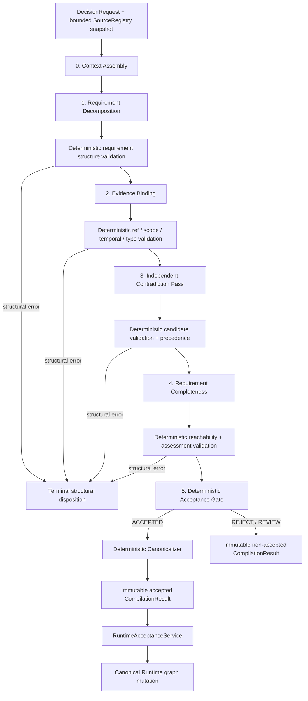
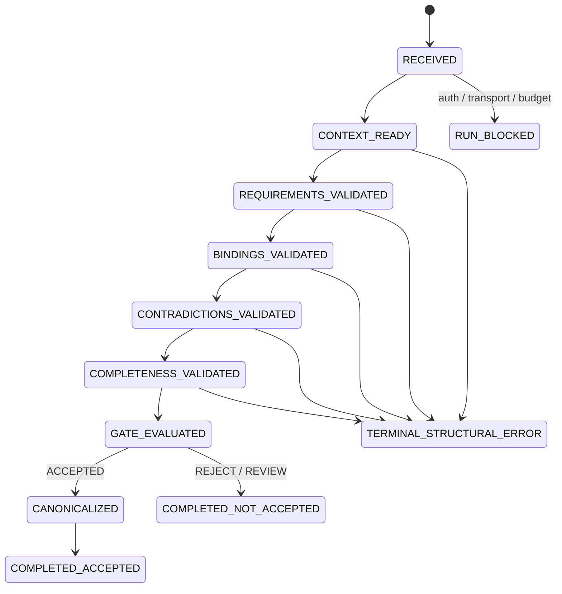

# 15 — Replacement Architecture: Requirement-Centred Compiler

## 文档状态

- Product owner 决策：**Option B 已批准**。
- 设计状态：**FOR REVIEW — 尚未实现**。
- 当前 vague critic：**已被架构决策否决**，不得作为最终 pipeline 保留。
- Option A（reasoner-only）：只保留为 ablation baseline，不是候选生产架构。
- Option C：不执行。
- 本文批准后才可编写 implementation plan；本文批准前不得修改 compiler 实现、生成 holdout case 或调用 live model。

## 决策依据

Experiment 1 已足以触发 K3：

- critic 只在 30 个 audited cases 中执行了 8 次；
- 新增的 5 次 block 全部是 false positive；
- 4 次虚构 `UNKNOWN_SOURCE_REQUIRED`；
- 1 次忽略已有的 transitive Claim → Claim / Decision requires Claim provenance；
- contradiction 与 omission cases 经常在 critic 之前被 validator 提前终止；
- critic 恢复 0 个 omission、发现 0 个 contradiction，却降低 precision、must-block compliance 与 acceptance coverage。

因此，问题不应被描述为“需要继续调 critic prompt”。旧架构同时混合了 requirement discovery、evidence checking、contradiction detection、completeness、severity 和 disposition，并且 pipeline 允许语义问题阻止对应语义 stage 执行。Option B 用显式 typed stages 取代该结构。

## 架构不变量

1. `Requirement` 是可审计的 semantic proposition，不是 source ref 的包装。
2. source identity、scope、temporal validity、authority class、precedence、canonicalization 和 final disposition 由 deterministic code 控制。
3. model 只能生成 immutable proposal；任何 model output 都不能直接写 canonical graph、Mission、Decision status、world snapshot 或 side effect state。
4. `CRITICAL` 表示反事实 materiality：该 source 的相关内容改变时，可能改变 requirement 或 decision validity。
5. 阅读过、相关或有解释价值，不足以成为 `CRITICAL`。
6. completeness 只评估 Stage 1 已显式声明的 requirements；它不能发明 requirement，也不能输出占位 source ref。
7. contradiction detection 是独立 typed semantic pass，不是 completeness 的副作用。
8. structural failure 可以提前终止；semantic incompleteness、contradiction、uncertainty 和 outcome mismatch 必须等相关 semantic passes 执行后，才由 final gate 处置。
9. canonical support 按 graph reachability 计算；不得要求每个 derived Claim 或 Decision 再重复添加 direct source edge。
10. Module 02、full 120-case paid benchmark 和 live Gemini acceptance 均不在本设计阶段执行。

## Replacement pipeline



Stage 3 和 Stage 4 无论发现何种 semantic condition 都运行到底。比如 evidence 不足时，Stage 3 仍需检查已知 authorities 是否互相矛盾；发现 unresolved contradiction 后，Stage 4 仍需给每个 explicit requirement 生成 completeness assessment。只有 malformed/unauthorized/stale/illegal typed input 等 structural errors 可以提前结束。

## Compiler execution state



`RUN_BLOCKED` 是 execution status，不是 semantic compilation disposition。Credential、transport、budget 或 provider outage 不能伪装成 `REJECTED_*`，更不能产生 canonical output。

## Typed contracts

以下四个类型是 immutable analysis IR。它们不是 Runtime entity，也没有 canonical mutation capability。所有 local IDs、source refs 和 cross-links 都必须经 deterministic validation 后才能进入下一 stage。

### 1. `Requirement`

```text
Requirement
  requirement_local_id: string
  proposition: string
  kind: FACT | RULE | AUTHORIZATION | EVIDENCE_PRESENCE | NEGATIVE_CONSTRAINT
  necessity: CRITICAL | SUPPORTING
  polarity: MUST_HOLD | MUST_NOT_HOLD
  depends_on_requirement_ids: list[string]
  applies_to_outcomes: non-empty list[outcome option]
  rationale_summary: string
```

约束：

- `proposition` 必须是独立可判定的语义命题，例如“requester 已完成当前安全培训”，不能是 `access-policy#training`。
- Stage 1 schema **禁止任何 source-ref 字段**。
- `depends_on_requirement_ids` 形成 DAG，并表达 requirement-level derivation；self-edge、unknown ID 和 cycle 是 structural error。
- `applies_to_outcomes` 只能取自 trusted request 提供的 outcome vocabulary，不能读取 benchmark expected outcome。
- `necessity=CRITICAL` 表示该命题不成立或证据不足时，相关 outcome 的 validity 会改变。
- 空 requirement set 或某个 `APPROVE` outcome 没有 applicable CRITICAL Requirement 是 semantic gap，不是 schema shortcut；pipeline 继续到 Stage 3/4，最终由 gate 拒绝。
- Stage 1 如果漏掉真实 requirement，Stage 4 不得“补猜”。该风险由独立 requirement ground truth 和 benchmark recall 暴露，而不是由另一个 open-ended critic 掩盖。

### 2. `EvidenceBinding`

```text
EvidenceBinding
  binding_local_id: string
  requirement_local_id: string
  source_ref: canonical SourceRef
  semantic_role: EVIDENCE | GOVERNING_AUTHORITY | SATISFACTION_RECORD | COUNTEREVIDENCE
  stance: SUPPORTS | OPPOSES
  materiality: CRITICAL | SUPPORTING
  validity_impact: MAY_CHANGE_VALIDITY | EXPLANATION_ONLY
  counterfactual_summary: string
```

约束：

- `source_ref` 必须来自 request-scoped `SourceRegistry` inventory，并在当前 world snapshot 下通过 identity、scope、temporal 和 authority validation。
- `CRITICAL` 当且仅当 `validity_impact=MAY_CHANGE_VALIDITY`；`SUPPORTING` 当且仅当 `EXPLANATION_ONLY`。deterministic code 强制字段一致性，benchmark 验证语义是否正确。
- `counterfactual_summary` 必须回答“这个 fragment 的相关内容变化时，哪个 requirement/outcome 可能改变”；它是 concise audit rationale，不是 chain-of-thought。
- `CONTEXTUAL` 不进入 binding contract。纯上下文仍可记录为 model-read telemetry，但不能成为 validity edge。
- Binding stage 追求 minimal sufficient set。相关但对 validity 无反事实影响的 evidence 必须是 `SUPPORTING` 或省略。
- Stage 2 不能创建 canonical edge，只能提出 binding。

### 3. `Contradiction`

```text
Contradiction
  contradiction_local_id: string
  requirement_local_id: string
  lhs_ref: canonical SourceRef
  rhs_ref: canonical SourceRef
  lhs_binding_id: string | null
  rhs_binding_id: string | null
  proposition: string
  contradiction_type:
    DIRECT_NEGATION | VALUE_MISMATCH | SCOPE_CONFLICT |
    TEMPORAL_CONFLICT | AUTHORITY_CONFLICT
  severity: CRITICAL | SUPPORTING
  model_resolvable_by_precedence: boolean
  model_recommended_disposition: BLOCK | HUMAN_REVIEW | IGNORE_AFTER_PRECEDENCE
  deterministic_resolution: LHS_PRECEDES | RHS_PRECEDES | UNRESOLVED
  precedence_rule_id: string | null
```

Ownership：

- model 提出 ref pair、semantic proposition、type、severity 和非权威 recommendation；
- deterministic code 验证 refs、scope、temporal validity、source classes、authority rank 和 pair identity；
- deterministic precedence policy 独立计算 `deterministic_resolution` 与 `precedence_rule_id`；model 的 `resolvable` 或 `recommended_disposition` 不能覆盖该结果；
- `lhs_binding_id` / `rhs_binding_id` 可以为空，因为 dedicated pass 必须能发现尚未被 Evidence Binding 选中的 relevant authoritative ref；若不为空，deterministic validator 必须验证 binding 与 ref 完全一致。

Stage 3 的输入是：explicit requirements、validated bindings、bounded inventory 中与这些 requirements 相关的 authoritative fragments、authority metadata 和 current snapshot。它不能访问 benchmark contradiction labels。

### 4. `RequirementAssessment`

```text
RequirementAssessment
  requirement_local_id: string
  status: SATISFIED | UNSATISFIED | CONTRADICTED | INSUFFICIENT_EVIDENCE
  critical_binding_ids: list[string]
  supporting_binding_ids: list[string]
  contradiction_ids: list[string]
  support_path_requirement_ids: list[string]
  missing_evidence_proposition: string | null
  assessment_summary: string
```

约束：

- 每个 explicit `Requirement` 必须且只能有一个 assessment。
- `critical_binding_ids`、`supporting_binding_ids` 和 `contradiction_ids` 必须引用前序 validated objects。
- `support_path_requirement_ids` 是 deterministic-validated DAG path，用于接受 transitive support；它不能凭空引入 requirement。
- `missing_evidence_proposition` 只能描述缺失的语义证据，例如“缺少当前培训状态的可验证记录”。它**没有 source-ref 类型**，不得包含 `UNKNOWN_SOURCE_REQUIRED` 或任何 invented ref。
- Completeness 不新增 binding、不改 materiality、不改 outcome，只评估 explicit requirement 是否有充分且一致的 evidence path。

## Canonical graph mapping 与 transitive semantics

新 analysis IR 不改变 Continuum 已有的 canonical reachability 语义：

```text
SourceFragment
    --SUPPORTED_BY / GOVERNED_BY[CRITICAL]-->
Claim(requirement leaf)
    --DERIVED_FROM / REQUIRES[CRITICAL]-->
Claim(derived requirement)
    --REQUIRES[CRITICAL]-->
Decision
```

从存储边方向看是 `Source → Claim → Claim → Decision`；从 dependency 视角看是 `Decision requires Claim`。两种叙述指向同一个 reachability invariant。

规则：

1. 一个 `Requirement` canonicalize 为一个 auditable Claim；requirement DAG canonicalize 为 Claim → Claim edges。
2. Evidence Binding 只在实际 evidence leaf 创建 SourceFragment → Claim edge。
3. completeness 用 validity-bearing `CRITICAL` edge closure 判断 support。
4. derived requirement 已经存在有效 transitive path 时，不要求 redundant direct SourceFragment → derived Claim 或 SourceFragment → Decision edge。
5. `SUPPORTING` edge 不参与 validity reachability，也不能触发 Runtime stale propagation。
6. Stage 3 发现但被 deterministic precedence 解决的 source pair保存在 compiler findings 中；只有经 gate 接受并由 canonicalizer 明确映射的 binding 才进入 Runtime graph。

这直接修复旧 critic 在 `vendor-onboarding-009` 中忽略 `derived_from_claims` 和 Decision `REQUIRES` path、强制要求重复 direct edges 的错误。

## Stage ownership

| Stage | Model ownership | Deterministic ownership | 不拥有 |
|---|---|---|---|
| Context Assembly | 无 | bounded inventory、allowed refs、snapshot、authority metadata、trusted outcome semantics | semantic requirement discovery |
| Requirement Decomposition | 提出 atomic propositions 与 requirement DAG | schema、IDs、DAG、outcome vocabulary、size limits | source refs、canonical claims、disposition |
| Evidence Binding | 提出 requirement↔source semantic bindings、materiality、counterfactual rationale | ref identity、scope、time、source type、authority legality、field consistency | canonical edges、precedence、acceptance |
| Contradiction Pass | 提出 semantic conflict candidates | candidate integrity、authority metadata、precedence、resolution | completeness、final disposition、state mutation |
| Requirement Completeness | 对 explicit requirements 提出 sufficiency assessment | graph closure、cross-link integrity、one-assessment-per-requirement、status consistency | 新 requirement、新 source ref、新 binding、outcome rewrite |
| Acceptance Gate | 无 | outcome constraints、all critical requirement coverage、contradiction policy、disposition | semantic invention、model retry |
| Canonicalizer | 无 | stable IDs、edge mapping、hash、ordering、dedupe | semantic repair、Runtime commit |
| RuntimeAcceptanceService | 无 | immutable accepted-result check、mission revision、world snapshot、atomic Runtime mutation | compiler semantics、LLM execution |

## Terminal 与 non-terminal semantics

### 可提前终止的 structural errors

| Error class | 最早发现位置 | Result |
|---|---|---|
| invalid JSON/schema after one bounded repair | corresponding model stage | `REJECTED_SCHEMA` |
| duplicate/unknown local ID、illegal enum、requirement cycle | post-stage structure validator | `REJECTED_INVALID_STRUCTURE` |
| unknown/fabricated source ref | Evidence/Contradiction validator | `REJECTED_INVALID_REFERENCE` |
| unauthorized/cross-scope ref | Evidence/Contradiction validator | `REJECTED_INVALID_REFERENCE` |
| disallowed historical or stale authority | Evidence/Contradiction validator | `REJECTED_STALE_SOURCE` |
| illegal source relation/authority class | Evidence validator | `REJECTED_INVALID_STRUCTURE` |
| internal invariant/persistence failure | orchestrator | run `FAILED`; no semantic disposition |
| credential/transport/provider/budget unavailable | orchestrator | run `BLOCKED`; no semantic disposition |

每个 terminal result 必须记录精确 `executed_stages`；未执行的 stage 明确为 `SKIPPED_STRUCTURAL_TERMINATION`，不能被展示成“未发现问题”。

### 不得提前终止的 semantic conditions

| Condition | 旧行为问题 | 新行为 |
|---|---|---|
| explicit requirement 没有 critical binding | validator 可能立即 incomplete | 继续 contradiction + completeness；gate 决定 incomplete |
| requirement set 为空或 APPROVE 无 applicable critical requirement | 容易被当成“无问题” | 继续 semantic passes；gate 产生 incomplete |
| blocking unresolved question | `BLOCKING_QUESTION_UNRESOLVED` 使 critic 跳过 | 表达为 `INSUFFICIENT_EVIDENCE` assessment；相关 semantic passes 全部执行 |
| high-risk proposal 暂无 support path | validator 立即 block | 继续全部 semantic passes；gate 检查最终 closure |
| conflicting authorities | 常被 incomplete 提前截断 | dedicated contradiction pass 必须执行并产出 typed finding |
| unresolved material contradiction | critic/reviewer 直接结束 | 继续 completeness；gate 产生 review/reject |
| proposed outcome 与 evidence 不一致 | reasoner 自行决定或漏检 | 继续 pipeline；gate 应用 trusted outcome semantics |
| model semantic uncertainty | vague unresolved question | assessment 为 `INSUFFICIENT_EVIDENCE`；gate deterministic 处置 |

## Deterministic Acceptance Gate

`DecisionRequest` 必须由 trusted caller 提供 `outcome_semantics`，将每个允许的 domain outcome 映射到 `APPROVE | DENY | REVIEW`。这不是 benchmark ground truth，也不暴露 case-specific allowed outcome。

Gate 按以下固定顺序执行：

1. 若 run 存在 structural terminal error，不进入 gate。
2. 验证每个 applicable `CRITICAL Requirement` 恰有一个 validated assessment；`APPROVE` 至少必须存在一个 applicable critical requirement，否则为 incomplete。
3. `APPROVE`：所有 applicable critical requirements 必须 `SATISFIED`，且每个都有至少一条 current、authorized、validity-bearing critical support path；不得有 unresolved CRITICAL contradiction。
4. `DENY`：必须至少有一个 applicable critical requirement 为 `UNSATISFIED`，或 deterministic policy 明确禁止该 outcome；单纯缺证据不能伪装成 `DENY`。
5. `REVIEW`：必须至少有一个 applicable critical requirement 为 `INSUFFICIENT_EVIDENCE` / `CONTRADICTED`，或存在 unresolved CRITICAL contradiction。
6. resolved contradiction 若 winning authority 与 proposed outcome 冲突，产生 `REJECTED_CONTRADICTION`；equal-authority unresolved critical conflict 产生 `NEEDS_HUMAN_REVIEW`。
7. requirement gap 产生 `REJECTED_INCOMPLETE_REQUIREMENTS`；outcome 与上述语义不符产生 `REJECTED_OUTCOME_CONSTRAINT`。
8. 只有 `ACCEPTED` 才调用 canonicalizer；其他 disposition 不包含 canonical Decision、Claim 或 Edge。

Gate 是 deterministic 的，但它不会把 probabilistic semantic labels magically 变成 truth。Requirement decomposition、binding materiality 和 semantic contradiction quality仍必须由 DEV/HOLDOUT/live-provider benchmark falsify。

## Old critic migration/removal plan

### M0 — Freeze，不再演进

- 将现有 `reasoner-v2 + critic-v1` 行为、prompt、schema、raw evidence 和 corrected evaluator 固定为 `legacy-critic-v1`。
- 不再调 `critic-v1` prompt，不再修成“看起来像”新架构。
- 历史 reports 保持 immutable。

### M1 — 从 active architecture 移除

- 实现开始时，`ModelDependencyCritic` / `DeterministicReviewGate` 从 v2 orchestrator 和默认候选生产 wiring 中移除。
- legacy adapter 只能由 benchmark 的显式 `pipeline=old-critic` 选择，不能接受 Runtime traffic。
- v2 failure 不得 fallback 到 old critic。
- reasoner-only 同样只能由 benchmark 显式选择。

### M2 — Parallel v2 contract

- 新 typed contracts 和 stage outputs 使用独立 version namespace；不得把旧 `CriticProposal` 字段复用成 requirement/contradiction/completeness 类型。
- 在 v2 通过 integrated DEV subset 前，generic model-backed compiler 保持 not accepted for product claims；deterministic reference demo不计 model evidence。
- persisted result 显式记录 `pipeline_version`、每个 stage 的 prompt/schema/model metadata、usage 和 execution status。

### M3 — Cutover

- 只有新架构通过 Experiment 5 progression gate 后，v2 才成为唯一可进入后续 full DEV evaluation 的 pipeline。
- old critic 的 product wiring、prompt export 和 API response field `critic_findings` 从 active surface 删除；必要的 legacy reader 留在 benchmark/report namespace，用于重放已有 evidence。
- 不保留 compatibility fallback。旧 report 中的 field 仍可由 versioned reader 解析。

### M4 — Final cleanup

- full DEV、locked holdout 和 live Gemini 全部 P0 PASS 后，删除非重放所需的旧 critic implementation/tests。
- 在此之前 Module 01 状态始终是 `NOT READY` 或 `REDESIGN REQUIRED`，不能称为 DONE。

## Benchmark integrity before implementation

### Frozen requirement annotation

现有 120 cases 的 refs/outcomes/mutations 不得修改。为评估 Stage 1，在写 v2 prompt/schema 前，由 method-blind annotation 单独生成 `requirement-ground-truth-v1`：

- 每个 case 只描述 semantic propositions、polarity、necessity 和 outcome applicability；
- 不复制 model output，不改变现有 required/forbidden refs；
- annotation 与 corpus file hashes 一起 freeze；
- production code/prompts 不得 import 或读取 annotation；
- 后续只能修客观 annotation bug，并以新版本和审计说明追加，不能覆盖历史版本。

### Locked generalization set

在任何 v2 prompt/schema/logic 实现之前一次性生成并 commit：

- 60 cases：3 domains × 20；
- 每个 domain 对现有 10 个 semantic classes 各 2 cases；
- semantic categories 与 DEV 相同，但 scenario family、task wording、source wording、fragment arrangement、source order 和 distractor layout 明显不同；
- 独立目录与 schema；production package 不得依赖；
- manifest 记录每文件 SHA-256、按路径排序的 aggregate SHA-256、authoring tool hash、schema version 和 freeze commit；
- 生成后不得为任何 individual holdout case 调 prompt、logic、threshold 或 ground truth；
- DEV 未通过前不得运行 holdout live inference。

这一步是设计批准后的 implementation Step 0；本次 design review 不生成 case。

## Ablation plan

### 三个 primary arms

| Arm | 目的 | 架构地位 |
|---|---|---|
| A — reasoner-only | 当前单 pass 能力下限 | baseline only；不得进入 final Runtime architecture |
| B — old critic pipeline | 已触发 K3 的历史二 pass | frozen legacy baseline；不得继续调优 |
| C — new requirement-centred pipeline | Option B 候选 | 唯一可能进入后续 acceptance 的架构 |

A/B 使用 Experiment 1 的 immutable paired reasoner evidence重算，不新增 legacy calls。C 使用同一个 frozen 30-case stratified subset、相同 task/source context、provider/model/service tier/reasoning settings 和 metric implementation；因 schema 与 call topology 是实验变量，prompt version 与 call count显式不同。报告必须同时披露 quality、accepted coverage、calls、latency 和总成本。

### Stage experiments

所有 live experiment 运行前必须 commit 一份 preregistration：hypothesis、code/prompt/schema hashes、case selection rule、max calls、worst-case reserved cost、success/failure interpretation。无 preregistration 不调用模型。

1. **Experiment 2 — Requirement + Evidence Binding**

   只跑预先按 class 选定的 DEV precision subset；检验 requirement recall、critical precision、supporting/critical separation 和 transitive support。成功信号：critical recall ≥ 0.92、precision ≥ 0.82、unknown refs = 0，且不要求 redundant direct edges。
2. **Experiment 3 — Dedicated Contradiction**

   只跑 DEV contradiction class；检验 pair recall、critical severity recall、precedence 和 equal-authority block。成功信号：两项 contradiction recall ≥ 0.90、must-block = 100%，且每个 case 的 contradiction stage 均执行。
3. **Experiment 4 — Deterministic Outcome Gate**

   只跑预先冻结的 must-block/outcome subset；检验 `APPROVE/DENY/REVIEW` mapping。成功信号：outcome compliance = 100%、must-block compliance = 100%，semantic condition 不造成 stage skip。
4. **Experiment 5 — Integrated three-arm DEV subset**

   在 frozen 30 cases 上比较 A/B/C。只有 C 同时满足所有现行 P0 quality thresholds、unsupported canonical refs = 0、所有 expected-accept cases被接受、所有 must-block cases不被接受、accepted mutation direction全部正确，才允许 Experiment 6。

### 后续 gate（本次不运行）

- Experiment 6：只有 Experiment 5 PASS 后才跑 full 120 DEV。
- Experiment 7：只有 full DEV 全 P0 PASS 后才首次运行 locked holdout；DEV 和 HOLDOUT 分开报告。
- Experiment 8：只有 OpenAI DEV + HOLDOUT 证明 methodology 成立后，才运行 required live Gemini acceptance。
- 任一阶段 FAIL，先停下产出 evidence-backed analysis，不机械继续后续付费实验。

### 共同 metrics

- requirement proposition recall；
- critical dependency recall / precision；
- CRITICAL↔SUPPORTING confusion matrix；
- contradiction recall / critical severity recall；
- outcome compliance / must-block compliance；
- accepted-case coverage 与 disposition confusion matrix；
- unsupported canonical refs；
- accepted-only stale escape / unnecessary invalidation，连同 denominator；
- compilation determinism；
- stage execution coverage；
- calls、input/cache-write/cache-read/output tokens、latency、settled cost。

不得再把 proposal-union recall、accepted canonical coverage 和 NOT_ACCEPTED mutation records混成同一指标。

## Regression requirements

实现必须新增 method-level fixtures，而不是 case-ID hacks：

- supporting ref 被错误提升为 CRITICAL → 保持 SUPPORTING 或省略；
- critical fragment 变化 → accepted Decision becomes STALE；
- supporting/irrelevant fragment 变化 → Decision stays VALID；
- equal-authority contradiction → dedicated pass发现且不能 silently ACCEPT；
- omission → assessment 为 insufficient，并在 gate block；
- existing Source → Claim → Claim → Decision path → completeness 接受，无 redundant direct edge；
- stale historical ref不能支持 accepted requirement；
- prompt injection 不能创建 authority edge；
- semantic incompleteness不能跳过 contradiction/completeness；
- reasoner-only / old critic / new architecture ablation routing准确；
- production compiler无法 import benchmark ground truth 或 holdout annotations。

## Falsification and stop rules

- K3 已经终止 current critic configuration；该结论不因 sunk cost 反转。
- 若 Experiment 2 不能同时达到 precision ≥ 0.82 和 recall ≥ 0.92，停止进入 contradiction integration，回报 `REDESIGN REQUIRED`。
- 若 Experiment 3 contradiction recall 或 critical severity recall低于 0.90，停止进入 integrated paid run，回报 `REDESIGN REQUIRED`。
- 若 Experiment 4 outcome 或 must-block不是 100%，停止 Experiment 5。
- 若 Experiment 5 未达到 progression gate，不运行 full 120。
- 若 full DEV PASS 但 locked holdout 任一 P0 metric FAIL，Module 01 为 `REDESIGN REQUIRED`；不得用 DEV 数字覆盖 generalization failure。
- 若要达标必须读取 ground truth、加入 domain/case/source-ref special case、把 refs 放宽到 whole-document 造成 K2，或让 model 直接决定 Runtime stale state，则推荐 narrow/kill，而不是继续调参。
- whole-project kill 仍由 product owner 决定；coding agent 只能依据 `13_ACCEPTANCE_MATRIX_AND_KILL_CRITERIA.md` 给出 `REDESIGN REQUIRED` 或 kill recommendation，不能自行降低 P0。

## Review checklist

Product owner 批准本设计时，应明确确认：

1. 四个 typed contracts 与 enum 是否足够稳定，可以进入 implementation plan；
2. `DENY` 与 `REVIEW` 的 deterministic outcome semantics 是否符合产品意图；
3. old critic 只保留 benchmark legacy reader、不保留 production fallback；
4. holdout 必须在 v2 实现前 freeze；
5. Experiment 5 前不跑 full 120，DEV PASS 前不打开 holdout。

设计批准不代表 Module 01 PASS。当前状态仍是 **REDESIGN REQUIRED**。
