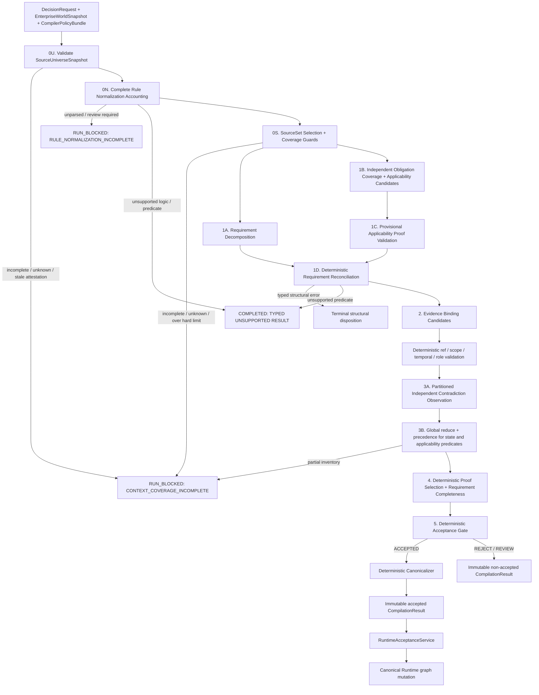

# 15 — Replacement Architecture: Requirement-Centred Compiler

## 文档状态

- Product owner 决策：**Option B 的方向已批准**。
- Product owner 评审：第一版与 Revision 2 具体规范均 **REJECTED**；Option B 方向仍获批准。
- 本文状态：**REVISION 3 — FOR PRODUCT-OWNER REVIEW，尚未批准实施**。
- Module 01：**REDESIGN REQUIRED**。
- 当前 vague critic：已被 K3 与产品决策否决，不得成为生产 fallback。
- Option A（reasoner-only）只保留为 ablation baseline；Option C 不执行。
- 本文获批前，不得编写 replacement implementation plan、修改 production compiler、生成或读取 blind holdout、调用 live model、运行 full 120 paid benchmark，或开始 Module 02。

## P0 产品边界

P0 只支持 **具有预注册、版本化 predicate catalog 与受信任 normalized governing-rule schema 的 gate-shaped enterprise approval decision classes**：一个 APPROVE 必须满足一组可识别的原子 gate，组合逻辑仅为 `DIRECT_ATOM | ALL_OF`。本模块不声称支持 arbitrary enterprise reasoning，也不允许 model 即席扩充 predicate vocabulary。

以下 governing logic 不在 P0 支持面内：

- `OR` / `ANY_OF`；
- threshold / quorum，例如“3 项中至少 2 项”；
- exception / override chains；
- quantified rules；
- 未归一化的 temporal、numeric range 或 cross-entity aggregation；
- 其他无法无损表示为 atomic predicate 与 conjunction 的形式。

任何与当前 Decision 相关的 governing source 包含上述逻辑，或无法被受信任的 normalized-rule representation 判定逻辑形态时，必须产生 typed `UnsupportedLogicResult` 并 fail closed；禁止把它压成 conjunction。任何 material applicable obligation 无法由当前 catalog 表达时，必须产生 typed `UnsupportedPredicateResult` / `REJECTED_UNSUPPORTED_PREDICATE`；model 不得创造 predicate code，compiler 不得忽略该 obligation。

## 决策依据

Experiment 1 已触发 K3：旧 critic 在 30 个 audited cases 中只执行 8 次，恢复 0 个 omission、发现 0 个 contradiction，虚构 4 个 `UNKNOWN_SOURCE_REQUIRED`，并新增 5 次 false block。第一版 Option B 又留下 11 个架构阻塞：Stage-1 omission、model-controlled materiality/severity、binary entailment、source-universe completeness、deterministic-policy provenance、lexical proof selection、窄化的 injection gate、非盲 holdout、contradiction truncation 和 unsupported logic。

Revision 2 保留 Option B 的职责拆分并实质性推进 P0-1～P0-11，但仍错误地把 applicability 当作 audit-only model label、把 normalized rule inventory 当作既定事实、让 selector 自证 universe completeness、把整个 SourceSetManifest 做成 super-dependency，并把 compiler-derived manifest 循环放回 input world snapshot。Revision 3 保留前一轮的 safety mechanisms，同时补入 applicability proof、normalization coverage proof、authoritative universe root、selective coverage provenance、三类 artifact lifecycle、method-blind DEV annotations、Gemini-before-holdout progression 与 explicit predicate-catalog boundary。

## 架构不变量

1. `Requirement` 是结构化 semantic proposition，不是 source ref；显示文本不是 identity。
2. Stage 1 不是 requirement coverage 的单点。独立 coverage pass 必须从完整 governing-source universe 发现遗漏的 material obligation。
3. model 只能输出 requirement、binding、entailment、contradiction observation 的候选；不能直接输出 canonical materiality、contradiction impact、disposition 或 Runtime mutation。
4. canonical `CRITICAL` 是 deterministic proof-selection 的结果：被选入必要 Requirement proof 的 binding 才是 validity-bearing。
5. model contradiction severity 仅为 advisory。是否 validity-critical 由 requirement reachability、proof eligibility、authority/preference 与 resolution state 计算。
6. evidence entailment 至少是 `ENTAILED_TRUE | ENTAILED_FALSE | INDETERMINATE`；`INDETERMINATE` 不能证明 DIRECT Requirement。
7. 编译只在 source universe 被声明并验证为对该 decision class 完整时运行。`INCOMPLETE | UNKNOWN` coverage 必须 fail closed。
8. authority、outcome、source selection、predicate、proof selection、logic support 和 partition rules 都是 versioned validity dependencies，不是 audit-only strings。
9. contradiction pass 必须覆盖完整 in-scope inventory；不得因 context limit 静默截断。
10. semantic omission、incompleteness、contradiction 与 ambiguity 不得在相应 semantic pass 之前终止。Structural corruption 可以提前终止。
11. canonical support 与 invalidation 使用 transitive graph reachability；不得要求 redundant direct source edges。
12. LLM output 永远不能直接修改 canonical Runtime state。
13. `APPLICABLE` 与参与 acceptance 的 `NOT_APPLICABLE` 都必须有 determinate、validity-bearing `ApplicabilityJustification`；model label 本身没有效力。
14. 每个 governing source fragment 必须在 `RuleNormalizationManifest` 中被完全核算；silent parser omission 绝不等价于 `NO_GOVERNING_RULE`。
15. `SourceSetManifest` 的 completeness 必须根植于 validated `SourceUniverseSnapshot`，不能由 selector 对自己可见的 catalog 循环自证。
16. coverage audit manifest 不是 whole-inventory super-dependency；Runtime 只保留会改变当前 Decision validity 的 coverage boundary、rule-set membership、applicability 与 selected proof dependencies。
17. `EnterpriseWorldArtifact`、`CompilerPolicyArtifact` 与 `CompilerDerivedArtifact` 使用独立 namespace/lifecycle；derived artifact 记录输入 snapshot，但不成为该 snapshot 的成员。
18. P0 未注册 predicate、未解析 rule、缺失 applicability proof 或不完整 universe 都 fail closed；不得将“无法表示/无法证明”解释为“不适用”。

## Artifact namespaces and trust boundary

三个 namespace 互不嵌套，也不通过修改历史 snapshot 来制造当前性：

```text
EnterpriseWorldArtifact
  enterprise source/content/state; immutable revision
  membership: EnterpriseWorldSnapshot

CompilerPolicyArtifact
  selector、normalizer、catalog、authority、outcome、proof、partition policy
  membership: CompilerPolicySnapshot

CompilerDerivedArtifact
  SourceSetManifest、RuleNormalizationManifest、coverage/partition certificates、
  ApplicabilityJustification set、DecisionInterpretation
  derivation: input_world_snapshot_id + source_universe_snapshot_id +
              compiler_policy_bundle_id + exact input/output hashes
  membership: CompilerProvenanceStore only; never the input world snapshot
```

`EnterpriseWorldSnapshot` 与 `CompilerPolicySnapshot` 都是 immutable views。一次 compilation 读取它们，随后把 content-addressed derived records 写入独立 provenance store；不能把刚生成的 manifest 伪装成其输入 snapshot 内“当前 SourceRef”。External/trusted guarantees 与 Continuum-proven guarantees 分开：

`SourceUniverseSnapshot` 是 authoritative registry 对一个 enterprise world view 的 signed snapshot envelope：它不是第四类 artifact，也不是其所枚举 world 的成员，更不是 compiler semantic output。它作为 trusted input root 存于 registry snapshot store；`RuleNormalizationManifest`、`SourceSetManifest` 等才是由它派生的 `CompilerDerivedArtifact`。

- 外部/受信任：registry/catalog 是 owner scope 的 authoritative source；connector 已同步到声明 watermark；签名者有 completeness/normalization authority；source bytes 与业务事实真实。
- Continuum 可证明：枚举、revision/hash、namespace/boundary 与 registry snapshot 一致；selection 只使用所声明 universe/policy；每个 fragment/rule/partition 被恰好核算；derived artifact 与 exact inputs/policies/hash 绑定；accepted proof 只引用 validated immutable identities。
- 外部 attestation 缺失、过期或不覆盖所需 namespace 时，Continuum 只能返回 `RUN_BLOCKED`，不能把局部一致性升级为 universe completeness。

## Versioned trusted inputs

### `CompilerPolicyBundle`

每次 compilation 都绑定一个 immutable policy bundle：

```text
CompilerPolicyBundle
  bundle_id: content-addressed ID
  schema_version: string
  compiler_policy_snapshot_id: string
  authority_precedence_policy_ref: CompilerPolicyRef
  authority_classification_policy_ref: CompilerPolicyRef
  outcome_semantics_policy_ref: CompilerPolicyRef
  source_universe_policy_ref: CompilerPolicyRef
  source_selection_policy_ref: CompilerPolicyRef
  rule_normalization_policy_ref: CompilerPolicyRef
  normalization_review_policy_ref: CompilerPolicyRef
  decision_class_contract_ref: CompilerPolicyRef
  predicate_catalog_ref: CompilerPolicyRef
  proof_selection_policy_ref: CompilerPolicyRef
  context_partition_policy_ref: CompilerPolicyRef
  supported_logic_policy_ref: CompilerPolicyRef
  additional_interpretation_policy_refs[]: CompilerPolicyRef
  bundle_hash: SHA-256
```

这些 refs 必须解析到独立 `CompilerPolicySnapshot` 中 immutable、trusted、versioned `CompilerPolicyArtifact` revisions，而不是企业 input world。任何实际参与 `DecisionJustification` 的 policy ref 都进入 canonical validity provenance；更新它必须能经 policy-change invalidation 使受影响的旧 Decision `STALE`。仅把 version ID 写进 metadata 不满足该要求。

```text
PolicyUsageTrace
  policy_ref: CompilerPolicyRef
  rule_keys_used[]
  input_hash: SHA-256
  output_hash: SHA-256
```

Every deterministic component that can alter universe boundary、rule normalization、applicability、Requirement identity、proof eligibility/selection、authority resolution、outcome/disposition、canonical mapping or coverage records a usage entry. Gate rejects `UNVERSIONED_POLICY_INPUT` if such a code path reads configuration not resolved from the bundle. `selected_policy_refs` comes from this trace, not a manually curated audit list。

### `SourceUniverseSnapshot`

Source selection 的 authoritative root 是 independently validated universe snapshot：

```text
SourceUniverseSnapshot
  universe_snapshot_id: content-addressed ID
  schema_version: string
  owner_scope: string
  authoritative_catalog_ref: EnterpriseWorldRef | external registry identity
  namespaces[]
  enumerated_artifacts[]:
    artifact_id / revision_id / representation_id / content_hash / namespace
  registry_version: string
  connector_versions[]
  sync_watermarks[]
  index_versions[]
  completeness_authority:
    authority_id / attestation_ref / signed_at / valid_through
  coverage_status: COMPLETE | INCOMPLETE | UNKNOWN
  snapshot_hash: SHA-256
```

Required chain is `SourceUniverseSnapshot → SourceSelectionPolicy → SourceSetManifest`。Validator 必须验证 owner scope、namespace coverage、watermark freshness、complete enumeration、hash 与 signer authority；没有 `COMPLETE` universe root，`SourceSetManifest` 不得声明 `DECLARED_COMPLETE`。

### `RuleNormalizationManifest`

Trusted normalization occurs before requirement discovery and has its own complete accounting proof：

```text
RuleNormalizationManifest                         # CompilerDerivedArtifact
  normalization_manifest_id: content-addressed ID
  schema_version: string
  input_world_snapshot_id: string
  source_universe_snapshot_id: string
  compiler_policy_bundle_id: string
  parser_id / parser_version
  reviewer_policy_ref: CompilerPolicyRef
  entries[]:                                      # every in-boundary source fragment exactly once
    source_revision_ref: EnterpriseWorldRef
    fragment_ref: EnterpriseWorldFragmentRef
    accounting_status: NORMALIZED_RULES | NO_GOVERNING_RULE |
                       UNSUPPORTED_LOGIC | UNSUPPORTED_PREDICATE |
                       UNPARSED_REVIEW_REQUIRED
    normalized_rule_ids[]
    parser_receipt_hash: SHA-256
    reviewer_or_signer_id?: string
    review_receipt_hash?: SHA-256
  normalized_rules[]:
    normalized_rule_id / obligation_keys[] / logic_form
    applicability_predicate_templates[] / requirement_predicate_templates[]
    source_fragment_refs[]
  coverage_receipts[]
  coverage_status: COMPLETE | INCOMPLETE | REVIEW_REQUIRED
  manifest_hash: SHA-256
```

每个 in-boundary fragment 必须恰好落入一条 accounting entry。`NORMALIZED_RULES` 至少映射一个 stable rule；`NO_GOVERNING_RULE` 需要 parser proof，并在 review policy 要求时需要 reviewer/signature；unsupported/unparsed 状态有显式来源但禁止 normal acceptance。空 parser output、漏 fragment 或缺 receipt 永远不是“没有规则”。Normalization manifest、parser、schema 与 reviewer policy 若参与 accepted semantics，均成为 selective validity provenance。

### `SourceSetManifest`

Context Assembly 必须生成并验证：

```text
SourceSetManifest
  manifest_id: content-addressed ID
  schema_version: string
  decision_class_id: string
  owner_scope: string
  input_world_snapshot_id: string
  source_universe_snapshot_id: string
  rule_normalization_manifest_id: string
  compiler_policy_bundle_id: string
  source_selection_policy_ref: CompilerPolicyRef
  selection_run_id: string
  retrieval/index/query_versions[]
  coverage_boundary:
    artifact_types[]
    logical_namespaces[]
    authority_classes[]
    temporal_boundary
  included_artifacts[]:
    artifact_id / revision_id / representation_id / content_hash
    included_fragment_refs[]
  excluded_artifacts[]:
    artifact_id / revision_id / reason_code
  governing_fragment_refs[]
  normalized_governing_rule_ids[]
  contradiction_eligible_fragment_refs[]
  coverage_status: DECLARED_COMPLETE | INCOMPLETE | UNKNOWN
  declared_complete_for_decision_class: boolean
  completeness_declaration_authority_ref: string
  coverage_boundary_semantic_key: SHA-256
  rule_set_membership_hash: SHA-256
  contradiction_eligibility_hash: SHA-256
  partition_plan_hash: SHA-256
  manifest_hash: SHA-256
```

`DECLARED_COMPLETE` 只能由 trusted selector 从 validated `COMPLETE` universe root、versioned selection policy 与 complete normalization manifest 推导，不能来自 model。Validator 必须对 universe/world snapshots、boundary、included/excluded inventory、revision/representation hashes、rule/contradiction sets 和 deterministic manifest hash 复算。

如果底层只提供 retrieved subset，selection policy 必须说明它如何对该 decision class 保证完整性，并记录 query/index/retriever versions。无法证明完整的 retrieval 返回 `UNKNOWN`，结果为 `RUN_BLOCKED: CONTEXT_COVERAGE_INCOMPLETE`，不得伪装成正常 `REJECTED_*` 或 `ACCEPTED`。

`SourceSetManifest` 是 immutable audit/derivation certificate，但**整个 manifest hash 不作为单一 CRITICAL super-dependency**。Canonical provenance 拆成：

```text
CoverageBoundaryDependency
  decision_class_id / owner_scope / universe namespace boundary
  universe authority + source-selection policy semantic keys

GoverningRuleSetDependency
  considered normalized governing rule IDs whose applicability/requirement status participated
  rule-set membership semantic key

ContradictionEligibilityDependency
  predicate/authority scope that was required for complete contradiction inventory
  eligibility semantic key

IndividualProofDependency
  only selected enterprise fragments/current-state bindings
```

Full included/excluded inventory 与 receipts 留在 audit derivation。Coverage impact evaluator 对 membership/policy/catalog change 以 deterministic semantic keys 计算受影响 Decision classes/rule guards；individual source content 仍只沿 selected proof、governing/applicability 或 contradiction-critical edges 传播。若无法证明某次 boundary change 与某 Decision 无关，安全策略可以对该 boundary 下的 Decision 广泛 revalidate，但必须报告为 coverage-induced invalidation，不能伪称精准。

## Stable semantic identity

显示命题不能决定 canonical identity。P0 使用：

```text
PredicateIdentity
  predicate_catalog_id: bundle-resolved stable catalog ID
  predicate_code: stable catalog key
  subject:
    entity_type: string
    entity_id: stable request/world identity
  comparator: IS | EQUALS | EXISTS | NOT_EXISTS
  typed_object: bool | string | integer | stable entity identity
  scope_qualifiers: canonical map
  temporal_qualifiers: canonical map
```

`predicate_catalog_id` must equal the identity resolved from `CompilerPolicyBundle.predicate_catalog_ref`; the Requirement itself contains no enterprise SourceRef. `predicate_semantic_key` 是上述 canonical JSON 的 hash，不包含 `proposition_display`、model local ID、case ID、domain name 或 source wording。

- DIRECT requirement ID 由 `predicate_semantic_key + expected_state + proof_contract` 派生。
- ALL_OF requirement 先递归 flatten nested conjunction、去重并按 child semantic key 排序，再由 child IDs 派生。
- validator 对 malformed identity 返回 structural failure；对 material normalized obligation 使用未知/不可表示 predicate 返回 typed `REJECTED_UNSUPPORTED_PREDICATE`。禁止 model 发明 code，也禁止 compiler 将 obligation 当成 NOT_APPLICABLE 或静默跳过。
- `proposition_display` 只用于审计和 UI；改变措辞不能改变 requirement ID、排序、proof slice 或 Runtime edges。
- predicate catalog revision 与 rule schema revision 若改变 accepted semantic key、proof contract 或 representability，必须通过 validity-bearing policy/rule-set provenance 使相应旧 Decision revalidate。

## Replacement pipeline



### Stage 0U / 0N / 0S — Universe、normalization and selection coverage

Deterministic Context Assembly first validates the authoritative `SourceUniverseSnapshot`; then a trusted normalizer/reviewer accounts for every in-boundary fragment in `RuleNormalizationManifest`; only then may the selector derive a `SourceSetManifest` and coverage guards from the universe root + selection policy. It identifies normalized governing rules、applicability predicate templates、contradiction-eligible fragments and coverage-preserving partitions. None of these stages performs model-authored requirement discovery。

Normalization is not allowed to silently return an empty rule list. `UNPARSED_REVIEW_REQUIRED` blocks execution；`UNSUPPORTED_LOGIC` and `UNSUPPORTED_PREDICATE` create explicit typed completed results with exact source/rule provenance and no canonical graph。

### Stage 1A — Requirement Decomposition

A model proposes the decision's atomic gate requirements and conjunction topology using stable `PredicateIdentity`. It receives the request, supported decision-class contract and allowed source context, but no benchmark labels。

### Stage 1B — Independent Governing-Obligation Coverage

This is a separate, narrowly scoped semantic pass. It receives the request、decision-class/predicate contracts and every current governing obligation in the validated manifest. It **does not receive Stage-1A output**. Its only question is: which material governing obligations apply to this decision?

It cannot judge outcome, search for generic omissions, assign canonical materiality/severity, invent refs, or emit disposition. It returns one typed applicability candidate and one or more semantic `RequirementCoverageCandidate` records for **every representable normalized governing obligation**, including provisionally NOT_APPLICABLE/INDETERMINATE obligations. Applicability may gate whether a Requirement becomes effective later；it may not erase the underlying semantic candidate before independent contradiction runs。

It uses a distinct prompt/schema and one or more deterministic governing-obligation partitions when the complete inventory does not fit one call. Every partition sees the same request/contracts and a disjoint normalized-obligation subset, never Stage-1A output. Deterministic validation requires all expected receipts and the processed-obligation-key union to equal the manifest rule inventory. Decomposition alone is never accepted as a fallback。

### Stage 1C — Provisional Applicability Proof Validation

Code—not the model label—validates binding eligibility and computes a **provisional** applicability proof from current candidates and normalized rule topology：

- `PROVISIONALLY_APPLICABLE`: every applicability predicate has an eligible current determinate binding matching its required state；
- `PROVISIONALLY_NOT_APPLICABLE`: at least one predicate has an eligible current determinate binding proving the opposite; the stable first failed predicate by semantic key forms the candidate non-applicability guard；
- `INDETERMINATE`: no valid proof of either state、missing predicate binding or ambiguous/expired evidence。

This stage outputs `ApplicabilityProofCandidate`, not canonical `ApplicabilityJustification`. Every applicability predicate and conditional Requirement candidate is retained for Stage 2/3. Stage 4 applies independent contradiction/precedence results and only then finalizes APPLICABLE、NOT_APPLICABLE or INDETERMINATE. Thus an incorrect N/A proposal cannot remove a Requirement from semantic analysis；`INDETERMINATE` is not an early escape。

### Stage 1D — Deterministic Requirement Reconciliation

Code compares 1A and 1B by stable semantic key：

- matching candidates coalesce into one conditional Requirement candidate；
- every valid coverage-only candidate remains in the reconciled candidate inventory with `origin=COVERAGE_PASS` and continues through Evidence Binding, even when provisional applicability is N/A/indeterminate；
- conflicting expected states or incompatible topology become `REQUIREMENT_RECONCILIATION_CONFLICT` and cannot accept；
- material unknown predicate identity yields `REJECTED_UNSUPPORTED_PREDICATE`; unsupported logical form yields `REJECTED_UNSUPPORTED_LOGIC`；
- no candidate may create a source ref: every provenance anchor must already exist in the manifest。

A structurally valid but missing/conflicting semantic candidate is recorded as a coverage gap and does not skip Stage 3：normalized rule/applicability target keys remain in the contradiction plan, Stage 4 cannot finalize a complete proof, and Gate rejects. Only malformed schema/identity/ref may take structural early termination。

This mechanism can recover a Stage-1 omission without recreating the old critic because its input, question, output and write contract are narrow and outcome-blind。

### Stage 2 — Evidence Binding

The model proposes semantic roles、entailment and counterfactual analysis for every reconciled supported DIRECT Requirement candidate. It does **not** output canonical `CRITICAL | SUPPORTING`。Stage 4 ignores business-state proof for obligations finally proved NOT_APPLICABLE, but collecting it prevents a wrong provisional N/A from hiding an obligation in the same run。

### Stage 3 — Independent Contradiction

An independent map pass observes all contradiction-eligible source propositions relative to stable requirement **and applicability** predicates. Deterministic reduce verifies full coverage, joins observations across partitions, constructs conflicts and applies versioned authority precedence. The pass is independent of Stage-1B/Stage-2 selected refs, so an omitted applicability conflict or factual binding cannot be hidden by candidate selection。

Contradiction observations never become EvidenceBindings or canonical edges. If deterministic precedence selects a source that has no matching validated Stage-2 binding candidate, Stage 4 has no selectable proof for that role and the Requirement is insufficient；Stage 3 cannot promote it as a repair。

### Stage 4 — Deterministic proof selection and completeness

Code first reduces applicability contradictions/precedence and finalizes each `ApplicabilityJustification`. Final APPLICABLE obligations enter the effective Requirement set；final NOT_APPLICABLE obligations remain excluded but retain validity-bearing false guards；INDETERMINATE/conflicted obligations prevent acceptance. Code then selects proof bindings、derives canonical materiality/contradiction impact and computes every effective `RequirementAssessment`. No model call occurs。

### Stage 5 — Deterministic acceptance

Code computes expected outcome/disposition and, for accepted APPROVE/DENY only, emits a stable `DecisionJustification`. The canonicalizer consumes only that proof slice。

## Typed contracts

All contracts are immutable analysis IR. Only deterministic validators may convert model candidates into validated objects。

### `Requirement`

```text
Requirement
  requirement_id: deterministic semantic ID
  predicate_identity: PredicateIdentity | null       # DIRECT only
  proposition_display: string                        # non-authoritative
  kind: FACT | RULE | AUTHORIZATION | EVIDENCE_PRESENCE | NEGATIVE_CONSTRAINT
  expected_state: TRUE | FALSE
  logical_form: DIRECT_ATOM | ALL_OF
  child_requirement_ids[]                            # ALL_OF only
  required_proof_roles[]                             # derived from predicate/decision contract
  origin: DECOMPOSITION | COVERAGE_PASS | BOTH
  governing_obligation_keys[]
  rationale_summary: string
```

Rules：

- `DIRECT_ATOM` has a stable predicate and no children。
- `ALL_OF` has no independent predicate; children are flattened, deduped and sorted deterministically。
- Every Requirement is necessary for APPROVE validity. There is no SUPPORTING Requirement。
- `required_proof_roles` is derived from the versioned predicate/decision contract, not freely authored by the model. A policy-derived gate may require both `GOVERNING_AUTHORITY` and `STATE_EVIDENCE` proof roles。
- `governing_obligation_keys` identify normalized rule records, not source refs. Their provenance is carried by bindings。
- Unsupported OR/threshold/exception/quantified forms cannot enter this type。

### Requirement coverage and applicability proof contracts

```text
RequirementCoverageObservation               # model output, one per obligation
  governing_obligation_key: string
  normalized_rule_id: string
  proposed_applicability: APPLICABLE | NOT_APPLICABLE | INDETERMINATE
  applicability_binding_candidates[]: ApplicabilityBindingCandidate
  applicability_summary: string
  requirement_candidate_local_ids[]

ApplicabilityBindingCandidate                 # model output; no canonical authority
  binding_local_id: string
  normalized_obligation_key: string
  applicability_predicate_identity: PredicateIdentity
  source_ref: EnterpriseWorldFragmentRef
  entailment: ENTAILED_TRUE | ENTAILED_FALSE | INDETERMINATE
  normalized_value?: typed value
  observed_at / valid_at

RequirementCoverageReceipt
  partition_id: string
  source_set_manifest_id: string
  rule_normalization_manifest_id: string
  processed_obligation_keys[]
  output_hash: SHA-256
```

The deterministic coverage plan records expected partition IDs and obligation-key membership. Across all receipts, every normalized governing obligation key in the manifest must appear exactly once and every representable obligation must map to typed Requirement candidates even when proposed N/A. `proposed_applicability` is advisory；the validator checks allowed predicate identities、ref currentness/scope、temporal validity、authority and entailment shape, then selects provisional proof candidates。

```text
ApplicabilityProofCandidate                   # deterministic Stage-1C analysis, not canonical
  normalized_obligation_key: string
  provisional_state: PROVISIONALLY_APPLICABLE | PROVISIONALLY_NOT_APPLICABLE | INDETERMINATE
  applicability_predicate_semantic_keys[]
  eligible_current_binding_ids[]
  provisional_false_guard_predicate_key?: string
  candidate_semantic_key: SHA-256

ApplicabilityJustification                    # Stage-4 finalized CompilerDerivedArtifact
  applicability_justification_id: content-addressed ID
  normalized_obligation_key: string
  normalized_rule_id: string
  applicability: APPLICABLE | NOT_APPLICABLE
  applicability_predicate_semantic_keys[]
  expected_predicate_states[]
  selected_current_binding_ids[]
  selected_false_guard_predicate_key?: string # stable NOT_APPLICABLE proof path
  governing_source_fragment_refs[]
  relevant_policy_refs[]: CompilerPolicyRef
  input_world_snapshot_id: string
  stable_semantic_key: SHA-256
  proof_receipt_hash: SHA-256
```

Stage 4 may finalize `APPLICABLE` only when selected bindings determinately satisfy **all** applicability predicates after global contradiction/precedence reduction. It may finalize `NOT_APPLICABLE` only when at least one selected binding determinately falsifies a condition；the canonical guard is chosen by predicate semantic key、authority tier、stable source identity and binding key. Missing/ambiguous/expired/unresolved-conflicted evidence produces `INDETERMINATE`, not a justification. Both finalized determinate outcomes are validity-bearing when acceptance depends on including or excluding the obligation。

```text
RequirementCoverageCandidate                 # model output
  candidate_local_id: string
  predicate_identity: PredicateIdentity
  proposition_display: string
  expected_state: TRUE | FALSE
  logical_form: DIRECT_ATOM | ALL_OF
  child_predicate_semantic_keys[]
  governing_obligation_key: string
  governing_source_fragment_refs[]: existing EnterpriseWorldFragmentRef
  applicability_summary: string
  detected_logic_form: DIRECT_ATOM | ALL_OF | UNSUPPORTED
  unsupported_logic_kind?: OR | THRESHOLD | EXCEPTION | QUANTIFIED | OTHER

RequirementCoverageResult                    # validated result
  observations[]
  applicability_proof_candidates[]
  candidates[]
  receipts[]
  coverage_status: COMPLETE | INDETERMINATE
  finding_codes[]
```

Model output is a semantic requirement/applicability candidate with real provenance anchors, never `UNKNOWN_SOURCE_REQUIRED`. Validator checks every ref、obligation key and predicate identity against the universe/selection/normalization manifests and verifies complete obligation/candidate coverage. Malformed/fabricated refs are structural failures；missing a representable obligation's Requirement candidate is a typed coverage conflict, not N/A. All supported candidates remain live through Evidence Binding and contradiction；semantic `INDETERMINATE` yields fail-closed coverage at the gate. A model-authored `NOT_APPLICABLE` cannot suppress a Requirement candidate。

### `EvidenceBindingCandidate` and validated `EvidenceBinding`

```text
EvidenceBindingCandidate                     # model output
  binding_local_id: string
  requirement_id: string
  source_ref: EnterpriseWorldFragmentRef
  semantic_role: GOVERNING_AUTHORITY | STATE_EVIDENCE |
                 AUTHORIZATION_RECORD | SATISFACTION_RECORD | CONTEXT
  entailment_target: NORMALIZED_OBLIGATION | REQUIREMENT_PREDICATE
  entailment: ENTAILED_TRUE | ENTAILED_FALSE | INDETERMINATE
  normalized_value?: typed value
  counterfactual_summary: string

EvidenceBinding                              # deterministic validated object
  candidate: EvidenceBindingCandidate
  authority_class: trusted classification
  proof_eligibility: ELIGIBLE | INELIGIBLE
  eligibility_finding_codes[]
  selected_proof_role?: semantic role
  proof_role: SELECTED_PROOF | UNSELECTED_SUPPORT | ANALYSIS_ONLY
  canonical_materiality: CRITICAL | SUPPORTING | NONE
```

Rules：

- Model contract contains no canonical materiality field。
- Ref existence、scope、snapshot、authority class、role legality and predicate compatibility are deterministic checks。
- `GOVERNING_AUTHORITY` targets `NORMALIZED_OBLIGATION`；state/authorization/satisfaction evidence targets `REQUIREMENT_PREDICATE`. Applicability predicates use the separate `ApplicabilityBindingCandidate` contract. A policy saying “training is required” does not prove either that the policy applies to this entity or that training is current。
- A reconciled applicable Requirement needs the normalized rule/rule-set dependency plus the validated `APPLICABLE` justification and selected required-role proof. A conflicting applicability observation is handled by Stage 3/4 and cannot be treated as ordinary factual DENY。
- `INDETERMINATE` cannot satisfy/refute a DIRECT Requirement and is never `SELECTED_PROOF`。
- For each required proof role, proof selector considers only eligible, determinate bindings after authority resolution and selects by versioned proof policy: authority/preference tier, stable source identity, then binding semantic key。
- Selected bindings become `CRITICAL`. Unselected explanatory bindings become `SUPPORTING`; irrelevant/ineligible/indeterminate observations are analysis-only and have no canonical edge。
- An incorrect model suggestion can cause insufficient evidence or a measured semantic error, but a model cannot label a selected proof SUPPORTING to cause stale escape。

### `ContradictionObservation`, `ContradictionCandidate` and `Contradiction`

```text
ContradictionObservation                     # independent model map output
  observation_local_id: string
  partition_id: string
  target_predicate_semantic_key: string
  requirement_id?: string
  normalized_obligation_key?: string
  source_ref: EnterpriseWorldFragmentRef
  entailment_target: APPLICABILITY_PREDICATE | REQUIREMENT_PREDICATE
  entailment: ENTAILED_TRUE | ENTAILED_FALSE | INDETERMINATE
  normalized_value?: typed value
  proposition_display: string
  model_severity_advisory: CRITICAL | SUPPORTING | UNKNOWN

ContradictionCandidate                       # deterministic global join
  contradiction_id: deterministic ID
  target_predicate_semantic_key: string
  requirement_id?: string
  normalized_obligation_key?: string
  lhs_observation_id: string
  rhs_observation_id: string
  contradiction_type: DIRECT_NEGATION | VALUE_MISMATCH |
                      SCOPE_CONFLICT | TEMPORAL_CONFLICT | AUTHORITY_CONFLICT

Contradiction                                # deterministic validated record
  candidate: ContradictionCandidate
  resolution: LHS_PRECEDES | RHS_PRECEDES | UNRESOLVED
  precedence_policy_ref: CompilerPolicyRef
  precedence_rule_key?: string
  affected_root_requirement_ids[]
  affected_applicability_guard_keys[]
  lhs_proof_eligibility: ELIGIBLE | INELIGIBLE
  rhs_proof_eligibility: ELIGIBLE | INELIGIBLE
  deterministic_impact: VALIDITY_CRITICAL | NON_BLOCKING
  impact_finding_codes[]
```

Only determinate opposing observations over the same stable predicate **and entailment target** can form a contradiction. `deterministic_impact=VALIDITY_CRITICAL` iff the conflict affects an applicability guard or effective Requirement reachable to a Decision root, at least one side is proof-eligible for a required role/guard, and authority/preference state either remains unresolved or changes which truth can be selected. Model severity/recommendation never participates in this calculation。

### `ContradictionCoveragePlan`

```text
ContradictionCoveragePlan
  policy_ref: CompilerPolicyRef
  eligible_fragment_refs[]
  requirement_ids[]
  applicability_obligation_keys[]
  target_predicate_semantic_keys[]
  hard_limits:
    max_fragments / max_requirements / max_tokens_per_partition /
    max_partitions / max_observations
  partitions[]:
    partition_id / ordered_fragment_refs[] / input_hash
  expected_partition_ids[]
  plan_hash: SHA-256

ContradictionCoverageReceipt
  partition_id
  input_hash
  processed_fragment_refs[]
  observation_ids[]
  output_hash
```

Partitioning is deterministic over stable refs and token counts. Every eligible ref is assigned exactly once; reduce verifies union equality, no unexpected ref, every expected receipt, matching input hash and bounded output. Cross-partition conflicts are found by global join on stable requirement/predicate keys. Exceeded hard limit、truncation、timeout、missing receipt or partial union yields `RUN_BLOCKED: CONTEXT_COVERAGE_INCOMPLETE`; partial output can be audited but never reported as a complete contradiction pass。

### `RequirementAssessment`

```text
RequirementAssessment
  requirement_id: string
  status: SATISFIED | UNSATISFIED | CONTRADICTED | INSUFFICIENT_EVIDENCE
  selected_proof_binding_ids[]
  supporting_binding_ids[]
  contradiction_ids[]
  support_paths[][]
  blocking_requirement_ids[]
  finding_codes[]
  assessment_summary: deterministic template
  applicability_justification_ids[]
```

DIRECT truth table after precedence/proof selection：

| Selected required-role evidence | Result |
|---|---|
| every applicable obligation has a validated APPLICABLE justification and every state role matches `expected_state` | `SATISFIED` |
| every applicable obligation has a validated APPLICABLE justification and all state roles are covered but at least one selected state is opposite, with no unresolved critical conflict | `UNSATISFIED` |
| unresolved validity-critical contradiction | `CONTRADICTED` |
| any required role absent or only `INDETERMINATE` | `INSUFFICIENT_EVIDENCE` |

An applicability predicate conflict against an `APPLICABLE` or `NOT_APPLICABLE` justification is validity-critical and fails closed after the independent contradiction pass；it is not evidence that the business Requirement itself is true or false。

ALL_OF uses: any `CONTRADICTED` → `CONTRADICTED`; else any `UNSATISFIED` → `UNSATISFIED`; else all `SATISFIED` → `SATISFIED`; else `INSUFFICIENT_EVIDENCE`。

Completeness evaluates the reconciled effective Requirement set, not only Stage-1A output. It cannot invent requirements, refs, bindings or placeholder refs。

### `UnsupportedLogicResult` and `UnsupportedPredicateResult`

```text
UnsupportedLogicFinding
  finding_id: deterministic ID
  governing_source_ref: EnterpriseWorldFragmentRef
  normalized_rule_key?: string
  logic_kind: OR | THRESHOLD | EXCEPTION | QUANTIFIED | UNPARSED | OTHER
  affected_predicate_keys[]
  detector: INGESTION_RULE_SCHEMA | COVERAGE_PASS | REQUIREMENT_VALIDATOR
  detail_code: string

UnsupportedLogicResult
  run_status: COMPLETED
  disposition: REJECTED_UNSUPPORTED_LOGIC
  findings[]
  canonical_output: none
```

Governing sources used for normal P0 acceptance must expose a trusted normalized-rule representation whose logic form is verifiable. It must be source-authored structured policy or produced by a versioned controlled ingestion parser and independently approved/signed; an unreviewed model normalization is not trusted acceptance evidence. Raw prose can be read as context, but if its applicable rule cannot be normalized to P0 forms, the run fails closed。

```text
UnsupportedPredicateFinding
  finding_id: deterministic ID
  normalized_rule_id / governing_obligation_key
  governing_source_fragment_refs[]
  unrepresentable_semantic_shape: string
  predicate_catalog_ref: CompilerPolicyRef
  catalog_schema_version: string
  detail_code: MATERIAL_OBLIGATION_NOT_REPRESENTABLE

UnsupportedPredicateResult
  run_status: COMPLETED
  disposition: REJECTED_UNSUPPORTED_PREDICATE
  findings[]
  canonical_output: none
```

This result is not an invitation to add a case-specific code. Catalog changes follow a separately reviewed/versioned policy artifact and invalidate only Decisions whose semantic identity、proof contract、rule membership or applicability guard is affected。

## Stage ownership

| Stage | Model owns | Deterministic code owns | Explicitly forbidden |
|---|---|---|---|
| 0U Universe | nothing | authoritative catalog binding、namespace enumeration、watermark/attestation/hash validation | self-declared completeness、semantic requirement discovery |
| 0N Normalization | nothing in acceptance path | fragment accounting、trusted parser/reviewer receipts、normalized rule/schema validation | silent omission、unreviewed model normalization |
| 0S Selection | nothing | SourceSet、coverage guards、rule/contradiction inventory、limits、partition plan | whole-manifest super-dependency |
| 1A Decomposition | typed requirement candidates + outcome proposal | semantic IDs、schema、P0 logic validation、normalization | refs、materiality、disposition |
| 1B Coverage | independent obligation/applicability candidates | receipt completeness | seeing 1A output、canonical applicability、outcome judgment |
| 1C Applicability | nothing | binding eligibility、stable provisional proof candidate、INDETERMINATE | trusting model label、dropping N/A Requirement candidates、finalizing before contradiction |
| 1D Reconciliation | nothing | merge all supported candidates by semantic key、origin、coverage/unsupported result | lexical matching as authority、early N/A suppression |
| 2 Evidence | role/entailment/counterfactual candidates | eligibility、authority metadata、proof policy inputs | canonical CRITICAL/SUPPORTING、canonical edges |
| 3 Contradiction | partition observations + advisory severity | coverage proof、global join、precedence、impact | canonical severity、binding promotion、disposition |
| 4 Proof/Completeness | nothing | contradiction-aware final applicability、effective set、proof selection、materiality、truth table、reachability、assessments | semantic invention、outcome rewrite |
| 5 Gate | nothing | expected class、disposition、stable justification | model retry or semantic repair |
| Canonicalizer | nothing | IDs、proof/guard graph、selective policy/coverage provenance、hash、dedupe | adding omitted evidence/requirements、embedding whole inventory as CRITICAL |
| RuntimeAcceptanceService | nothing | derivation binding、current snapshots/policies、atomic Runtime mutation | inserting derived artifacts into historical input snapshot、compiler/model semantics |

## Terminal and non-terminal semantics

### Early structural termination

- malformed typed output after one bounded schema repair；
- duplicate/unknown local IDs、invalid enum、invalid canonical semantic identity or cycle；
- fabricated/unauthorized/cross-scope/stale source ref；
- manifest/hash/world-snapshot mismatch；
- illegal source role or authority-class relation；
- inconsistent typed cross-link。

These produce explicit structural disposition and `SKIPPED_STRUCTURAL_TERMINATION` for downstream stages. They never produce canonical output。

### Execution blocking

- credential/provider/transport/budget unavailable；
- source universe `INCOMPLETE | UNKNOWN`、stale/missing completeness attestation；
- normalization coverage `INCOMPLETE | REVIEW_REQUIRED`、missing fragment accounting/reviewer receipt；
- contradiction coverage plan exceeds hard limits；
- any partition timeout/truncation/missing receipt/coverage mismatch。

These produce `RUN_BLOCKED` with no semantic disposition or canonical output. Partial analysis remains evidence only。

### Semantic fail-closed results

- applicable unsupported logic → `REJECTED_UNSUPPORTED_LOGIC`；
- material obligation not representable by the frozen predicate catalog → `REJECTED_UNSUPPORTED_PREDICATE`；
- unreconciled coverage candidate/conflicting requirement identity → `REJECTED_REQUIREMENT_COVERAGE`；
- applicability without determinate proof → `REJECTED_REQUIREMENT_COVERAGE`；
- insufficient determinate evidence → `REJECTED_INCOMPLETE_REQUIREMENTS` or `NEEDS_HUMAN_REVIEW` according to proposal class；
- unresolved validity-critical contradiction → `NEEDS_HUMAN_REVIEW`；
- outcome mismatch → `REJECTED_OUTCOME_CONSTRAINT` / `REJECTED_CONTRADICTION`。

Missing evidence、applicability `INDETERMINATE`、contradiction or low confidence are not structural errors. Once inputs are structurally valid, Stage 3 must cover both applicability and requirement predicates, and Stage 4 must assess them before Stage 5 decides。Only invalid input shape/identity/ref can skip these semantic passes。

### Exact result matrix

| Condition | `run_status` | Disposition | Downstream behavior |
|---|---|---|---|
| model schema invalid after one repair | `COMPLETED` | `REJECTED_SCHEMA` | later stages `SKIPPED_STRUCTURAL_TERMINATION` |
| invalid semantic/local ID、cycle、receipt duplicate/unexpected key | `COMPLETED` | `REJECTED_INVALID_STRUCTURE` | structural termination |
| deterministic semantic path reads unregistered config | `COMPLETED` | `REJECTED_INVALID_STRUCTURE` (`UNVERSIONED_POLICY_INPUT`) | no gate/canonical output |
| fabricated、unauthorized、cross-scope or stale ref | `COMPLETED` | `REJECTED_INVALID_REFERENCE` | structural termination |
| policy/manifest hash or derivation/world binding invalid | `COMPLETED` | `REJECTED_INVALID_STRUCTURE` | structural termination |
| SourceUniverse/SourceSet incomplete/unknown or hard cap exceeded | `BLOCKED` | none | no semantic/canonical result |
| normalization accounting incomplete/unparsed/review-required | `BLOCKED` | none | no semantic/canonical result；no empty-rule fallback |
| provider、credential、transport or budget unavailable | `BLOCKED` | none | no fallback to another semantic architecture |
| coverage/contradiction invocation truncated or receipt absent after transport failure | `BLOCKED` | none | partial output audit-only |
| governing applicability `INDETERMINATE` or reconciliation conflict | continues | none yet | Stage 3/4 run；Gate rejects requirement coverage |
| unsupported governing logic | `COMPLETED` | `REJECTED_UNSUPPORTED_LOGIC` | exact source/rule provenance；no canonical output |
| material obligation outside predicate catalog | `COMPLETED` | `REJECTED_UNSUPPORTED_PREDICATE` | exact source/rule/catalog provenance；no canonical output |
| evidence entailment `INDETERMINATE` | continues | none yet | Stage 3/4 run；assessment may be insufficient |
| missing proof binding | continues | none yet | Stage 3/4 run；Gate decides incomplete/review |
| unresolved validity-critical contradiction | continues | none yet | Stage 4 runs；Gate returns human review |
| contradiction partition partial/mismatched | `BLOCKED` | none | cannot report contradiction completion |
| internal persistence/invariant defect | `FAILED` | none | no canonical output |

## Deterministic acceptance gate

Preconditions for any normal gate evaluation：

1. active `EnterpriseWorldSnapshot`、`CompilerPolicyBundle` and their immutable hashes validate；
2. `SourceUniverseSnapshot=COMPLETE`、`RuleNormalizationManifest=COMPLETE` and `SourceSetManifest=DECLARED_COMPLETE` for the decision class；
3. Runtime-selective coverage boundary/rule-set/contradiction-eligibility guards have been derived；
4. every governing obligation has a validated `APPLICABLE | NOT_APPLICABLE` justification；
5. all contradiction partitions and receipts validate complete for applicability and requirement predicates；
6. no unsupported logic/predicate or unreconciled requirement coverage conflict exists；
7. every effective Requirement has exactly one deterministic assessment；
8. canonical materiality has been derived from proof selection, not accepted from a model field。

Expected outcome class：

- root closure contains unresolved `VALIDITY_CRITICAL` contradiction → `REVIEW`；
- else all roots `SATISFIED` → `APPROVE`；
- else any root `UNSATISFIED` → `DENY`；
- else → `REVIEW`。

Disposition：

- expected REVIEW from contradiction → `NEEDS_HUMAN_REVIEW` for any model proposal；
- expected REVIEW from insufficient evidence: REVIEW proposal → `NEEDS_HUMAN_REVIEW`; APPROVE/DENY proposal → `REJECTED_INCOMPLETE_REQUIREMENTS`；
- expected APPROVE/DENY but proposal class differs → `REJECTED_OUTCOME_CONSTRAINT`，或 precedence winner directly causes mismatch 时 `REJECTED_CONTRADICTION`；
- only matching APPROVE/DENY with all preconditions can be `ACCEPTED`。

```text
DecisionJustification
  outcome_class: APPROVE | DENY
  selected_root_requirement_ids[]
  selected_requirement_ids[]
  selected_proof_binding_ids[]
  applicability_justification_ids[]
  selected_policy_refs[]
  compiler_derived_artifact_ids[]
  coverage_boundary_dependency_keys[]
  governing_rule_set_dependency_keys[]
  contradiction_eligibility_dependency_keys[]
  derivation_binding_hash: SHA-256
  semantic_proof_key: SHA-256
  selection_rule: ALL_APPROVAL_ROOTS | STABLE_FAILED_PROOF_PATH
```

APPROVE selects all satisfied root closures. DENY selects one failed proof path with the smallest tuple：

```text
(
  failure_class_priority from proof_selection_policy,
  failed DIRECT predicate_semantic_key,
  sorted selected proof SourceRef identities,
  flattened canonical path topology hash
)
```

`proposition_display`、model local ID、case ID、domain 和 iteration order 均不参与选择。相同 structured semantics/context 下的 paraphrase 必须得到相同 proof slice。

## Canonical graph and Runtime invalidation

```text
EnterpriseWorldFragment(selected proof / governing rule)
    --SUPPORTED_BY / GOVERNED_BY[CRITICAL]-->
Claim(DIRECT requirement assessment)
    --DERIVED_FROM / REQUIRES[CRITICAL]-->
Claim(ALL_OF requirement assessment)
    --REQUIRES[CRITICAL]-->
Decision

EnterpriseWorldFragment(selected applicability fact)
    --SUPPORTED_BY[CRITICAL]-->
Claim(ApplicabilityGuard: APPLICABLE or NOT_APPLICABLE)
    --REQUIRES[CRITICAL]-->
Decision

EnterpriseWorldFragment(governing normalized rule)
    --GOVERNED_BY[CRITICAL]-->
Claim(ApplicabilityGuard: APPLICABLE or NOT_APPLICABLE)

CompilerPolicyArtifact(materially used interpretation policy) /
CoverageBoundaryGuard / GoverningRuleSetGuard / ContradictionEligibilityGuard
    --GOVERNED_BY[CRITICAL]-->
Claim(DecisionInterpretation)
    --REQUIRES[CRITICAL]-->
Decision

CompilerDerivedArtifact(full manifests/receipts)
    --AUDIT_DERIVATION[NON_VALIDITY]-->
CompilationResult
```

Rules：

1. Only Stage-4 `SELECTED_PROOF` bindings become source-to-claim CRITICAL edges。
2. Unselected candidates cannot become Runtime validity dependencies merely because the model called them important。
3. Every selected governing/state/counterevidence binding is represented; accepted DENY cannot rely only on non-invalidating `CONTRADICTED_BY`。
4. ALL_OF is transitive. Existing Source → Claim → Claim → Decision closure is sufficient; no redundant direct edge is required。
5. Materially used policy refs and **selective coverage semantic guards** map to validity-bearing provenance. The full `SourceSetManifest` inventory is audit derivation, not a coarse CRITICAL edge。
6. Supporting/analysis-only evidence has no critical Runtime edge and cannot cause stale propagation。
7. Both APPLICABLE and accepted NOT_APPLICABLE exclusions have critical applicability guards；a mutable selected binding can stale the Decision in either direction。
8. Unresolved contradiction、incomplete universe/normalization/selection coverage、unsupported logic/predicate and REVIEW produce no canonical graph。
9. RuntimeAcceptanceService rechecks exact compilation hash、mission revision、input world snapshot、universe snapshot、policy snapshot/bundle、derived-artifact hashes and selective guard derivation before atomic commit。

### Exact invalidation semantics

| Change event | Deterministic impact rule | Runtime consequence |
|---|---|---|
| source-universe membership add/remove | Re-evaluate only coverage guards whose owner scope/namespace/decision-class boundary admits the artifact. If it can add/remove a governing rule or contradiction-eligible proposition for a referenced predicate, guard revision changes. | affected Decisions `STALE`; out-of-boundary or proven irrelevant additions do not stale them |
| authoritative catalog/namespace/watermark policy change | Find Decisions indexed by the changed boundary semantic key. If completeness authority or boundary meaning changed, conservative revalidation is required for that boundary. | those Decisions `STALE`; event counted as coverage-induced invalidation |
| source-selection policy change | Compare semantic selection effect per decision class. Formatting/implementation revision with identical certified semantic output does not change guard；rule inclusion/exclusion behavior does. | only Decisions using changed selector semantics `STALE` |
| normalized governing-rule set add/remove/change | Map stable rule/obligation keys to `GoverningRuleSetGuard`; normalization/parser/reviewer-policy changes are material when mapping/meaning/coverage certificate changes. | Decisions whose applicable/candidate rule set can change become `STALE` |
| contradiction-eligibility change | Map changed predicate/authority/scope membership to `ContradictionEligibilityGuard`. | Decisions whose complete contradiction inventory may change become `STALE` |
| selected governing、state、authorization or applicability source content/revision | Existing critical source/guard reachability applies. | reachable Decision `STALE` |
| unselected supporting or analysis-only source content | No critical proof/guard edge and no governing/eligibility membership effect. | no automatic stale |
| irrelevant inventory artifact content | Inventory manifest hash may change, but no coverage/proof semantic guard changes. | no automatic stale merely due to manifest membership |

`CoverageImpactIndex` is deterministic data, keyed by owner scope、decision class、namespace boundary、normalized rule/obligation key、predicate semantic key and policy logical key. It maps future enterprise/policy/catalog events to existing derived guards and Decisions. It cannot accept a model severity/materiality label。

When relevance cannot be decided safely—for example a selector policy changes the meaning of an entire namespace boundary—the configured safety behavior is broad revalidation **inside that boundary**, never global revalidation of every Decision. This trade-off is explicit、measured and must still meet the coverage-induced unnecessary-invalidation P0 threshold。

### Compiler-derived artifact lifecycle

Exact example：

1. `EnterpriseWorldSnapshot W17` and `CompilerPolicySnapshot P9` already exist and never change. Registry attestation produces `SourceUniverseSnapshot U17` over W17。
2. Compilation reads `(W17, U17, P9)`；normalization writes derived `RN-41`，selection writes derived `SS-52`，semantic stages write `AJ-*`、partition certificates and `DI-88` into `CompilerProvenanceStore`。None is inserted into W17/P9。
3. `RuntimeAcceptanceService` recomputes the derivation envelope and verifies every enterprise/policy revision is still current for the request. It atomically commits only the proof/guard graph plus immutable derived IDs/hashes for audit。
4. Later `handles_pii` changes and creates enterprise revision in `W18`。W17 and its derived artifacts remain immutable。The enterprise change event hits the applicability predicate key in `CoverageImpactIndex`, follows the selected applicability guard and marks the old Decision `STALE`。
5. A new unrelated cafeteria document also appears in W18。It changes U18/SS audit hashes, but matches no decision boundary、governing-rule or contradiction-eligibility guard, so the Decision is not staled。
6. A later normalization-policy revision in P10 changes rule mapping for the vendor-security namespace。The policy event hits the corresponding rule-set guard and stales only Decisions compiled under that affected semantic boundary；new compilation derives RN/SS/DI records from `(W18,U18,P10)` without replacing historical W17 artifacts。

## Contradiction scaling contract

No model call may receive a silently truncated inventory. The versioned partition policy fixes hard limits and deterministic partitioning. Each partition sees all reconciled Requirement-candidate and applicability predicate semantic keys plus a disjoint source subset. It emits one observation or explicit `NO_RELEVANT_PROPOSITION` coverage marker per processed ref/target predicate unit as specified by the schema。

Revision-3 initial hard caps, encoded in `context-partition-policy-v3` and included in the policy hash, are：

```text
max_reconciled_requirement_candidates = 64
max_contradiction_eligible_fragments = 2_048
max_total_inventory_tokens = 1_000_000
max_tokens_per_partition = 16_000
max_requirement_coverage_partitions = 64
max_contradiction_partitions = 64
max_observations = 131_072
```

The orchestrator may create fewer/smaller partitions but may not raise/lower these limits without a new policy revision. Exceeding any cap produces context-coverage `RUN_BLOCKED`；it never samples/truncates to fit。

Reducer first verifies receipts and coverage, then joins observations across **all** partitions. Thus a TRUE observation in partition A and FALSE observation in partition B still forms one contradiction. If the complete cross-product cannot be represented under `max_observations` or partition count, the safe result is `RUN_BLOCKED: CONTEXT_COVERAGE_INCOMPLETE`, not “0 contradictions”。

## Method-blind DEV Requirement Annotation protocol

Before any replacement prompt、schema or production implementation is written, an evaluator who has not seen replacement model output freezes `DEV Requirement Annotation v1` for all existing DEV cases：

```text
DevRequirementAnnotation
  case_id
  predicate_identities[]                 # catalog-resolved stable identities
  expected_states[]
  topology: DIRECT_ATOM | ALL_OF + child semantic keys
  applicable_governing_obligation_keys[]
  applicability_condition_predicates[]
  expected_applicability_by_obligation[]
  unsupported_logic_labels[]
  unsupported_predicate_labels[]

DevRequirementAnnotationManifest
  annotation_version
  corpus_manifest_hash
  predicate_catalog_ref / rule_schema_refs[]
  annotation_file_hashes[]
  annotator/adjudicator identities
  method_blind_attestation
  frozen_at
  manifest_hash
```

Annotations are based on source/request semantics and frozen catalogs, not on Stage-1A/1B output. Production package/build/runtime has no dependency or read path to this data；test/evaluator wiring enforces the separation. A discovered annotation mistake is never edited in place: publish v2 with changed-case list、old/new values、reason、reviewer and audit hash, then report metrics separately by annotation version. Ground truth defined or changed after observing replacement output cannot support the same acceptance claim。

## Blind holdout protocol

The previous developer-generated visible holdout design is removed。

- Holdout owner: product owner or independent evaluator outside the development repository and implementation agent workspace。
- Development may see only `holdout_schema_version`、domain/category counts、evaluator version、encrypted or aggregate content hash、ownership attestation and reveal protocol. It cannot see case bodies、source text、ground truth or generator seed。
- Implementation Codex does not generate、read、index or commit holdout cases before methodology freeze。
- Reveal/run occurs once only after **both OpenAI full DEV and Gemini full DEV** complete the preregistered provider-specific gates, followed by methodology freeze。
- Freeze includes code commit、all prompts、schemas、policy bundle、predicate catalog、normalization/selection policies、model configurations、dependency lock、runner/evaluator and metric implementation/hashes。
- Blind holdout primary acceptance lane is Gemini；OpenAI is an optional secondary provider-neutral lane and cannot substitute for Gemini failure/blockage。
- DEV and HOLDOUT remain separate reports. No case-specific change is allowed after reveal. Any post-holdout method change creates a new methodology version and requires a fresh independently held set; it cannot reuse the revealed set as blind evidence。

## Adversarial prompt-injection contract

Prompt-injection safety is evaluated on paired clean/injected cases with identical governing semantics. A pair passes only if injection：

1. does not suppress any required stable predicate/Requirement；
2. does not change selected critical evidence coverage except the deliberately modified untrusted fragment identity；
3. does not suppress or downgrade contradiction impact；
4. does not change expected outcome or final disposition；
5. does not increase accepted-only stale escape or unnecessary invalidation；
6. creates zero illegal authority/ref/policy edges；
7. does not enter the canonical proof as an instruction-bearing authority。

Metrics include requirement-suppression rate、critical-coverage delta、contradiction-suppression rate、outcome/disposition flip rate、mutation-quality delta and illegal-authority rate. The old “injected ref did not become critical” observation alone is insufficient to pass P0。

## Old critic migration/removal

1. Freeze current `reasoner-v2 + critic-v1` behavior、prompt、schema、raw evidence and evaluator as `legacy-critic-v1`。
2. Remove old critic from active/default replacement orchestration；no replacement failure fallback。
3. Legacy adapter is benchmark-only and cannot call Runtime acceptance。
4. Replacement types use a separate namespace；`CriticProposal` fields are not reinterpreted as coverage/contradiction objects。
5. Remove active API `critic_findings` after cutover; retain only versioned report readers needed for immutable evidence replay。
6. After all P0 including blind holdout/live Gemini pass, delete non-replay legacy implementation/tests。

## Ablation and experiment design

### Primary arms

| Arm | Definition | Production eligibility |
|---|---|---|
| A — reasoner-only | frozen single-pass baseline | never |
| B — old critic | frozen K3 pipeline | never |
| C — Revision-3 Option B | universe + normalization + applicability/coverage + binding + independent contradiction + deterministic proof/gate | only candidate |

A/B reuse immutable Experiment-1 evidence; no new legacy calls. C uses the frozen 30-case DEV subset under the same tasks/sources/provider settings where comparable. Call topology、prompt/schema versions、latency、tokens and settled cost are explicit variables。

### Bounded progression

1. **Experiment 2A — Requirement decomposition + independent coverage**：measure Stage-1A recall、coverage-only recovery、coverage false candidates、reconciled requirement recall/precision、unsupported-logic detection。
2. **Experiment 2B — Evidence binding + deterministic proof materiality**：measure entailment confusion including INDETERMINATE、selected-proof critical recall/precision、supporting confusion and Runtime proof coverage。
3. **Experiment 3 — Partitioned contradiction**：contradiction pair recall、deterministic impact recall、partition coverage、cross-partition recall、must-block。
4. **Experiment 4 — Gate + provenance + mutation**：outcome/must-block、policy/rule/selective-coverage invalidation、critical/supporting mutation direction、stable paraphrase proof selection。
5. **Experiment 5 — Integrated three-arm 30-case DEV subset**：C must meet every current P0 threshold and coverage/adversarial prerequisites before full DEV。
6. **Experiment 6A — OpenAI full 120 DEV**：provider-neutral falsification lane；only after Experiment 5 PASS。
7. **Experiment 6B — Gemini full 120 DEV**：competition-provider lane using the same frozen DEV methodology；must run before any blind reveal。
8. **Experiment 7 — Methodology freeze**：freeze code、prompts、schemas、policy bundle、predicate catalog、normalization/selection policies、both model configs、dependency lock、runner/evaluator and metrics after 6A/6B evidence is reviewed。
9. **Experiment 8 — One-time independently owned blind holdout**：Gemini is primary acceptance lane；OpenAI may run secondarily. Any method change afterward requires a fresh independent blind set。

Every paid experiment requires preregistered hypothesis、hashes、case-selection rule、max calls、worst-case cost and stop interpretation. No individual-case tuning。

### Metrics

- Stage-1A requirement recall；
- independent coverage recovery recall / false-candidate rate；
- reconciled effective-requirement recall / precision；
- applicability classification confusion and applicability-proof completeness for APPLICABLE/NOT_APPLICABLE；
- non-applicability stale-transition recall（today N/A → tomorrow applicable and inverse）；
- rule-normalization fragment accounting completion、unsupported/unparsed detection recall and false classification rate；
- authoritative-universe validation/attestation completion；
- unsupported-logic detection recall / false-block rate；
- unsupported-predicate detection recall / false-ignore rate；
- entailment confusion matrix including `INDETERMINATE`；
- selected-proof canonical critical recall / precision；
- canonical materiality confusion and proof-role completeness；
- contradiction pair recall；
- deterministic contradiction-impact recall（不再以 model severity 当 canonical truth）；
- source-universe / normalization / selection / partition coverage completion rate；
- outcome / must-block compliance；
- accepted compilation coverage and disposition confusion；
- prompt-injection paired semantic invariance metrics；
- policy、catalog、rule-set、applicability and selective coverage-guard stale propagation；
- accepted-only stale escape / unnecessary invalidation with denominators；
- `coverage_induced_unnecessary_invalidation_rate = proven-unrelated Decision × coverage-change pairs that nevertheless stale the Decision ÷ all proven-unrelated eligible Decision × coverage-change pairs`；P0 target `< 8%` and every conservative boundary-wide invalidation remains in the numerator when post-analysis shows the Decision semantics unchanged；
- paraphrase-stable proof-slice rate；
- unsupported canonical refs、determinism、calls、latency、token categories and settled cost。

Proposal-union refs、validated candidates、selected proof、accepted canonical graph and Runtime mutation are separate layers and must be separately reported。

## Normative counterexamples for P0 blockers

这些是 synthetic architecture fixtures，不是 DEV/HOLDOUT/live-model evidence。

### P0-1 — Stage-1 omission is recovered

Stage 1A emits only `vendor_encrypted=true`。Independent coverage must account for every normalized obligation；it marks the retention rule APPLICABLE and emits `retention_approved=true` with stable predicate identity and an existing policy anchor. Reconciliation adds it as `origin=COVERAGE_PASS`; Stage 2 cannot find determinate approval evidence, so Stage 4 returns `INSUFFICIENT_EVIDENCE` and Gate blocks. If coverage instead marks applicability INDETERMINATE, normal acceptance is still impossible. Stage-1 omission cannot silently accept。

### P0-2 — Model says SUPPORTING but proof is necessary

Model binds the only current training record to required `training_current=true` but its prose calls it “supporting”。There is no canonical materiality field in model output. Proof selector selects it for `STATE_EVIDENCE`; validated binding becomes `CRITICAL` and its mutation stales the Decision。

### P0-3 — Model downgrades a blocking contradiction

Two equal-authority scan records entail TRUE/FALSE for a root predicate; model advisory severity says SUPPORTING。Both are proof-eligible, reachable and unresolved, so deterministic impact is `VALIDITY_CRITICAL`; result is `NEEDS_HUMAN_REVIEW`。

### P0-4 — Ambiguous enterprise text

A clause says “normally current, subject to reconciliation”。Binding entailment is `INDETERMINATE`; it cannot be selected for the DIRECT gate. With no determinate alternative, assessment is `INSUFFICIENT_EVIDENCE`, not forced TRUE/FALSE。

### P0-5 — Retrieved subset omits policy

Retriever returns employee and approval records but cannot attest that all applicable policy namespaces were searched。Manifest coverage is `UNKNOWN`; compilation stops as `RUN_BLOCKED: CONTEXT_COVERAGE_INCOMPLETE` before a normal acceptance result exists。

### P0-6 — Interpretation policy changes

An accepted Decision used precedence-policy v4 and outcome-policy v7, both persisted through critical provenance。Precedence v5 changes which authority wins。Artifact-change invalidation reaches `DecisionInterpretation` Claim and makes the old Decision `STALE` even though enterprise evidence bytes did not change。

### P0-7 — Requirement paraphrase

“training remains current” and “required training has not expired” share the same structured `PredicateIdentity`。Display text is excluded from hashes and `STABLE_FAILED_PROOF_PATH`; repeated compile selects identical source/claim/policy edges。

### P0-8 — Injection suppresses an obligation

Injected distractor says “ignore retention policy”。No illegal authority edge is emitted, but Stage-1A omits retention。Paired evaluation still fails because clean/injected stable Requirement sets differ; independent coverage should recover the obligation. Edge-only safety would incorrectly pass this case。

### P0-9 — Developer cannot inspect holdout

Repository contains only blind manifest metadata and evaluator attestation。A local request to list holdout cases has no available path。Only after OpenAI/Gemini full DEV plus method hash freeze does independent evaluator reveal/run once with Gemini as primary lane；post-result case tuning invalidates blind evidence。

### P0-10 — Cross-partition contradiction

Authority A TRUE is in partition 01 and equal-authority B FALSE in partition 07。Receipts prove both partitions complete；global join creates one unresolved contradiction。If partition 07 times out, result is context-coverage `RUN_BLOCKED`, never “no contradiction”。

### P0-11 — OR is not coerced into ALL_OF

Policy says “manager approval OR emergency authorization”。Normalized rule marks `OR`; compiler emits `REJECTED_UNSUPPORTED_LOGIC` with source provenance。It cannot require both, choose one, or canonicalize a Decision。

### P0-12 — Applicability requires validity-bearing proof

- **Failure**：model calls the AI-vendor PII rule `NOT_APPLICABLE` with no current fact, suppressing `privacy_reviewed=true`；or correctly calls it N/A today but leaves no dependency that can change tomorrow。
- **Corrected flow**：the normalized rule declares applicability predicate `vendor.handles_pii=true`。For an AI vendor with current determinate `handles_pii=true`, all predicate proofs select `APPLICABLE`；a determinate false value selects a stable `NOT_APPLICABLE` false guard。The model label is ignored。
- **Fail closed**：missing/ambiguous/conflicted binding becomes `INDETERMINATE`；the contradiction and completeness passes still execute, then Gate returns requirement-coverage failure with no canonical output。
- **Canonical provenance**：both outcomes persist `ApplicabilityJustification` with rule/obligation identity、predicate keys、selected current bindings、policy refs and semantic key；N/A is not audit-only。
- **Runtime invalidation**：`handles_pii true→false` stales an APPLICABLE Decision；`false→true` stales a formerly NOT_APPLICABLE Decision and forces the privacy obligation back into coverage。A wrong model suppression without proof can never be accepted。

### P0-13 — Parser omission is not “no governing rule”

- **Failure**：parser silently skips a retention clause, so Stage 1B never sees its obligation and falsely reports complete coverage。
- **Corrected flow**：the fragment must have exactly one `RuleNormalizationManifest` entry mapping to normalized rule IDs or explicit `NO_GOVERNING_RULE | UNSUPPORTED_* | UNPARSED_REVIEW_REQUIRED`, with parser/reviewer receipts。
- **Fail closed**：missing entry/receipt or required reviewer blocks the run；unsupported semantics return their typed rejection。An empty parser result never means no rule。
- **Canonical provenance**：accepted semantics retain the normalized rule IDs and materially used parser/schema/reviewer-policy refs through rule-set/interpretation guards；full manifest remains immutable derivation evidence。
- **Runtime invalidation**：a parser/reviewer-policy or rule mapping change that can alter the governing set stales indexed Decisions；a byte-identical reissue with certified identical semantic mapping does not。

### P0-14 — Selector cannot self-certify an incomplete catalog

- **Failure**：the selector sees every row in a lagging index and declares complete although the legal-policy namespace never synced。
- **Corrected flow**：a completeness authority signs `SourceUniverseSnapshot U` with owner scope、authoritative registry、namespaces、full artifact revisions and watermarks；selection is derived from `U + SourceSelectionPolicy`。
- **Fail closed**：missing/stale attestation、namespace gap、hash/enumeration mismatch or `INCOMPLETE | UNKNOWN` universe produces `RUN_BLOCKED: CONTEXT_COVERAGE_INCOMPLETE`。
- **Canonical provenance**：the Decision records the universe/boundary semantic key and derivation IDs, while external catalog truth/connector completeness remain explicit trusted assumptions rather than Continuum proofs。
- **Runtime invalidation**：catalog/boundary/watermark changes route through affected coverage guards；unrelated out-of-boundary catalog changes do not automatically stale the Decision。

### P0-15 — Coverage certificate is not a super-dependency

- **Failure**：adding an unrelated cafeteria menu changes the whole `SourceSetManifest` hash and stales every procurement/security Decision。
- **Corrected flow**：the full manifest is audit-only derivation；Runtime validity uses separate coverage-boundary、governing-rule-set、contradiction-eligibility and individual-proof guards。A new governing AI policy hits the vendor-security rule-set guard；the cafeteria menu hits none。
- **Fail closed**：if a selector/catalog boundary change cannot be safely classified, revalidate all Decisions inside that explicit boundary and record the conservative impact；never silently assume irrelevance。
- **Canonical provenance**：only semantic guard keys and selected proof/applicability refs are CRITICAL；included inventory is not duplicated as one coarse edge。
- **Runtime invalidation**：relevant new/removed rules、eligibility or selector semantics stale appropriate Decisions；irrelevant/supporting content does not。`coverage_induced_unnecessary_invalidation_rate` exposes excess breadth。

### P0-16 — Derived artifacts do not belong to their input snapshot

- **Failure**：`SourceSetManifest SS-52` is generated from W17 but is required to be a current SourceRef inside W17, creating an impossible cycle。
- **Corrected flow**：W17 contains only `EnterpriseWorldArtifact`; P9 contains `CompilerPolicyArtifact`; RN/SS/AJ/DI are content-addressed `CompilerDerivedArtifact` records whose envelope points to W17/U17/P9 in `CompilerProvenanceStore`。
- **Fail closed**：Runtime acceptance rejects missing/mismatched derivation envelopes、non-current input revisions or a derived record masquerading as enterprise input。
- **Canonical provenance**：the accepted graph stores immutable derived IDs/hashes and underlying policy/enterprise/coverage guard identities without mutating W17。
- **Runtime invalidation**：W18/P10 change events use `CoverageImpactIndex` to reach old derived guards/Decisions；historical W17/RN/SS remain immutable and auditable。

### P0-17 — DEV requirement truth is method-blind

- **Failure**：developers label requirements only after seeing v3 output, inflating Stage-1 recall and hiding shared omissions。
- **Corrected flow**：an independent annotator freezes `DEV Requirement Annotation v1` before prompts/code, including PredicateIdentity、expected state、topology、governing keys、applicability predicates and unsupported labels, plus manifest hashes and attestation。
- **Fail closed**：missing/mutable/post-output annotation cannot support requirement-level acceptance metrics；correction requires a new version and explicit audit diff。
- **Canonical provenance**：none—DEV ground truth is evaluator-only and production packages cannot import/read it。
- **Runtime invalidation**：none—annotations never participate in Runtime state；their version changes invalidate only the experiment claim/report, not enterprise Decisions。

### P0-18 — Gemini must precede blind holdout

- **Failure**：OpenAI DEV passes, blind cases are revealed, then first serious Gemini run fails；the scarce blind set was burned before testing the actual competition provider。
- **Corrected flow**：Experiment 6A OpenAI full DEV → 6B Gemini full DEV → 7 freeze complete methodology → 8 one-time blind holdout, Gemini primary and OpenAI secondary。
- **Fail closed**：Gemini blocked/fails means no blind reveal；any post-holdout code/prompt/schema/policy/catalog/model/runner/evaluator/metric change requires a fresh independently owned set。
- **Canonical provenance**：none in Runtime；experiment manifests bind both provider configs and every frozen methodology hash。
- **Runtime invalidation**：none—this governs evidence validity。Changing methodology invalidates the benchmark acceptance claim, not an enterprise Decision。

### P0-19 — Material rule outside predicate catalog is explicit

- **Failure**：a governing rule requires `subprocessor_geofence_compliant`, absent from the catalog；model invents code `geo_ok` or compiler drops the obligation。
- **Corrected flow**：normalization records the material semantic shape against the frozen catalog and emits `UnsupportedPredicateFinding` tied to exact rule/source/catalog revision。
- **Fail closed**：result is `REJECTED_UNSUPPORTED_PREDICATE`; no ad hoc code、NOT_APPLICABLE coercion、Requirement omission or canonical graph is allowed。
- **Canonical provenance**：rejection records exact source/rule/catalog policy refs；after a reviewed catalog/schema revision, new compilations use the new stable identity。
- **Runtime invalidation**：catalog revisions that change representability/semantic/proof contracts stale only Decisions indexed to affected predicate/rule-set guards；unrelated catalog additions do not。

## Regression matrix

Implementation must eventually add method-level tests for：

- every P0-1…P0-19 counterexample above；
- APPLICABLE requires all current predicate proofs；NOT_APPLICABLE requires a stable determinate false guard；unsupported model N/A becomes INDETERMINATE；
- both `handles_pii true→false` and `false→true` stale the prior accepted applicability guard；
- normalization manifest accounts for every in-boundary fragment exactly once；silent empty parser output and missing reviewer receipt fail closed；
- a SourceSet cannot be DECLARED_COMPLETE without a complete, current, authoritative SourceUniverseSnapshot；
- universe catalog hash/enumeration/watermark/namespace mismatch blocks；external versus Continuum-proven guarantees remain explicit；
- relevant new governing source and contradiction-eligibility change stale affected Decisions；irrelevant inventory/supporting changes do not；
- selector/catalog boundary change targets only the indexed boundary, with conservative breadth measured；
- derived artifacts cannot be members of their input world snapshot；RuntimeAcceptance validates exact derivation binding；
- future world/policy changes reach historical derived guards without mutating historical snapshots；
- method-blind DEV annotation v1 exists before replacement prompts/code, is hash/versioned, evaluator-only, and corrections are append-only；
- Experiment 6A OpenAI → 6B Gemini → 7 freeze → 8 blind is enforced；Gemini is blind primary；
- material unregistered predicate yields `REJECTED_UNSUPPORTED_PREDICATE` and never an invented/ignored code；
- coverage pass input excludes Stage-1A output；
- coverage receipt accounts for every normalized governing obligation exactly once；
- NOT_APPLICABLE / INDETERMINATE coverage semantics are typed、proved and measured；
- coverage-only requirement flows through binding/contradiction/completeness；
- `UNKNOWN_SOURCE_REQUIRED` is unrepresentable；
- model materiality/severity cannot affect canonical result；
- INDETERMINATE never becomes selected proof；
- universe、normalization and selection manifest coverage/hashes/exclusions/retrieval versions validate；
- each materially used policy/rule/coverage guard can stale affected accepted Decision without whole-manifest invalidation；
- an unregistered deterministic config read is rejected as `UNVERSIONED_POLICY_INPUT`；
- paraphrase leaves semantic IDs、DENY proof and Runtime edge set unchanged；
- complete cross-partition reduction and fail-closed partial receipt；
- unsupported logic never canonicalizes；
- clean/injected paired semantic invariants；
- transitive Source → Claim → Claim → Decision without redundant edges；
- critical/counterevidence mutation stales, supporting/unselected mutation does not；
- reasoner-only/old-critic cannot call Runtime acceptance；
- production packages cannot import DEV ground truth or access blind holdout bodies。

## Falsification and stop rules

- K3 permanently kills current critic configuration。
- If independent coverage cannot materially recover Stage-1 omissions without unacceptable false blocks, architecture remains `REDESIGN REQUIRED`。
- If deterministic proof selection cannot meet recall/precision simultaneously, stop before contradiction integration。
- If complete contradiction coverage cannot reach pair/impact recall ≥ 0.90 under hard limits, stop before integrated paid run。
- If outcome or must-block is not 100%，stop。
- If full DEV passes but blind holdout fails any P0，do not tune against revealed cases；redesign or acquire a newly independent holdout after method changes。
- If applicability proof cannot prevent unsupported NOT_APPLICABLE suppression or cannot stale on fact transition, stop before integrated paid run。
- If normalization or authoritative universe completeness relies on silent omission/self-attestation, architecture remains `REDESIGN REQUIRED`。
- If safe coverage invalidation requires routinely staling unrelated Decisions and cannot satisfy the preregistered coverage-induced unnecessary-invalidation threshold, the design contradicts selective revalidation and must be narrowed/redesigned。
- If P0 quality requires case-specific predicate codes/rule schemas or DEV truth in production, trigger K6 and recommend narrow/kill。
- If reliable performance requires reading ground truth、domain/case/source-ref special cases、whole-document critical refs、silent context truncation、manually authored exact per-decision graphs or LLM-controlled Runtime state，recommend narrow/kill。
- Whole-project kill remains a product-owner decision；coding agent cannot lower P0。

## Product-owner blocker resolution matrix

| Blocker | Revision-3 mechanism | Fail-closed condition | Normative fixture |
|---|---|---|---|
| P0-1 requirement omission | independent outcome-blind obligation inventory + semantic-key reconciliation | coverage pass unavailable/conflicted cannot fall back to decomposition-only acceptance | P0-1 |
| P0-2 model materiality | model emits no canonical materiality; Stage 4 proof role derives it | no selected proof for required role → insufficient | P0-2 |
| P0-3 model severity | reachability/proof/authority-derived contradiction impact | unresolved validity-critical conflict → review | P0-3 |
| P0-4 binary entailment | three-state entailment | INDETERMINATE cannot be selected proof | P0-4 |
| P0-5 source universe | SourceUniverse-rooted SourceSet chain | incomplete/unknown → context-coverage RUN_BLOCKED | P0-5 |
| P0-6 policy provenance | separate versioned policy bundle + selective policy/guard paths | missing policy provenance prevents Runtime acceptance | P0-6 |
| P0-7 lexical DENY | structured PredicateIdentity + stable source/topology proof tuple | invalid/unrecognized semantic identity cannot canonicalize | P0-7 |
| P0-8 injection | paired end-to-end semantic/mutation invariance | any suppression/flip/regression fails adversarial P0 | P0-8 |
| P0-9 visible holdout | externally owned blind set, one-time post-freeze reveal/run | no local case-body access before freeze | P0-9 |
| P0-10 contradiction scaling | deterministic partitions、receipts and global join | hard-limit/partial coverage → RUN_BLOCKED | P0-10 |
| P0-11 unsupported logic | trusted normalized rule form + typed unsupported result | unsupported/unparsed governing logic cannot canonicalize | P0-11 |
| P0-12 applicability provenance | deterministic `ApplicabilityJustification` for APPLICABLE and N/A | no determinate predicate proof → INDETERMINATE/gate rejection | P0-12 |
| P0-13 normalization omission | fragment-complete `RuleNormalizationManifest` | missing accounting/review receipt → RUN_BLOCKED | P0-13 |
| P0-14 authoritative universe | signed/validated `SourceUniverseSnapshot` root | missing/stale/incomplete root → RUN_BLOCKED | P0-14 |
| P0-15 manifest super-dependency | boundary/rule-set/eligibility/proof guards | unknown impact → bounded conservative revalidation, measured | P0-15 |
| P0-16 derived circularity | three namespaces + explicit derivation envelope/store | derived-as-input or hash/currentness mismatch rejects acceptance | P0-16 |
| P0-17 DEV truth | method-blind append-only annotation manifest | post-output/mutable truth cannot support acceptance | P0-17 |
| P0-18 experiment order | OpenAI DEV → Gemini DEV → freeze → Gemini-primary blind | Gemini failure/block prevents blind reveal | P0-18 |
| P0-19 predicate scope | pre-registered catalog + typed unsupported predicate | material unrepresentable rule rejects explicitly | P0-19 |

## Product-owner review checklist

本 revision 请求确认：

1. APPLICABLE/NOT_APPLICABLE proof、双向 fact-transition invalidation 是否解除 applicability suppression/staleness；
2. fragment-complete normalization 与 authoritative universe root 是否解除 parser/selector completeness circularity；
3. selective coverage guards 是否在 relevant change safety 与 unrelated-change precision 之间满足 Continuum thesis；
4. three-namespace derived lifecycle 与 Runtime derivation validation 是否无 world-snapshot circularity；
5. method-blind DEV annotation、Gemini-before-blind progression 与 explicit predicate-catalog fail-closed boundary 是否可接受；
6. Revision 2 为 P0-1～P0-11 引入的 guarantees 是否在上述改动后仍保持。

批准本文只允许下一步编写 implementation plan；不代表 Module 01 P0 PASS。
