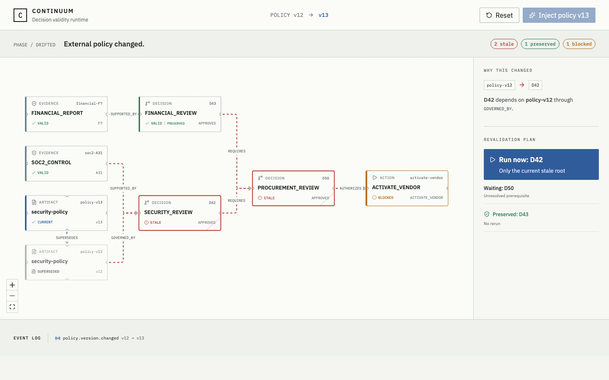

# Continuum 36-Hour Falsification Gate Report

**Observed:** 2026-08-18 (Asia/Singapore)  
**Branch:** `agent/phase-g`  
**Evidence base commit:** `2e94155` (`feat: visualize policy drift graph`)  
**Automated gate:** PASS  
**Full 36-hour gate:** PENDING — five-person visual observation has not occurred

## Decision boundary

This report establishes only that the deterministic kernel, API, and browser prototype are ready for human falsification. It is not approval to build the full product. Gemini, Google ADK, Google Cloud, Firestore, and Pub/Sub remain outside this prototype and were not tested.

## Environment

```text
macOS Darwin 24.6.0 arm64
uv 0.11.29
uv-managed backend Python 3.13.14
Node.js v25.1.0
npm 11.6.2
Playwright 1.62.1 / Chromium
```

## Automated evidence

| Command | Observed result |
|---|---|
| `make setup` | PASS; uv lock resolved, npm lock installed, 0 npm vulnerabilities |
| `make test` | PASS; 23 Pytest tests, 98% branch-aware application coverage; 2 Vitest tests; TypeScript/Vite production build |
| `make test-e2e` | PASS; 1 Chromium test exercising the real FastAPI and Vite servers |
| `make dev` smoke check | PASS; isolated override ports returned HTTP 200 for both UI and API docs, then both child processes stopped cleanly |
| native Python Playwright visual check | PASS; `networkidle`, drift assertions, revalidation assertions, and zero browser warnings/errors |
| `git diff --check` | Run in the final audit before commit |

The real browser test executes this sequence:

```text
reset
  → inject policy v13
  → D42 STALE
  → D50 STALE
  → D43 VALID + PRESERVED
  → ActivateVendor BLOCKED
  → dispatch affected branch
  → D42 REVALIDATING (execution_count = 2)
  → D50 still STALE + WAITING
  → D43 still VALID (execution_count = 1)
```

## Deterministic kernel evidence

The canonical fixture produces exactly:

```text
D42              STALE       cause: policy-v12
D50              STALE       cause: D42
D43              VALID       preserved
ActivateVendor   BLOCKED     cause: D50
Run now                      D42 only
Waiting                      D50
```

The alternate fixture changes every business identifier and the artifact type, yet derives the same structure-driven outcome:

```text
risk-review-X   STALE
release-Z       STALE
budget-Y        VALID
publish-Q       BLOCKED
```

Additional tests cover duplicate event IDs, duplicate dispatch request IDs, non-critical edges, non-propagating relation types, cycles, mismatched versions, missing artifact identity fields, unknown missions, and revalidation before drift.

The API route write guard confirms that route code does not write Decision or Action statuses directly. Those transitions are delegated to the domain services.

## Visual evidence



The captured real-browser state shows the external v12→v13 change, the red affected path, the green preserved D43 branch, the blocked Action, causal explanation, and the derived selective plan in one screen. Status meaning is redundant across text, color, icons, borders, and the stale strike mark. Reduced-motion behavior and the tablet rail layout exist in CSS; they have automated build coverage but have not received human usability observation.

## Untested hypotheses and explicit exclusions

This gate did not test:

- Gemini decision or dependency proposals;
- Google ADK agent execution;
- Firestore or Pub/Sub adapters and concurrency behavior;
- Google Cloud deployment or managed runtime behavior;
- commitment acquisition, expiry, or revocation;
- real side effects or compensation;
- completed re-approval of D42 against v13 evidence.

The repository intentionally contains no generic agent builder, workflow editor, IAM platform, generic memory platform, or Temporal replacement.

## Human 15-second gate

Required observation: a person unfamiliar with Continuum understands within 15 seconds that an external fact changed, only part of prior work became invalid, and unaffected work was preserved.

| Participant | External change understood | Partial invalidation understood | Preserved work understood | Time | Status |
|---|---:|---:|---:|---:|---|
| 1 | — | — | — | — | PENDING |
| 2 | — | — | — | — | PENDING |
| 3 | — | — | — | — | PENDING |
| 4 | — | — | — | — | PENDING |
| 5 | — | — | — | — | PENDING |

No participant result has been invented or inferred from automated tests.

## GO / NO-GO

- **Automated kernel/API/UI readiness:** GO for the five-person visual falsification session.
- **Complete 36-hour gate:** PENDING.
- **Full-product build:** NOT AUTHORIZED by this report.

Kill or pivot the project if any of the following becomes true:

1. Gemini must choose runtime staleness without deterministic structural rules.
2. The graph is effectively a static hardcoded DAG.
3. Restarting everything is simpler and equally convincing.
4. People need several minutes of narration to understand the benefit.
5. Implementation complexity threatens the remaining hackathon schedule.

If the five-person observation cannot meet the 15-second comprehension criterion, condition 4 is satisfied and the project should stop or pivot rather than proceed to the full build.
