# Continuum architecture



## What the diagram proves

- Mission Control static assets and the control plane ship in one Cloud Run service; the React client executes in the operator's browser.
- Google ADK agents use Gemini for bounded reasoning and return typed proposals.
- The Continuum semantic runtime—not Gemini—owns canonical Mission state, provenance, invalidation, commitments, and side effects.
- Firestore is the durable system of record; Pub/Sub carries outbox events; Cloud Trace receives execution telemetry.
- Agent Runtime, Registry, Gateway, and Model Armor remain explicitly optional P1 integrations. The P0 product does not claim them unless live evidence exists.

Source: [`architecture.mmd`](architecture.mmd). Regenerate the SVG with:

```bash
npx -y @mermaid-js/mermaid-cli@11.16.0 \
  -i docs/submission/architecture.mmd \
  -o docs/submission/assets/continuum-architecture.svg \
  -b transparent
```
